# MCPP —— MCP Plus：构建于 MCP 2026-07-28 之上的 Agent 层交互规范

> 状态：Draft v0.1（2026-08-17）
> 基础协议：[MCP 2026-07-28](https://modelcontextprotocol.io/specification/2026-07-28)
> 扩展基准：[SEP-2640 Skills Extension](https://github.com/modelcontextprotocol/modelcontextprotocol/pull/2640)（Extensions Track，Draft）与 [Agent Skills 规范](https://agentskills.io/specification)
> 定位：MCPP 具有**双重身份**——
> - **规范身份**：一份构建于 MCP 2026-07-28 之上的**规范化规范**（conforming spec），即 Agent 层交互指南，规范 Agent 如何发现、评估、使用基于 MCP 传递的 Skills、Tools 与 Resources，不改变 MCP 线级语义；
> - **项目身份**：其实现又是一个遵循 **Agent Plugin 1.0.0 格式**的标准插件项目（`plugin.json` + `skills/` + `mcp.json`），执行能力由 MCP server 承载。

---

## 1. 引言

### 1.1 什么是 MCPP

MCP（Model Context Protocol）解决了「如何在客户端与服务器之间传递能力」的问题：定义工具、资源、提示词的传输格式与调用方法。但 MCP 规范本身**不关心 Agent 如何使用这些能力**——何时加载一个 skill、按什么顺序编排多个 skill、依据什么缓存工具目录、如何信任远端下发的指令内容，这些决策属于 Agent 层。

MCP Plus（以下简称 **MCPP**）是在 MCP 2026-07-28 之上的**协议扩展规范**，把上述 Agent 层决策标准化：

- 定义 **Agent Plugin** 作为标准分发与部署形态：`plugin.json` 身份清单、`skills/` 打包技能、`mcp.json` 声明的 MCP server 作为运行时执行载体（第 3 章），覆盖两种部署形态——monorepo server（3.7，中心化部署）与 registry 下发（第 4 章，端侧 stdio）；
- 定义 **MCPP Registry** 作为端侧 stdio 下发的标准分发与发现渠道：插件以标准 npm 包发布，任何标准 npm registry 即 MCPP Registry（第 4 章）；
- 定义 **Skill** 作为一等公民的承载格式、传递约定与编排规则（依赖声明、拓扑加载、工具绑定）；
- 定义 Agent 层 **资源发现** 的统一策略（渠道、过滤、排序、缓存、新鲜度）；
- 定义 Agent 层 **资源使用** 的统一方式（读取、订阅、嵌入、引用、输入需求、状态句柄）；
- 为 server 与 Agent 提供可验证的 **一致性要求**（conformance requirements）。

MCPP 同时具有**双重身份**：

- **规范身份**：MCPP 是一份 **MCP 的规范化规范**（conforming spec）——不发明新的传输语义，只把 Agent 层决策（何时加载 skill、按什么顺序编排、如何缓存工具目录、如何信任远端指令）翻译为可执行、可验证的规范性条款；
- **项目身份**：MCPP 的实现是一个**标准的 Agent Plugin**——严格遵守 [agent-plugins.org](https://agent-plugins.org) 1.0.0 的 `plugin.json` / `skills/` / `mcp.json` 布局与约束，是一个可分发、可安装、可审计的标准插件；其执行能力由插件声明的 MCP server 承载。

两种身份互为表里：**项目形态**保证规范落地时可分发、可部署；**规范条款**保证项目行为在 Agent 层可预测、可交互。

MCPP 不脱离 MCP：**所有传输、JSON-RPC、认证、路由、无状态与 MRTR 语义一律由 MCP 2026-07-28 规范负责**，MCPP 只在其上增加 Agent 层约定与少量扩展方法。

总览（全篇结构 —— Agent 生命周期 · 插件分发 · server 承载三层模型）：

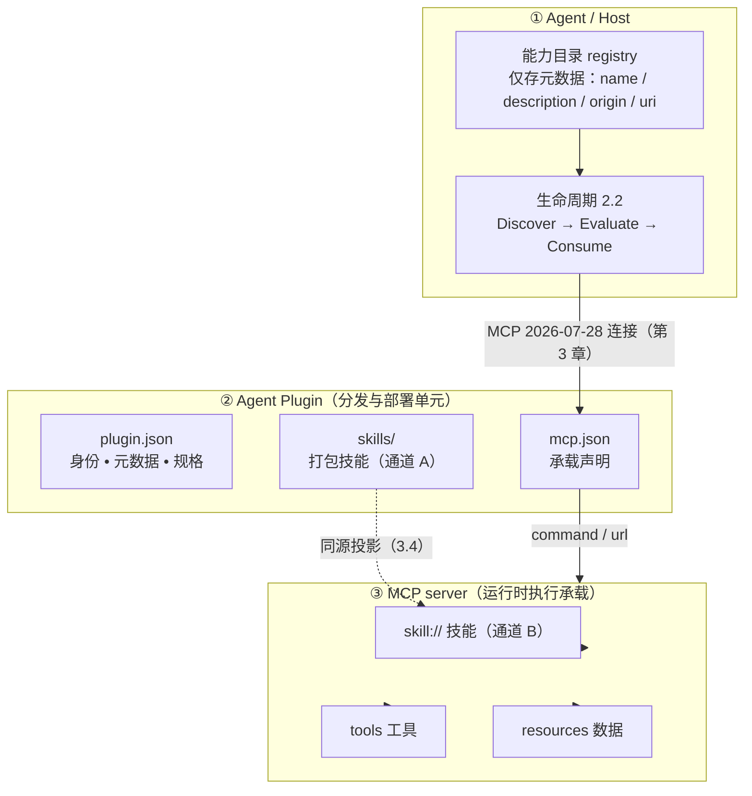

图与章节对应：**①** 生命周期见 2.2、渐进披露见 2.3、origin 见 2.4；**②** 插件形态见第 3 章、分发渠道见第 4 章；**③** 技能/工具/资源分别见第 5、6 章与第 7、8 章。

### 1.2 范围与边界

本文档 **规定**（within scope）：

- Skill 的结构、URI 约定、发现与加载流程，以及 MCPP 新增的编排字段；
- Agent Plugin：插件清单 `plugin.json`、执行承载声明 `mcp.json`、`skills/` 打包技能与 MCP skill 双通道分发（第 3 章）、monorepo 多 server 聚合（HTTP 路径路由，3.7）；
- MCPP Registry：插件经标准 npm registry 的分发与发现形态、单个 npm 包规范及其与 `mcp.json` 的关系（第 4 章）；
- Tools 目录的 Agent 消费约定：元数据质量、可追溯引用（2.5）、状态句柄、错误处理、懒加载与 Tool Search（6.6）；
- 资源发现：`resources/list`、`resources/templates/list`、目录读取、缓存与注释（annotations）的使用策略；
- 资源使用：读取、订阅、嵌入、引用跟随、输入需求、状态句柄；
- 超大载荷与私域数据的引用优先传递（8.6，stdio 同机 vs HTTP 跨机通道选择）；
- 扩展声明与安全信任边界；
- 技能的命令化（slash command）用户触达模式（5.9）；
- 多 server 共存：冲突事实、注入治理抓手与协议底线（2.5）；
- 一致性要求与检查清单。

本文档 **不规定**（out of scope，均指向 MCP 规范或 agent-plugins.org）：

- 传输层与消息格式（stdio / Streamable HTTP / header 路由 / `Mcp-Method` / `Mcp-Name`）；
- 无状态核心、每次请求的 `_meta`、`server/discover`、Multi-Round-Trip Requests 的传输语义；
- JSON Schema 2020-12 的具体语法、分页与缓存的线级字段定义（`cursor` / `ttlMs` / `cacheScope` 的取值规则见 MCP 规范）；
- OAuth / 授权 / 加密传输；
- Agent Plugins 的 schema 机器校验细节，以及安装器实现、启停、更新、卸载等客户端管理机制（属 agent-plugins.org 规范与 npm 生态；MCPP 只标准化「分发渠道为 npm 包」这一形态，见第 4 章）。

MCPP 文档凡涉及上述内容，只引用到 MCP 规范条目，不复述其动作细节。

### 1.3 读者

- **Agent / Host 实现者**：本文档第 2、3、7、8、10、11.2 章为其规范性要求；
- **MCP server / Skill 作者 / 插件作者**：第 3、4、5、6、9、11.1 章为其规范性要求；
- **SDK 维护者**：第 9 章的协商与能力位定义。

### 1.4 文档约定

- 关键词 **MUST、MUST NOT、REQUIRED、SHALL、SHALL NOT、SHOULD、SHOULD NOT、RECOMMENDED、MAY、OPTIONAL** 按 [BCP 14](https://datatracker.ietf.org/doc/html/bcp14)（RFC 2119 / RFC 8174）解释，仅当其以全大写出现时有效。
- 示例如无特别说明均为说明性（non-normative）。
- 「服务器」/「server」指 MCP server；「Agent」指承载模型、消费 MCP 能力的宿主（host）；「origin」指一个 Agent 可区分的能力来源，详见 2.4。

### 1.5 参考文件

| 文件 | 用途 |
| --- | --- |
| [MCP 2026-07-28 规范](https://modelcontextprotocol.io/specification/2026-07-28) | 传输、方法、字段的权威定义 |
| [MCP 2026-07-28 · Resources](https://modelcontextprotocol.io/specification/2026-07-28/server/resources.md) | 资源原语 |
| [MCP 2026-07-28 · Tools](https://modelcontextprotocol.io/specification/2026-07-28/server/tools.md) | 工具原语 |
| [SEP-2640 Skills Extension](https://github.com/modelcontextprotocol/experimental-ext-skills/blob/main/docs/sep-draft-skills-extension.md) | Skills 传输绑定（Draft）；MCPP 以其为基线并对齐演进 |
| [Agent Skills 规范](https://agentskills.io/specification) | SKILL.md 内容格式、frontmatter 与渐进式披露 |
| [Agent Plugins · Manifest](https://agent-plugins.org/plugin-authors/manifest) | 插件清单 plugin.json 的字段与约束 |
| [Agent Plugins · MCP servers](https://agent-plugins.org/plugin-authors/mcp-servers) | mcp.json 承载声明与传输约定 |
| [Agent Plugins · Skills](https://agent-plugins.org/plugin-authors/skills) | skills/ 目录布局与失败隔离 |
| [npm registry 文档](https://docs.npmjs.com/cli/v10/using-npm/registry) | npm registry 协议：packument / tarball / SemVer / dist-tags（MCPP Registry 复用的语义，第 4 章） |
| 本仓库 [`examples/plugins/monorepo`](examples/plugins/monorepo) | 参考实现（聚合出口 + skill:// 自动挂载 + CF 部署） |

### 1.6 分工边界：谁定义什么

MCPP 的价值在于把 **Agent 层交互的协议契约**标准化，而非替各层重复造轮子。规范中每一项要求都必须能对号入座：**凡已有规范覆盖的内容，MCPP 只引用、不重述；凡属宿主内部实现的决策，MCPP 只指出存在性与底线、不规定实现策略**。

| 层次 | 负责什么 | 本规范的处理 |
| --- | --- | --- |
| **MCP 2026-07-28** | 传输、JSON-RPC、无状态 / MRTR、认证、缓存字段（`ttlMs` / `cacheScope`）、工具 / 资源 / 提示词的线级格式 | 一律引用官方规范（1.2），不重述动作细节 |
| **Agent Skills 规范** | `SKILL.md` 内容格式、frontmatter 字段、渐进式披露概念 | 格式委托（5.1）；披露概念引用 2.3 |
| **Agent Plugins** | 插件打包布局、`plugin.json` / `mcp.json` schema、schema 校验、失败隔离 | 第 3 章只定义「MCP server 承载执行」的**衔接契约**与 npm 分发渠道（第 4 章），schema 细节引用 agent-plugins.org；安装/更新机制属宿主 |
| **Agent 宿主（Host）** | 消歧策略、注入集选择、上下文预算算法、缓存管理算法、命令 UI 呈现、审计存储等**实现决策** | 指出问题存在与协议底线（如 2.5「不得不静默遮蔽」），**实现策略明确标注属 Agent 层**，不得作为 MUST 规定 |
| **MCPP（本文档）** | Agent 层交互的协议级契约：能力身份（origin）、Skill 传递与编排字段、发现 / 使用策略的约束、扩展协商、安全底线、一致性要求 | 本文档 |

判定原则：**凡能写成「必须对所有对话双方成立」的，属 MCPP；凡能写成「某宿主内部怎么做」的，归 Agent 层**。对 Agent 层实现策略 MCPP 只能以 MAY / 「例如」给出方向性建议。

> 注意：SEP-2640 与 MCPP 均为草案形态。MCPP 以 SEP-2640 v1 基线为准；SEP-2640 正式发布后的字段若与本文冲突，以 MCP 官方为准，MCPP 落后之处在下一版本对齐。

---

## 2. 核心模型

### 2.1 能力三角

MCPP 将 MCP 暴露给 Agent 的能力归纳为三类，其 Agent 侧语义为：

| 能力 | MCP 承载 | Agent 侧含义 | 典型内容量 |
| --- | --- | --- | --- |
| **Skills**（技能） | Resources + `skills/list`、`skills/get`（SEP-2640） | 「**如何做**」：多步骤工作流、编排指令。决定 Agent 如何调用其他能力 | 中等～大（可达数百行 Markdown），必须渐进披露 |
| **Tools**（工具） | `tools/list`、`tools/call` | 「**做什么**」：单个可执行动作 | 小（名称 + 描述 + schema） |
| **Resources**（资源） | `resources/list`、`resources/read` | 「**用到的数据**」：上下文、文档、模板 | 不确定，按需读取 |

三者可以相互引用，是 MCPP 最重要的编排事实：

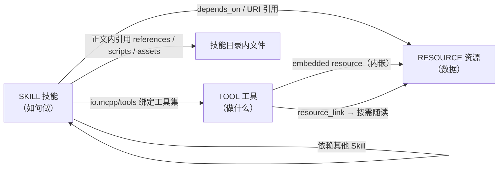

### 2.2 交互生命周期

MCPP 规范 Agent 对每一项能力都依次经历三个阶段（循环迭代）：


- **Discover（发现）**：Agent 在启动、连接加入时建立能力目录（registry），只摄入轻量元数据（tool 名与描述、skill 名称与描述、资源注释），不加载正文；
- **Evaluate（评估）**：依据元数据决定「是否相关、是否值得使用」（过滤 audience、比对 priority、判断描述相关性）；
- **Consume（使用）**：真正加载正文 / 调用工具 / 读取资源，其间遵循渐进披露与校验规则。

MCPP **MUST** 保持三阶段分离：Evaluate 阶段 MUST NOT 加载能力正文，Consume 阶段才允许。

### 2.3 渐进式披露

MCPP 采用与 Agent Skills 一致的**渐进式披露**（progressive disclosure）模型：


好处：Agent 可以同时在手大量能力，而上下文占用极小。MCPP **REQUIRED** 在 Agent 侧实施该模型；能力完整正文（尤其 Skill 正文）MUST NOT 无差别、无条件注入上下文。

### 2.4 命名空间与 origin

MCP 2026-07-28 是无会话协议，工具名、资源名的唯一性只限于单个 server。Agent 可能同时连接多个 server，因此：

- 每个连接的 server 在 Agent 侧构成一个 **origin**（能力来源）；
- Agent MUST 为每个 origin 分配**宿主命名的标识**（host-assigned label），MUST NOT 依赖 server 自报的 `serverInfo.name` 作为身份与去重依据（多 server 可同名）；
- Skill 名称、Tool 名称、资源 URI 的冲突解析一律在 **per-origin 命名空间**内进行；
- 跨 origin 的同名能力 MUST NOT 互相遮蔽、静默替换（见第 10 章）。

MCPP 的编排与安全规则都建立在 origin 概念之上：依赖解析、资源读取、批准粒度都以 origin 为单位签发（插件作为一种 origin 形态，见 3.6）。

### 2.5 多 server 共存：指出冲突，把解法留给 Agent

**协议事实**：MCP 的能力唯一性只限于单个 server（2.4）。Agent 同时连接多个 server 时，同名工具、同名技能、同名资源**必然可能发生**——且 MCP 协议层不存在 server 之间的协调通道，冲突无法由两端协商避免。MCPP 对此只承担两项职责：**指出这一事实**，并**划定 Agent 消歧必须满足的协议底线**；具体的消歧策略是 Agent 宿主的内部决策（1.6 分工边界）。

MCPP 指出的三类问题：

- **① 同名撞车**：两个 server 均可暴露 `get_weather`、`skill://convert/SKILL.md` 等同名能力。这是预期常态而非实现缺陷；
- **② 注入失控**：server 数量越多，无差别注入导致的上下文占用、相互干扰与缓存串味越严重。缓解手段（注入集选择、按 origin 计量预算、缓存管理算法）属于 Agent 层，MCPP 不规定；协议侧抓手分别见 2.2（评估只依赖元数据）、7.2（annotations 过滤语义）、10.5（缓存条目携带来源）；
- **③ 归属不清**：能力混在一起后，用户、批准、审计无法判断「这个工具 / 技能 / 资源是哪个来源」。

**Agent 层的解法（示意，non-normative）**：宿主可能采用「以 host-assigned origin 标签作前缀」的策略——工具 `{origin}:{tool}`、命令 `/{origin}:{skill}`、资源 `{origin}:{uri}`，并对 registry 按 origin 分区存储。这只是一种可行形态：

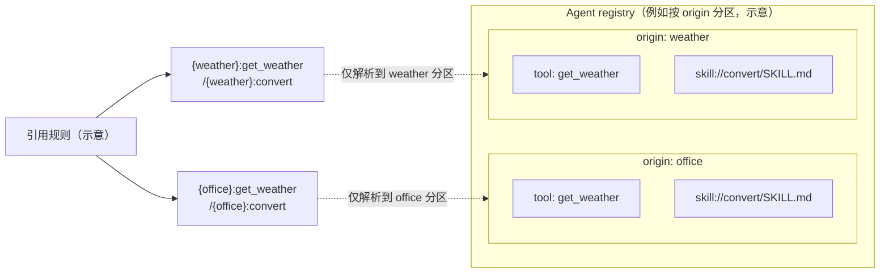

**协议底线**（仅两条，均属可审计性与安全范畴，Agent 的任何实现都必须满足）：

- **可追溯呈现**：Agent 把跨 server 能力呈现给用户、批准流程或审计时，引用 MUST 无歧义地追溯到归属 origin；无法归属的引用不得呈现为已确认能力；
- **可观测变化**：Agent 的消歧处理 MUST NOT 静默遮蔽或替换任何来源的能力（A4）；能力消失、被覆盖或冲突悬而未决时，必须可观测（提示 / 报告 / 记录）。

---

## 3. Agent Plugin：打包、发现与执行承载

MCPP 的实现即是一个 **标准的 Agent Plugin**（[agent-plugins.org](https://agent-plugins.org) 规范 1.0.0）：`plugin.json` 声明身份与元数据、`skills/` 打包技能、`mcp.json` 声明 MCP server 作为**执行承载**。MCPP 以这一可移植形态作为标准部署单元，本章规定其布局、约束与 Agent 侧加载顺序，以及它们与第 5 章 skill 传递、第 6 章 tools 的衔接关系。

### 3.1 插件形态

一个 Agent Plugin 是自包含目录，组件位于固定位置（**分发形态**——如何打包为 npm 包、如何经 MCPP Registry 发现与安装——见第 4 章）：

```
{pluginRoot}/
├── plugin.json          # REQUIRED：可移植清单（身份与元数据）
├── mcp.json             # OPTIONAL：MCP server 承载声明（执行载体）
├── skills/              # OPTIONAL：打包技能目录（每个直接子目录一个 skill）
└── ...                  # server 可执行、资源文件等
```

MCPP 视角下的职责划分：

| 组件 | 角色 | 生命周期 |
| --- | --- | --- |
| `plugin.json` | **静态契约**：插件身份、元数据、规格版本 | 安装/启用时校验一次 |
| `skills/` | **打包技能**：开箱即用的本地技能（filesystem origin） | 安装时即存在，随插件版本演化 |
| `mcp.json` 声明的 server | **运行时承载**：tools、resources、`skill://` 技能、MRTR 交互等动态能力 | 客户端按需启动/连接，运行时发现 |

一个 MCPP server 项目的可执行入口（stdio 或 streamable HTTP）就是 `mcp.json` 中 `command`/`url` 所指的目标；插件的动态能力全部经由该 server 以 MCP 2026-07-28 语义提供。

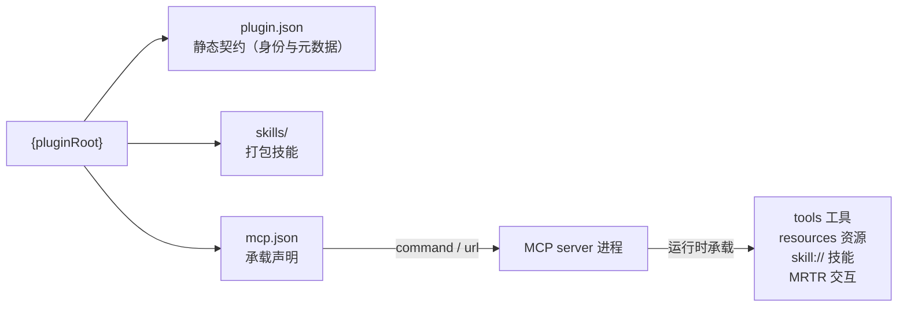

### 3.2 plugin.json：可移植清单（manifest）

[Manifest 规范](https://agent-plugins.org/plugin-authors/manifest)定义闭合（closed）字段集，MCPP 完全采用：

```json
{
  "$schema": "https://agent-plugins.org/schemas/1.0.0/plugin.schema.json",
  "name": "office",
  "version": "1.0.0",
  "description": "Office document processing plugin",
  "license": "MIT",
  "keywords": ["office", "documents", "markdown"]
}
```

| 字段 | 必填 | 语义 |
| --- | --- | --- |
| `$schema` | 是 | 选择校验与解释契约（插件必须声明规范 schema 标识） |
| `name` | 是 | 插件名与包标识（约束见下） |
| `version` | 否 | 插件版本，RECOMMENDED 使用 SemVer |
| `description` | 否 | 插件简介 |
| `author` | 否 | 对象：`name` / `email` / `url` |
| `homepage` / `repository` / `license` / `keywords` | 否 | 文档、仓库、SPDX 许可证、检索关键词 |
| `extensions` | 否 | 客户端私有数据，按 reverse-domain 命名空间组织 |

约束（MCPP 重申为规范性要求）：

- `name`：1–64 字符，仅小写 ASCII 字母、数字、连字符、点；首尾必须为字母数字；不得含 `--` 或 `..`；
- 未知顶层字段：schema 违规但**不致插件失效**——客户端报告并忽略；其他 schema 违规（如缺 `$schema` / `name`）**致命**——客户端拒绝发现与执行该插件；
- 插件私有数据 MUST 放 `extensions` 下，MUST NOT 扩展现有顶层字段。

### 3.3 mcp.json：MCP 执行承载

[MCP servers 规范](https://agent-plugins.org/plugin-authors/mcp-servers)定义闭合的 `mcp.json`：顶层只有 `$schema` 与 `mcpServers`。客户端将其映射到原生 MCP 配置；MCP 线级行为仍由 MCP 规范负责。

```json
{
  "$schema": "https://agent-plugins.org/schemas/1.0.0/mcp.schema.json",
  "mcpServers": {
    "office": {
      "type": "stdio",
      "command": "./bin/office",
      "args": ["--stdio"],
      "env": { "CONFIG": "${PLUGIN_ROOT}/config.json" },
      "cwd": "${PLUGIN_ROOT}"
    }
  }
}
```

承载约定：

- 传输类型：`stdio`（`type` + `command` 必填，可选 `args`/`env`/`cwd`）、`streamable-http`（`type` + `url` 必填，可选字面量 `headers`）、`sse`（已弃用，可选支持）；
- `command` 是**单个可执行 token**（裸可执行名或 `./` 开头的插件相对路径），不是 shell 命令；占位符展开不适用于 `command`；
- **stdio server 的标准分发形态是 npm 包**（见 4.2）：`command` 指向安装后 `node_modules/.bin` 的 bin 链接名（裸可执行名，满足上一条约束），或以 `npx` 为 `command` + 包名为 `args` 启动远端包；MCPP 不发明其他 stdio 分发载体；
- 客户端提供 `PLUGIN_ROOT`（插件根）与 `PLUGIN_DATA`（跨更新持久化的可写数据目录）两个环境变量；`args`、`env` 值、`cwd` 中做 `${PLUGIN_ROOT}` / `${PLUGIN_DATA}` 文本展开（单趟、非递归）；插件不得覆盖这两个保留变量；
- 远程 `url` 必须为绝对 HTTP(S) URL，无 userinfo 与 fragment；非 loopback 必须 HTTPS；
- `headers` 是字面量、随包可见的数据，**MUST NOT** 含凭据或密钥；Agent Plugins 1.0.0 未定义便携 OAuth/凭证引用字段，认证由客户端管理；
- 包边界：所有 `./` 相对路径 MUST 解析在插件根内；禁止用符号链接等手段逃逸包。

MCPP 附加要求：

- 插件内 MCP server SHOULD 声明 `io.modelcontextprotocol/skills` 扩展（协商见第 9 章），使插件打包技能在运行时也可经 `skill://` 通道发现（见 3.4）；
- 承载 server 的工具、资源与技能元数据质量要求与第 5、6 章一致，不因「本地插件」降级。

### 3.4 skills/ 与 MCP skill 双通道

插件内的技能存在**两条分发通道**：

| 通道 | 载体 | origin | 特性 |
| --- | --- | --- | --- |
| A 打包通道（静态） | `skills/` 直接子目录（每个含 `SKILL.md`） | 插件自身（filesystem） | 离线可用、随插件版本化、安装即发现 |
| B 运行通道（动态） | MCP server 的 `skill://` 资源 / skills 扩展（第 5 章） | 承载 server | 动态更新、可编排、支持远程 server |

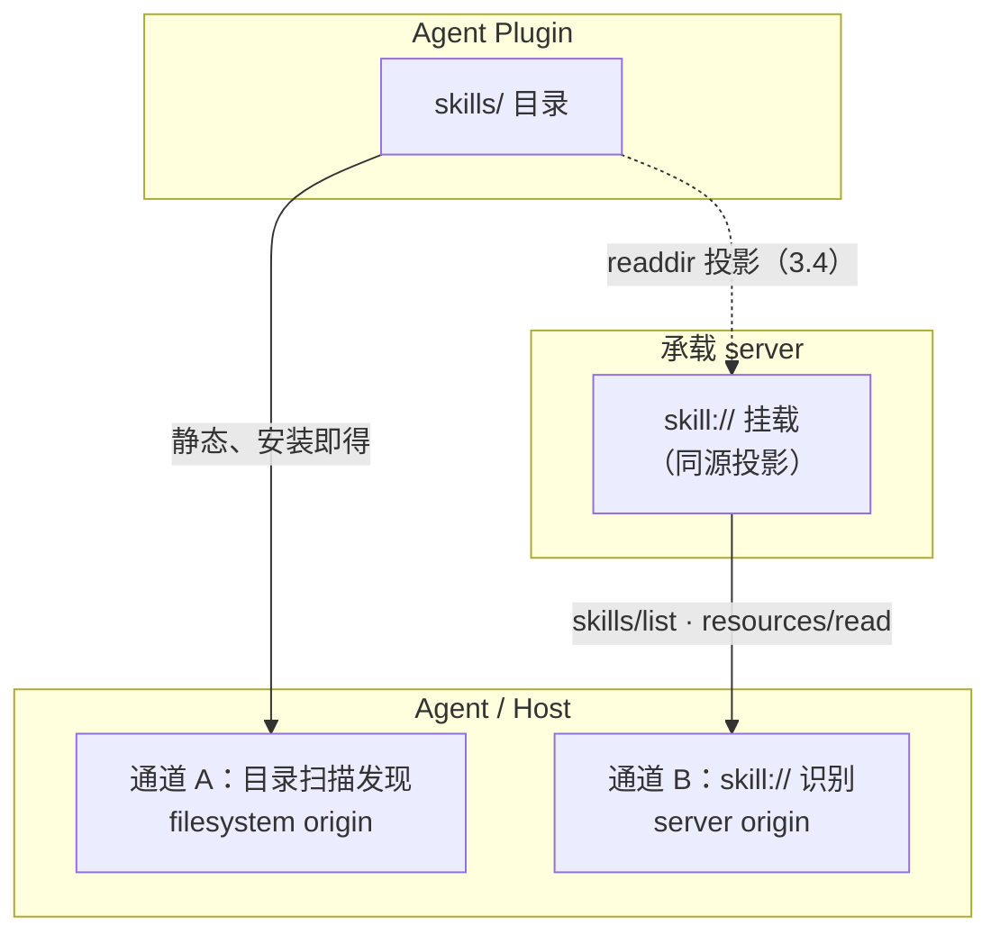

[Skills 规范](https://agent-plugins.org/plugin-authors/skills)规定通道 A 的布局：客户端只扫描 `skills/` 的**直接子目录**，不递归更深处；格式委托 Agent Skills 规范（MCPP 第 5.1–5.2 节内容适用于两种通道）。

MCPP 双通道规则：

- **同源投影**：插件内 server 的 `skill://` 挂载 MUST 与 `skills/` 目录内容同源同版（推荐实现为目录投影——本仓库 `ResourceForSkills.ts` 即实时 `readdir` 挂载，一份源两个通道），MUST NOT 维护两份漂移内容；
- **去重与遮蔽**：通道 A 与通道 B 属同一插件但 origin 不同（插件 vs server）。Agent 按 2.4 的 per-origin 命名空间处理：两通道同名校技能 MUST NOT 静默互相遮蔽；用户视角下应展示来源（本地打包 / server 承载）；
- **何时用哪条**：A 用于「安装即得、离线可用、可审计的固定技能」；B 用于「随 server 动态更新、参与 `depends_on` 编排、跨 server 组合」的技能。同一技能两通道并存合法，Agent 任取其一即可满足（B 的加载仍需 5.6 的校验）。

### 3.5 加载顺序与失败隔离

客户端加载一个插件的顺序 **REQUIRED**：

1. 校验 `plugin.json`（失败 → 拒绝整个插件，不发现任何组件）；
2. 扫描 `skills/` 直接子目录，逐个校验 `SKILL.md`（单个无效 → 跳过该技能、报告、继续）；
3. 解析 `mcp.json`（顶层无效 → 禁用该插件全部 MCP；单条 server 无效/不可用 → 仅禁用该条，其他 server、技能与扩展继续加载）；
4. 按 `mcp.json` 启动/连接承载 server，进入运行时发现（第 5、6 章）。

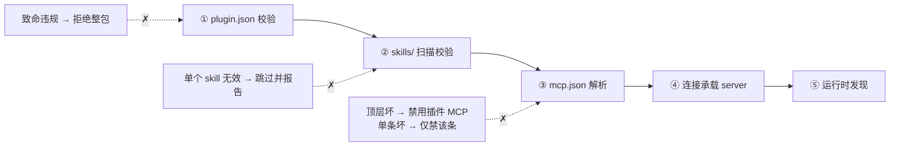

各步骤的失败互相隔离：技能坏不影响 server，server 坏不影响打包技能。

### 3.6 与核心模型的衔接

- **插件是一种 origin 形态**：插件（及其打包技能）与插件内承载 server 分别构成 origin；2.4 的 host-assigned 标签、命名空间与遮蔽规则同等适用；
- **信任分层**：`skills/` 打包技能属于「本地可信任」类别（10.3 的默认允许策略适用）；但**经 `mcp.json` 启动的承载 server 所服务的任何内容（含 `skill://`），无论进程是否本地，一律按 MCP origin 的不可信规则对待**——与 10.5 缓存隔离精神一致，本地进程不自动获得本地信任；
- 生命周期（2.2 三阶段）与渐进式披露（2.3）对两个通道同等生效。

### 3.7 monorepo 多 server 聚合（HTTP 路径路由）

一个 MCPP server 项目可以是 **monorepo 聚合形态**：**单一 HTTP server 进程**（唯一对外开放的端口）托管**多个 MCP endpoint**，以 **URL 路径路由**分发——`/xxx/mcp` 是子 server xxx 的 MCP 端点，`/yyy/mcp` 是子 server yyy 的 MCP 端点。客户端按路径（URL）连接对应的子 server，各自独立协商。

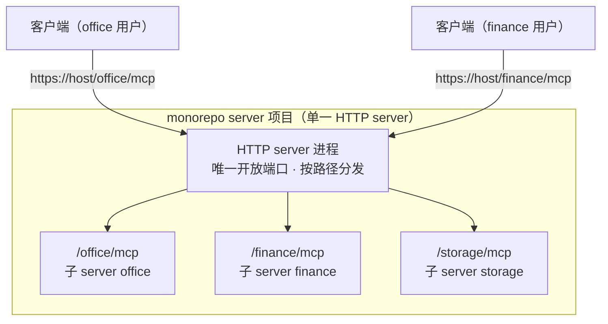

**模式定义**：

- 每个路径是一个**独立的 MCP endpoint**：拥有自有的能力集、协议协商、扩展声明（第 9 章）、skill 资源与插件技能挂载；**不**做端内能力转发或拼装（本设计不涉及「单端点聚合多 server 能力」的代理形态）；
- 每个端点从客户端视角构成**一个 origin**——URL 即 origin 的天然标识（2.4 host-assigned 也通常是主机的 URL 路径标识）；端点间工具/技能的唯一性本就互不相扰，跨端点引用以 URL 可追溯（2.5 底线①自然满足）；
- 挂载关系是**静态配置**（启动注册表：路径 ↔ 子 server 实例），客户端无需感知各端点内部实现；
- 端点的暴露清单可由**只读 Server Catalog endpoint**公开（3.7.1）；也可经 host 侧注册表或运维配置声明。无论发现途径为何，客户端均按需连接（对应 `mcp.json` 中多条 `url` 条目，见 3.3）。

**MCPP 约束**：

- 各端点**独立边界**：独立授权与资源隔离（可共享 TLS 端口，但应用层按端点隔离），符合最小暴露原则（第 10 章安全边界按 origin / 端点生效）；
- 端点路径分配 MUST 明确且可审计；端点间不得静默互访（一端点能力不得被伪装成另一端点的能力，A4 精神在 server 侧同成立）；
- **stdio 不适用本形态**：stdio 是一对一进程管道，无 URL / 路径概念。需要多 server 时，stdio 形态只能是一进程一 server + 客户端多条 stdio 配置（3.3），不提供路径路由聚合。
- **形态定位**：3.7 是插件能力的**形态一（monorepo server，中心化部署）**，符合企业中「server 部署与管理」需求；端点侧的 stdio 下发属**形态二（MCPP Registry，第 4 章）**。两形态正交、可并存，选择依据见第 4 章引言。

### 3.7.1 Server Catalog：已挂载端点的发现与连接解析

monorepo MAY 在同一 authority 下额外挂载一个 **Catalog endpoint**（推荐路径 `/catalog/mcp`）。Catalog 本身是独立 MCP endpoint / origin，声明 `io.mcpp/server-catalog`（第 9 章），仅用于发现、查询与解析本进程中已静态挂载的 Child MCP；它**不是**能力聚合代理，也不改变 3.7 的 Child endpoint 隔离边界。

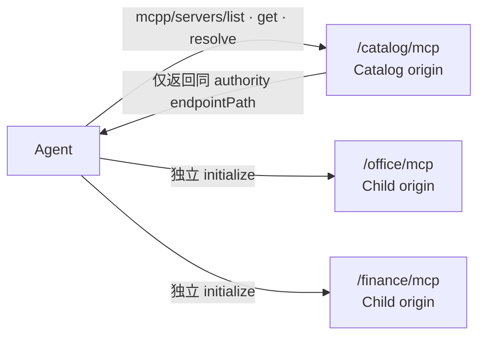

**静态条目与方法**：一个 Catalog entry 至少包含稳定 `id`、`title`、`description`、`version`、可选 `tags` / 能力摘要 / `auth.required` 与 content-bound 的 `entryDigest`。其仅描述可连接服务，不是 Tool、Resource 或 Skill 的权威事实；完整能力必须在连接 Child endpoint 后通过标准 MCP 方法重新发现。

| 方法 | 输入 | 输出与副作用 |
| --- | --- | --- |
| `mcpp/servers/list` | 可选 `cursor`、`query`、`tags`、`capabilities` | 轻量 Catalog entry 分页；只读、无副作用 |
| `mcpp/servers/get` | `serverId` | 单个 Catalog entry；未知 ID 返回 `-32602` |
| `mcpp/servers/resolve` | `serverId`、用户已审阅的 `entryDigest` | `{ transport: "streamable-http", endpointPath }` 与授权前置条件；摘要变化 MUST 拒绝，要求刷新与重新批准；只读、无副作用 |

**endpoint 解析与 Agent 装配**：Catalog MUST 仅返回以 `/` 开头的 `endpointPath`，不得含 scheme、authority、userinfo、query、fragment、`.` 或 `..` 段。Agent MUST 将它解析到 Catalog 的同一 scheme / host / port，MUST NOT 因 Catalog 条目自动跨 origin 重定向或携带凭据。用户明确选择条目后，Agent 以 `entryDigest` 调 `resolve`，验证路径，再创建本地 connection binding 并独立 initialize Child endpoint；后者构成新 origin，适用第 2.4、5–10 章的全部发现、缓存、批准与隔离规则。

**目录授权与路径生命周期**：Catalog MUST 先按调用者当前权限过滤条目，MUST NOT 以目录泄露不可连接服务的名称、用途或存在性。`id ↔ endpointPath` 绑定 MUST 稳定、唯一且可审计；Child endpoint 移除时，其路径 MUST NOT 静默改指向其他服务，旧 binding 失败后 Agent MUST NOT 自动连到同名、相似或替代服务。

**绝对禁止的动作**：Catalog **MUST NOT** 下发 npm 包、tarball、`command`、`args`、shell 指令或本地凭据；MUST NOT 安装、更新、卸载、启动本地进程、创建 runtime、按租户 provision 或代理拼装 Child MCP 能力。任何此类行为分别属于 npm Registry / Agent Plugin 生命周期或独立的受审计控制面，超出本节。`resolve` 永远是纯查询，不能以“连接装配”之名制造副作用。

---

## 4. MCPP Registry：NPM 分发与发现

MCPP 的插件能力覆盖两种**部署形态**，对应企业两类部署与管理需求：

| | 形态一：monorepo server（3.7） | 形态二：MCPP Registry 下发（本章） |
| --- | --- | --- |
| 载体 | 单一 HTTP 出口，路径路由多个 server | 标准 npm 包（tarball） |
| 运行位置 | 企业服务端（中心化） | 端点本地（stdio 子进程） |
| 管理方式 | 进程、监控、日志、升级、安全策略集中治理，多用户共享 | npm 生态分发：SemVer、dist-tags、integrity 校验 |
| 连接方式 | Agent 经 streamable-http 远程连接，URL 即 origin | Agent 本地启动 `command`（4.1：`bin` 入口即承载 server），包即 origin |
| 适用需求 | 「server 部署与管理」 | 「把 stdio 形态的 MCP 服务下发到端点」 |

两形态**正交、可并存**：同一企业可同时部署中心 server（形态一）与端点插件（形态二），互不排斥；streamable-http 承载的插件若经 registry 分发，其包仅是清单载体，服务本身仍属形态一的中心部署范畴。

形态二复用第 3 章的静态形态与执行承载：插件 = 标准 npm 包，**包根即 `{pluginRoot}`**，`mcp.json` 随包原样分发（4.3），解包后按 3.5 加载。agent-plugins.org 1.0.0 只约束包内布局与 manifest 字段，不规定分发渠道——MCPP 以 npm 生态补上这一环：任何标准 npm registry 都是 MCPP Registry；MCPP 插件以**标准 npm 包**发布；MCPP 的 registry 工具集本身也以**标准 npm 包**形态分发（4.1）。

### 4.1 模型：标准 npm registry 即 MCPP Registry

- **不发明协议**：MCPP Registry **MUST NOT** 发明新协议、新端点或新元数据格式。packument（registry 元数据文档）、tarball 下载、SemVer、dist-tags、keywords 检索、integrity 校验等语义一律复用 npm registry；
- **npm 包就是 stdio server 的标准分发方式**：MCP 生态中 stdio server 的事实标准即以 npm 包发布——`bin` 暴露可执行入口，客户端以 `npx -y <包名>` 或安装后的 `node_modules/.bin` 链接启动（3.3 的 `command`/`args` 即指向此）。MCPP 插件包是这一形态的**直接推广**：插件 = 一个 stdio server npm 包 + `plugin.json` + `skills/`（stdio 承载时 `bin` 入口即承载 server）。分发单元与 server 自身的分发单元合一，插件作者无需另造分发格式；registry、安装器、缓存、完整性校验全部复用既有 npm 设施；
- **任何标准 npm registry 都是 MCPP Registry**：公有 npmjs.com 与私有兼容源（Verdaccio、Nexus、GitHub Packages 等）均构成标准 MCPP Registry；Agent 按 registry URL + 包名寻址，不区分「官方源 / 私有源」，也不存在 MCPP 专属的 registry 端点；
- **工具形态**：MCPP 规范的 registry 工具集——检索、安装、发布、校验——以**标准 npm 包**形态分发（参考实现示意名 `@mcpp/registry`，经 `npx @mcpp/registry ...` 调用）。「Registry 是标准 npm 包」落在**工具层**；registry 本体（源）复用 npm 协议，不提供独立部署件。

发现流程与 2.2 的三阶段衔接：

- **Discover**：Agent 向 registry 发起 keywords 检索（检索标记见 4.2），只摄入 packument 元数据（名称、版本、描述、keywords、许可证），不下载 tarball；
- **Evaluate**：依据元数据判定相关性；评估期 **MUST NOT** 下载或解包正文（2.2 的三阶段分离在分发面同样成立）；
- **Consume**：选定后安装——下载 tarball → 校验 integrity → 解包 → 进入 3.5 的插件加载顺序。

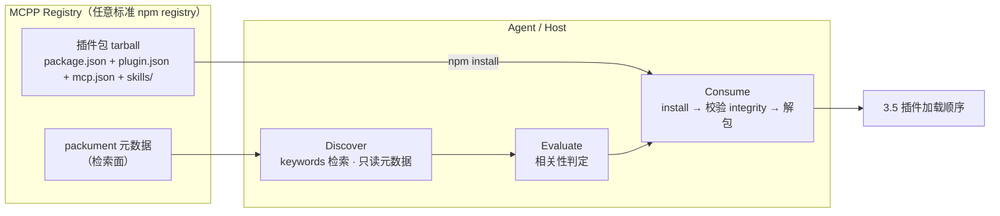

### 4.2 单个 NPM 包规范

一个 MCPP 插件 = 一个标准 npm 包；**包根即 `{pluginRoot}`**——解包后 3.1 的布局原样成立：

```
{packageRoot}/                # 安装解包后 == {pluginRoot}
├── package.json   # REQUIRED：npm 分发生命周期身份
├── plugin.json    # REQUIRED：MCPP 插件身份清单（3.2，原样保留）
├── mcp.json       # OPTIONAL：执行承载声明（3.3，原样保留）
├── skills/        # OPTIONAL：打包技能（通道 A，3.4）
└── ...            # server 可执行、资源文件等
```

`package.json` 字段约束：

| 字段 | 必填 | 语义 |
| --- | --- | --- |
| `name` | 是 | npm 包名（可带 scope）；**去 scope 后的包名** MUST 与 `plugin.json.name` 一致（`plugin.json.name` 仍遵守 3.2 的 1–64 字符约束，不含 scope） |
| `version` | 是 | SemVer；MUST 与 `plugin.json.version` 一致 |
| `description` | 否 | 插件简介；存在时 MUST 与 `plugin.json.description` 一致 |
| `keywords` | 否 | MUST 含检索标记 `mcpp-plugin`（可叠加功能词），否则 4.1 的发现面无法命中 |
| `license` / `author` / `homepage` / `repository` | 否 | 与 `plugin.json` 对应字段一致（SPDX / 作者 / 文档 / 仓库） |
| `files` | 否 | 发布白名单：MUST 含 `plugin.json`、`mcp.json`（若存在）、`skills/`（若存在）与 server 可执行；MUST NOT 含 `.git`、`node_modules`、凭据与运行数据 |
| `bin` | 否 | stdio server 可执行入口的链接名（如 `"office": "./bin/office"`）；链接名即 3.3 `command` 可用的裸可执行 token（4.1：npm 包即 stdio 的标准分发方式） |

约束（MCPP 重申为规范性要求）：

- **识别**：一个 npm 包是否 MCPP 插件，以解包后根级 `plugin.json` 的存在与校验为准；`keywords` 只是检索面，MUST NOT 作为身份依据；
- **一致性**：发布前 MUST 校验 `package.json` 与 `plugin.json` 的 `name` / `version` 一致（由 4.1 的发布工具校验）；不一致属致命违规，Agent 与 registry 均可拒绝；
- **命名空间**：`@scope` 是 npm 生态的发布者命名空间（组织归属），不进入 `plugin.json.name`；Agent SHOULD 以完整包名（含 scope）作为 origin 标签（2.4）的组成部分，提升跨插件可追溯性；
- **版本与更新**：版本号按 SemVer 演进，`dist-tags`（`latest` 等）语义复用 npm 约定；升级 = 发布新版本包，更新语义见 4.3。

示例（说明性）：

```json
{
  "name": "@acme/office",
  "version": "1.2.0",
  "description": "Office document processing plugin",
  "keywords": ["mcpp-plugin", "office", "documents", "markdown"],
  "license": "MIT",
  "files": ["plugin.json", "mcp.json", "skills/", "bin/"],
  "bin": { "office": "./bin/office" }
}
```

### 4.3 与 mcp.json 的关系：分发外壳与执行承载

**核心论断**：npm 包是**分发外壳**（distribution shell），`mcp.json` 是**执行承载声明**（execution carrier），二者职责正交——分发渠道解决「插件如何被找到、安装、更新」，`mcp.json` 解决「插件的动态能力由哪个 server、以何种传输方式承载」。MCPP 的分层关系：

- **内容不变**：`mcp.json` 随包原样分发，3.3 的闭合字段集、承载约定与安全约束（`headers` 为字面量、MUST NOT 含凭据等）在包内逐字生效；解包后 3.5 的加载顺序（manifest → skills/ → mcp.json → 连接 server）不因来源是 registry 而改变；
- **路径解析**：`./` 相对路径与 `${PLUGIN_ROOT}` / `${PLUGIN_DATA}` 展开基于解包后的真实目录——`{pluginRoot}` 即安装目录（如 `node_modules/@acme/office/` 或用户指定位置）；`command` 为 `bin` 链接名时，Agent 解析到安装环境实际的 `node_modules/.bin` 链接，`command` 为 `npx` 时经包名解析（两种形态均为 npm 分发，见 4.1）；
- **配置映射**：Agent 把包内 `mcp.json` 映射到自身原生 MCP 配置（与附录 A `examples/plugins/.mcp.json` 的客户端级配置同构）。**便携面与实例化面必须分离**：包内 `mcp.json` 是便携声明（可移植、随包审计、无凭据）；认证、凭据引用、host 级覆盖等属客户端实例化配置，由 Agent 在映射时注入——凭据永远不进入包（3.3）；
- **多包共存**：安装多个插件包 = 多个 `mcp.json` 并存 = 多 server 并存；2.4 的 per-origin 命名空间、2.5 的多 server 共存底线与第 10 章安全规则逐包适用；
- **更新语义**：升级包 = 新的 `mcp.json` 快照。Agent 按 10.3 的 content-bound 批准规则复核变更（尤其 `command` / `url` / `env` 变化），MUST NOT 静默沿用旧批准；origin 标签 SHOULD 携带 registry 来源（如 `https://registry.npmjs.org/@acme/office`），使 10.2 的来源可见性在分发面成立。

### 4.4 供应链与信任

- 经 registry 安装的插件内容一律按**远端不可信内容**对待（10.1）：`plugin.json`、`mcp.json`、`skills/`、server 二进制均可能被恶意或受损发布者投毒；MCPP 的信任规则（10.2 origin 可见、10.3 批准内容绑定、10.4 无隐式执行）在分发面完整适用；
- **完整性**：tarball 的 integrity 校验由 npm 安装流程提供，MCPP 引用不重述；digest 校验保证「下载内容即发布者所发」，不是可信凭证（与 10.3 对 digest 的定位一致）；
- **发布者身份、包签名、来源审计**属 npm 生态能力与宿主实现决策（1.6 分工边界），MCPP 不规定。

---

## 5. Skills：跨协议传递与编排

本章是 MCPP 的核心新增。Skill 的**内容格式**委托给 Agent Skills 规范，**传输绑定**以 SEP-2640 为基线，**编排语义**为 MCPP 自有扩展。

### 5.1 Skill 承载格式

一个 Skill **MUST** 是一个目录，目录结构满足：

```
{skillName}/
├── SKILL.md        # REQUIRED：frontmatter + 指令正文
├── references/     # OPTIONAL：支持文档（按需读取）
├── scripts/        # OPTIONAL：可执行代码（需显式批准执行）
├── assets/         # OPTIONAL：模板、资源
├── templates/      # OPTIONAL：可复用结构化模板
└── ...             # 仅当 server 的公开策略明确允许时才可作为 Resource 暴露
```

`SKILL.md` **MUST** 以 YAML frontmatter 开头，且 frontmatter **至少包含** `name` 与 `description` 两个字段：

```yaml
---
name: convert-documents-to-markdown
description: 将各类文档转换为 Markdown，用于文档迁移与合并
---
（指令正文，Markdown）
```

- `name` MUST 与父目录名一致（Agent Skills 规范要求）；
- `description` 是 Agent 在 Discovery 阶段唯一的判断依据，MUST 写清楚「何时使用、解决什么问题」，SHOULD 避免空泛描述；
- frontmatter 中其他字段（`license`、`metadata`、未来 Agent Skills 扩展字段）为透传（pass-through）：Agent MUST 忽略不认识的字段，MUST NOT 因未知字段拒载。

### 5.2 MCPP frontmatter 扩展

MCPP 在 frontmatter 的 `metadata` 对象内，以 `io.mcpp/` 反向域前缀定义编排字段。这些字段只对 MCPP 感知的 Agent 生效；不感知的 Agent 按 3.1 的透传规则忽略它们。

```yaml
---
name: convert-documents-to-markdown
description: 将各类文档转换为 Markdown
metadata:
  "io.mcpp/version": 1.2.0
  "io.mcpp/depends_on":
    - skill://pdf-processing/SKILL.md
  "io.mcpp/tools":
    required:
      - anydoc
    optional:
      - file_read
      - file_write
  "io.mcpp/context_budget": 8000
---
```

| 字段 | 类型 | 必填 | 语义 |
| --- | --- | --- | --- |
| `io.mcpp/version` | string | no | Skill 语义版本（SemVer）。Agent 用作缓存与升级依据 |
| `io.mcpp/depends_on` | string[] 或 object[] | no | 前置 Skill 引用（见 5.7.1） |
| `io.mcpp/tools` | object | no | 本 Skill 运行所需的工具绑定：`required`/`optional` 数组 |
| `io.mcpp/context_budget` | integer | no | 建议注入上下文的符号上限；Agent SHOULD 遵守 |
| `io.mcpp/provider` | string | no | 提供方标识（公司/团队/作者），用于审计展示 |

约束：

- `io.mcpp/` 前缀为 MCPP 保留。Server / Skill 作者 MUST NOT 在此前缀下定义未在本表登记的字段；
- 存量 Skill 的 `metadata` 中 MAY 以无前缀形式书写本表字段（Agent 按表保守推断），但**新写** Skill MUST 使用完整 `io.mcpp/` 前缀；
- `depends_on` 与 `tools.required` 均为**声明**而非**权限**：Agent MUST NOT 因声明即授予执行或读取权限（见 10.4）。

### 5.3 URI 与资源映射（skill:// 约定）

MCPP 采用 SEP-2640 的 URI 约定。Skill 作者选择公开的**每个文件**各暴露为一个 MCP resource：

```
skill://{org-prefix/}{skillName}/{相对路径}
```

- 末段（`{skillName}`）MUST 等于 frontmatter 的 `name`；
- 首段占据 authority 组件，MUST 是合法 `reg-name`，承载组织前缀，Agent MUST NOT 对其做 DNS/网络解析；
- `SKILL.md` 恒可寻址为 `skill://{skillName}/SKILL.md`，技能根目录为 `skill://{skillName}`（去后缀、无尾斜杠）；
- `{相对路径}` 支持任意深度（references / scripts / templates 等）；Server 对文件类型、单文件大小、累计大小或文件数施加公开限制时，MUST 在 Discovery 中仅列出实际可读文件，且不得让附属文件在根 `SKILL.md` 未公开时单独可读；
- `SKILL.md` 是唯一 Skill 根/激活入口。相同 `skillName` 下的 `references/`、`scripts/`、`assets/`、`templates/` 文件是附属 Resource，MUST NOT 被作为独立 Skill 呈现；
- Server SHOULD 默认只递归公开上述四个目录，其他一级目录 MUST 经部署者显式允许。Server MUST 拒绝隐藏路径、路径穿越、符号链接、未知或危险二进制，并在扫描与读取两阶段重新校验路径、文件类型、大小与文本完整性；
- scripts 可作为只读 Resource 公开，但其可读性 MUST NOT 被解释为执行授权；执行仍走独立 Tool 与批准边界。

示例（摘自 SEP-2640）：

| 技能路径 | 文件 | 资源 URI |
| --- | --- | --- |
| `git-workflow` | `SKILL.md` | `skill://git-workflow/SKILL.md` |
| `pdf-processing` | `references/FORMS.md` | `skill://pdf-processing/references/FORMS.md` |
| `acme/billing/refunds` | `SKILL.md` | `skill://acme/billing/refunds/SKILL.md` |

元数据映射：

- `SKILL.md` 资源的 `mimeType` SHOULD 为 `text/markdown`；
- `name`、`description` SHOULD 取自 frontmatter 同名字段；
- 其余文件按内容选取恰当的 `mimeType`。

Agent **MUST NOT** 仅凭 URI scheme 判定某资源是 Skill（「以 scheme 断技能」是禁止的）；唯一权威来源是 `skills/list` 条目、`skills/get` 返回，或校验通过的显式引用。

### 5.4 暴露方式（server 侧）

Server 声明 `io.modelcontextprotocol/skills` 扩展后（声明细则见第 9 章）**MUST** 实现：

1. **`skills/list`** —— 枚举 Server 提供的 Skill 目录。条目含 `uri`（SKILL.md 的 URI）、`frontmatter`（SKILL.md frontmatter 逐字 JSON 化）与 `resources`（目录内全部文件 `{uri, digest}` 清单，digest 为 `sha256:{64hex}`）。支持分页与列表缓存（`ttlMs`/`cacheScope`，语义与 `tools/list` 相同）。
2. **`skills/get`** —— 按 `uri` 返回单个 Skill 的条目（与 `skills/list` 条目同构），**无论该 Skill 是否出现在列表中**。未知 URI 返回 `-32602`。
3. **`resources/directory/read`**（OPTIONAL，受能力位 `directoryRead: true` 门控）—— 返回某个目录资源（`mimeType: inode/directory`）的直接子项，供 Agent 按目录导航。

另有两类兜底暴露，不要求枚举能力：

- **资源模板**：Server MAY 用 `resources/templates/list` 暴露 `skill://{skillName}/...` 模板，并在 `resources/list` 中列出具体 Skill 资源。本仓库 `ResourceForSkills.ts` 即此模式（每次访问实时 `readdir`，新增 Skill 无需重启）；无运行时文件系统的 Worker 应在构建期用同一公开策略生成静态 registry，并以 `ResourceForStaticSkills` 从 bundle 中挂载，MUST NOT 依赖运行时路径读取。这种模式的最大好处是无停机、可增量。
- **服务器指令指向**：Server MAY 在 `server/discover` 的 `instructions` 字段中直接给出 Skill URI。Agent 拿到 URI 即可通过 `resources/read` 读取，**无需任何枚举机制**。

分级要求（满足其一即可让 Agent 发现一次的 Skill）：

- 推荐：实现 `skills/list`（+ `directoryRead`）的完整枚举；
- 最小：资源模板挂载 + list 实时扫描（如 openspec 子 server）；
- 基线：仅指令引用（URI 可直接读）。

Agent 侧对应规则见 5.5。SEP-2640 明确「列表可为空/局部」，所以三类都有效，但 Agent 对**只靠基线**的 server 的 Skill 发现率受限，须容错。

### 5.5 发现（Agent 视角）

1. **建 registry**：启动与连接变更时，Agent 对每个 origin：
   - 若 server 声明 `io.modelcontextprotocol/skills` → 调用 `skills/list`（分页遍历），把条目以 `(origin, name, uri)` 为键并入 registry；
   - 否则 → 调用 `resources/list` 与 `resources/templates/list`，识别 `skill://` 资源与模板，填充 registry；
   - `resources/list` 结果按需标注为「列表来源」以与 `skills/list` 的权威条目区分。
2. **registry 只存元数据**：`name` + `description`（来自条目 `frontmatter`）+ origin + URI + 可选 digest 集合。**不读正文**。
3. **空/局部列表不得视为无 Skill**：MUST NOT 因枚举为空而断言 server 没有 Skill（生成型 / 大规模目录 server 可能不枚举）。
4. **缓存**：`skills/list` 的缓存字段由 Skills 扩展定义；当它携带 `ttlMs` / `cacheScope` 时，Agent SHOULD 按该扩展规定消费。`cacheScope: public` 的列表可在**同一 origin**内跨 Agent 会话与授权上下文复用；`private` 条目 MUST 按授权上下文隔离。列表缓存是「新鲜度提示」，不是完整性或信任证据。Skill 正文及目录文件的标准 MCP Caching 适用规则见 5.6.1 与 7.3。

### 5.6 加载与校验（Agent 视角）

Skill 的正式加载（进入模型上下文）为 **Activation 阶段**，触发条件：任务与 `description` 匹配，且用户批准（如适用）。

加载流程 **REQUIRED**：

1. **取条目**：优先从 registry 条目出发，用其 `uri` 调 `resources/read` 读取 `SKILL.md`；
2. **校验完整性**（条目含 `resources` 时）：读到的每个文件 **MUST** 与 `{uri, digest}` 一致，逐字节 SHA-256 校验；不匹配即视为校验失败，MUST NOT 使用未验证内容；
3. **校验 frontmatter 一致性**：读到的 `SKILL.md` frontmatter MUST 与条目 `frontmatter` 逐字段一致；不一致即校验失败，MUST NOT 加载；
4. **原信任评估**：条目缺 `resources`（动态生成 Skill）时 MAY 拒绝加载；
5. **以校验通过的版本进入上下文**：校验失败后，可调 `skills/get` 刷新该 Skill 当前条目再重试（内容漂移场景的恢复路径）；
6. **加载正文**：将 `SKILL.md` 全文及其 origin 标记注入上下文（provenance 见 10.2）。运行通道资源的读取与缓存适用 5.6.1；

#### 5.6.1 Skill 资源缓存

运行通道中，`SKILL.md`、references、assets 与其他 Skill 目录文件均为 MCP resource。Agent SHOULD 对它们的 `resources/read` 响应按 MCP Caching 规范与 7.3 消费 `ttlMs`、`cacheScope` 和失效通知；缓存命中不豁免本节的 digest、frontmatter 一致性、origin 标记或 10.3 的批准要求。

当 `skills/list` / `skills/get` 条目刷新后，若 `frontmatter` 或任一 `{uri, digest}` 变化，Agent MUST 将该 Skill 及其目录文件的已缓存读取结果视为 stale；下一次激活或按需读取 MUST 重新取得并校验。

**嵌套 Skill** 规则（与 SEP-2640 一致）：

- 嵌套 SKILL.md 在所属 Skill 视角下是**普通支持文件**，读取就是普通读取，Agent MUST NOT 对其 frontmatter 生效；
- 将嵌套 Skill 作为独立 Skill 激活，需**重新、显式**的用户批准；批准外层 Skill 不代表批准内层。

### 5.7 编排（MCPP 扩展）

编排是 MCPP 区分于 SEP-2640 传输绑定、新增 Agent 层语义的部分。

#### 5.7.1 依赖解析（depends_on）

`metadata."io.mcpp/depends_on"` 声明「本 Skill 运行前应已激活的前置 Skill」：

- 元素为 Skill 的 `SKILL.md` URI 字符串，或对象 `{ server?: string, uri: string }` 以支持跨 origin 引用；缺省 `server` 时解析到**同一 origin**；
- Agent 激活一个 Skill 前 **MUST** 先解析其 `depends_on`（含传递依赖），按**拓扑序**依次激活；
- 依赖环：**MUST** 检测循环依赖；存在环时 MUST NOT 静默跳过，且在提示中报告环路径供人工处置；
- 依赖不可用（URI 无法校验 / 目标 server 未连接 / 被用户拒绝）：MUST NOT 激活依赖方，并报告缺口；
- 依赖 Skill 的激活同样走 5.6 的校验与 10.3 的批准流程（逐 Skill 批准）。

#### 5.7.2 工具绑定（io.mcpp/tools）

`metadata."io.mcpp/tools"` 将 Skill 与 Tools 显式绑定：

- `required` 缺失时：Agent SHOULD 提示缺口（该 Skill 的关键动作不可用）；
- `required` 全部就绪时：Agent 方可在执行阶段把 Skill 正文中的动作指引映射到对应工具调用；
- 绑定是**提示**，Agent 仍可凭工具描述自行选择其他工具。

#### 5.7.3 上下文预算

- `io.mcpp/context_budget` 声明该 Skill 建议占用的上下文符号上限；Agent SHOULD 遵守，超限时 SHOULD 仅加载 `SKILL.md` 与最必要的 references；
- references / scripts / assets MUST 按需懒加载（执行阶段遇到相对路径引用时再经 5.6 的读取规则加载），不得随 SKILL.md 一并注入。

### 5.8 完整示例

设 server `office` 提供 `convert-documents-to-markdown` 技能，其依赖 `pdf-processing`：

```
skills/
├── convert-documents-to-markdown/SKILL.md
└── pdf-processing/SKILL.md + references/FORMS.md
```

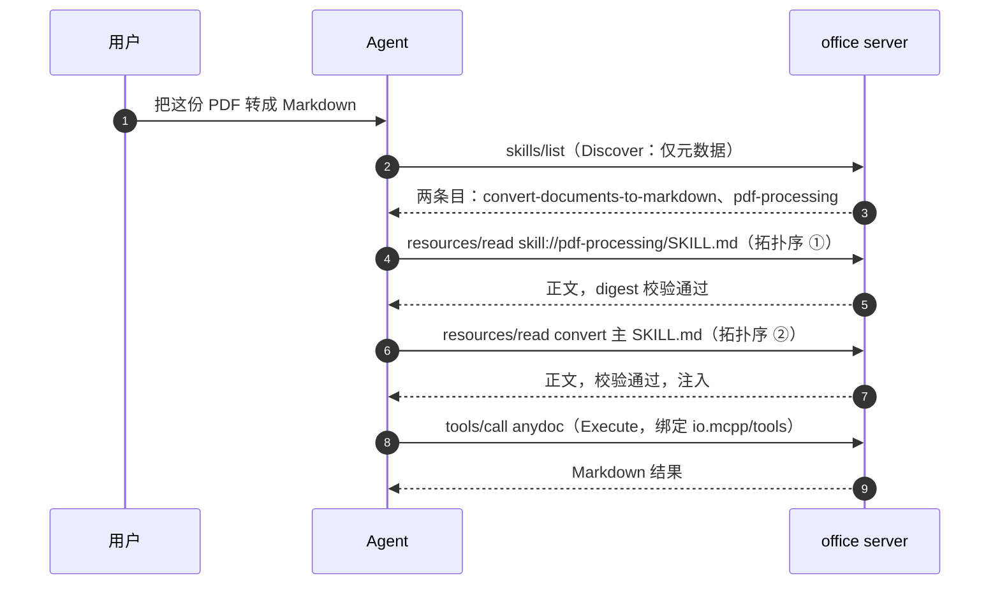

Agent 侧六步决策（省略 wire 细节）：**Discover** 枚举两个条目入 registry 不加载正文；**Evaluate** 命中 `convert-documents-to-markdown` 描述；**Resolve** 读 frontmatter 发现 `depends_on: [skill://pdf-processing/SKILL.md]`，确定拓扑序；**Consume** 按拓扑序读取两个 `SKILL.md` 并通过 digest / frontmatter 校验；**Bind** 确认 `io.mcpp/tools.required` 的 `anydoc` 工具就绪；**Execute** 跟随正文指引调用 `anydoc`，references 按需懒加载。

### 5.9 Command 化：技能的用户触发入口（Agent 侧模式）

> 非规范性模式：源自宿主 Agent 前端工程（原 perihelion）的 Command System 方案（`docs/design/mcp-commands.md`），MCPP 将其泛化为推荐的用户触达方式。宿主可不采用本模式；采用时须满足本节条款。

发现完成后（5.5），Agent MAY 将 registry 中的技能注册为宿主命令系统的命令。命令名的具体格式由宿主呈现层决定，本节 `/{origin 标签}:{skill name}` 仅为参考形态——其中 origin 标签取自 2.4 的 host-assigned 标识，用它能天然规避跨 server 同名校技能冲突（A4）。命令仅是**用户触达入口**，不改变技能的加载模型：

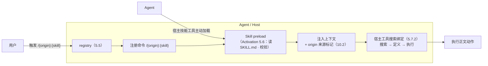

- **触发 = Activation**：用户触发 `/{origin}:{skill}` 等价于对该技能显式激活（5.6），进入 preload——读取 SKILL.md、通过 digest / frontmatter 校验后注入上下文；
- **注入标记**：注入时 MUST 随正文携带 origin 来源标记与「所需工具须经宿主工具搜索获取」的提示（10.2），不得无来源注入；
- **双入口等价**：用户命令触发与 Agent 经宿主技能发现工具主动加载是**同一条路径的两段**，MUST 复用同一套加载 / 校验 / 批准规则（5.6 / 10.3）；
- **执行绑定**：正文声明的 `io.mcpp/tools`（5.7.2）经宿主工具体系完成绑定（宿主侧的「搜索工具定义 → 执行工具」两个环节，对应工具形态由宿主定义，不在 MCPP 约定范围内），与 5.8 的完整示例一致。

---

## 6. Tools：Agent 侧使用约定

本章不重述 `tools/list` / `tools/call` 的传输定义（见 MCP 规范），只规定 Agent 如何消费工具目录、以及 Skill 作者 / Server 如何提高工具的「可被 Agent 正确调用」程度。

### 6.1 元数据质量

工具目录在 Agent 侧构成唯一的调用依据。MCPP 对 Server 提出如下元数据要求（Agent 侧规则见 11.2）：

- `name`：1–128 字符，仅含 ASCII 字母、数字、`_`、`-`、`.`，server 内唯一；大小写敏感；
- `title`：人类可读展示名，SHOULD 提供；
- `description`：**唯一的功能依据**，MUST 描述功能与适用场景，SHOULD 包含输入约束（例如 `args: --help 可查看用法`）、副作用、失败情形。空泛描述（"A tool"）== 不可用；
- `inputSchema`：缺省方言为 JSON Schema 2020-12；无参数工具 RECOMMENDED 使用 `{ "type": "object", "additionalProperties": false }`；
- `outputSchema`：RECOMMENDED；提供可帮助 Agent 结构化消费结果。

Agent 侧对应规则：

- Agent MUST 将 `description` 视作不可信文本（可能含误导注入，见 10.1），但其作为选择依据的事实不变；
- Agent SHOULD 将工具目录缓存在其 prompt cache 中（确定性顺序有助于提升缓存命中率，见 6.2）。

### 6.2 命名与跨 server 消歧

- Server MUST 返回**确定性顺序**的工具列表（底层集合未变时顺序稳定），以利客户端缓存与 LLM prompt cache 命中；
- 工具名唯一性限于单个 server。多 server 聚合时 Agent **MUST** 使引用可追溯（2.5 协议底线①），具体消歧策略属 Agent 层（见 2.5 / 1.6）——**MAY** 采用「以 host 分配的 origin 标签为前缀」等形态（例如 `office:anydoc`）；
- Agent MUST NOT 依赖 `serverInfo.name` 消歧（不保证唯一）；
- 两个 server 的同名工具：Agent MUST 处理两者并存，MUST NOT 静默丢弃其一（这同时也是安全规则，见 10.2）。

### 6.3 无状态与显式状态句柄

MCP 2026-07-28 无 protocol 层会话。跨调用的状态由**显式句柄**承载：

- Server 设计状态型工具（购物车、浏览器上下文、事务）时 SHOULD：由创建工具返回不透明句柄（如 `bsk_a1b2c3`），后续工具以句柄为参数接收；
- Agent 在 prompt 编排中 **MUST** 负责把句柄从一次调用带到下一次（模型上下文中的线程化）；
- 句柄是「名称」而非「能力凭证」：Server 每次调用 MUST 基于调用者身份重校验授权；
- 未认证 server 的句柄按 bearer 处理：RECOMMENDED 高熵（UUIDv4 级）且有界生命周期；
- 句柄过期/未知时，Server 应返回**工具执行错误**（`isError: true`）并说明恢复方式（重建句柄），让模型可自纠（见 6.4）。

### 6.4 错误分类与重试

MCP 区分两类错误，MCPP 规定其 Agent 侧处置：

| 错误类型 | 载体 | 含义 | Agent 处置 |
| --- | --- | --- | --- |
| 协议错误（Protocol Error） | JSON-RPC `error`（如 `-32602` Unknown tool） | 请求结构本身有误，模型难以修复 | 不重试，报告；可检查参数后**有限**重试 |
| 工具执行错误（Tool Execution Error） | 结果 `isError: true` | 业务/校验失败，反馈可操作 | SHOULD 将错误文本回传模型，允许基于其自纠正后重试 |

Agent **MUST** 实施：

- 限时限重试策略（按 MCP 的 cancellation / timeout 语义），禁止无界重试；
- 对协议错误与执行错误分别记账，避免耗尽配额；
- 工具超时 / 取消时，将取消原因（progress / cancellation）如实并入上下文，不得吞错。

### 6.5 与 Skills 的工具绑定

- Skill 的 `metadata."io.mcpp/tools"`（见 5.7.2）是 Skill↔Tool 绑定的标准载体；Agent 在激活 skill 时应盘点并报告 required 工具缺口；
- Skill 正文中的工具引用使用工具名，Agent 在 per-origin 命名空间内解析。跨 origin 引用用 `origin:toolName` 限定写法；
- Agent **MUST NOT** 因 Skill 声明了 `allowed-tools` 之类的字段就放行——该字段对 MCP origin 的 Skill **必须忽略**（权限边界见 10.4，此处是 SEP-2640 的硬性要求）。

### 6.6 Tool 懒加载与 Tool Search（Agent 层策略）

**问题**：`tools/list` 可能返回成百上千个工具。若全部定义（`description` + `inputSchema`）注入上下文，会造成 token 预算爆炸与首包延迟（stdio 等场景下还会引发异步排队阻塞）。MCPP **推荐** Agent 层对工具实施**懒加载**，并由此派生 Agent 层 **Tool Search** 能力：

- **目录即索引**：Agent SHOULD 将 `tools/list` 结果（分页 + 缓存，见 7.3）维护为**轻量索引**——只含元数据（`name` / `title` / `description` / `size` / `annotations`），**不注入 schema**；
- **Tool Search**：任务需要工具时，Agent 在索引上做检索式匹配（名称 / 描述关键词、与当前任务的语义相关性），得到**候选集**，对候选集按需拉取并注入定义（`description` + `inputSchema`）——检索在**元数据层**完成，定义按**命中**获取。MCP 2026-07-28 没有协议级的工具搜索方法，Tool Search 是 **Agent 层实现**（1.6 归属），搜索质量由宿主决定；
- **阻塞规避**：懒加载把「全量定义注入」换成「模型显式需要的几个」，避免全量拉取带来的排队与解析延迟；2.2 的 Evaluate 阶段（只依赖元数据）对工具目录同样适用；
- **候选排序**：复用以确定性顺序为底（7.2 `(audience, priority desc, 名称)`），稳定搜索输出以保 LLM prompt cache 收益；
- 定义拉取失败或缓存过期时，按 7.3 重取该条目；零候选时向模型如实报告「无可用工具」，MUST NOT 杜撰工具。

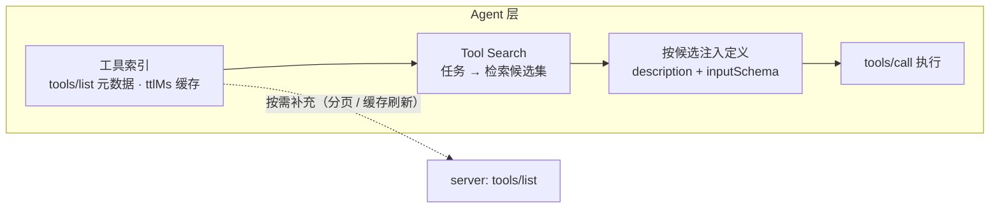

---

## 7. 资源发现（Agent 层）

资源原语的定义与字段在 MCP 规范中；本章规范 Agent「如何发现并组织它们」。

### 7.1 发现渠道

Agent 应综合利用以下渠道构建资源视角：

1. **`resources/list`**：全局资源枚举（分页 + 缓存）。作为基线渠道；
2. **`resources/templates/list`**：参数化资源（RFC 6570 模板）。`skill://{skillName}/SKILL.md` 模板对 Skill 场景尤其重要（见 5.4）；
3. **`resources/directory/read`**（`directoryRead: true` 的 server）：目录资源的下钻导航（Skill 内 references/templates 的目录浏览）；
4. **Skill 内的相对引用**：Skill 目录文件的相对路径解析规则（见 8.1 的「根解析」）；
5. **工具返回的引用**：`resource_link` 与显式 URI（见 8.3）。

Agent **SHOULD** 将这三类来源合成统一的资源导航视图，但**MUST** 保留来源标注（global list / template / directory / skill-relative），因为其完整性语义不同。

### 7.2 过滤与优先级（annotations）

资源及其内容块支持 annotations：

| 字段 | 取值 | Agent 规则 |
| --- | --- | --- |
| `audience` | `user` / `assistant` | 为模型选上下文时，Agent 优先 `assistant`；`user` 者按用户需求呈现 |
| `priority` | 0.0–1.0 | 上下文预算有限时按 priority 降序裁减；1.0 （有效必需）者不得因预算省略（除非显式用户指示） |
| `lastModified` | ISO 8601 | 用于排序与新鲜度展示，也辅助缓存决策 |

MCPP 规则：

- Agent **MUST** 将 annotations 视为不可信输入（可能被 server 操纵），其用途仅是**提示排序与呈现**，不构成授权证据；
- Agent 的默认上下文纳入准则是 `audience: assistant` 且 `priority` 高于阈值；阈值由宿主策略决定；
- 仅当资源标注缺失时，Agent 才退化为按名称/描述启发式。

### 7.3 缓存与新鲜度

Agent SHOULD 按 MCP Caching 规范消费 `resources/list`、`resources/templates/list` 与 `resources/read` 完整结果携带的 `ttlMs`、`cacheScope` 及相关失效通知。MCPP 不规定缓存介质、是否持久化、淘汰算法或预取策略。

缓存键 MUST 至少隔离 origin、MCP method 与所有影响结果的请求参数；分页列表的 `cursor` 是该键的一部分。`cacheScope: private` 的结果 MUST 按 authorization context 隔离，MUST NOT 跨身份复用；`cacheScope: public` 的结果可跨授权上下文复用，但也 MUST NOT 跨 origin 复用。

`ttlMs` 是新鲜度提示而非内容不变保证。Agent MAY 在 TTL 内复用响应；条目过期后 SHOULD 在下次需要时重取，MUST NOT 将 TTL 当作后台轮询周期。收到 `notifications/resources/list_changed` 时，Agent MUST 将该 origin 的 `resources/list` 与 `resources/templates/list` 缓存视为 stale；收到 `notifications/resources/updated` 时，Agent MUST 将对应 URI 的 `resources/read` 缓存视为 stale。一次读取若返回多个 `contents[]` URI，Agent SHOULD 使所有受影响的聚合缓存同时 stale；无法精确定位时 MUST 保守地使该 origin 的相关 read 缓存 stale。

重取失败时，Agent MAY 向用户展示 stale 内容，但 MUST 标注 origin、最后接收时间与过期状态；MUST NOT 将 stale 内容静默用于自动上下文注入、Skill 激活、工具执行、授权或安全决策。缓存副本 MUST 保留原始 origin，MUST NOT 伪装成 `file://` 或本地可信资源。

- 列表缓存是新鲜度提示而非完整性/信任证据：目录可能过期、局部、被篡改（见第 10 章）；
- **确定性顺序**在资源列表同样成立：Agent 的排序键 RECOMMENDED 为 `(audience, priority desc, lastModified desc, uri)`，稳定输出以保 LLM prompt cache 收益；
- 订阅（listChanged / resources/updated）是缓存失效的推送通道，见 8.2。

### 7.4 分页与原子性

- 所有 list 方法按 MCP 的 `cursor` / `nextCursor` 契约分页；
- Skill 条目（`skills/list`）的 `resources` 集合**原子**：不得跨页拆分（SEP-2640 要求）；
- Agent 遍历分页时 **MUST** 走完整个游标链，不得假定首页即全集；也不得假定列表非空即完备（局部列表合法）。

---

## 8. 资源使用（Agent 层）

### 8.1 读取

- `resources/read` 以 URI 为参数；返回一个或多个 contents（text / blob 均可）：
  - text：`text/markdown` 类直接入上下文；
  - blob：二进制按 `mimeType` 与宿主渲染约定处理，Agent MUST 正确处理 base64。
- Server 可在一个 read 中返回多个 content（如目录资源读多文件）；Agent **SHOULD** 支持该形态并逐一按 URI 记账。
- **相对引用根解析**：Skill 正文内的相对路径 MUST 针对「包含 `SKILL.md` 的目录」（skill 根）解析，而非 scheme 根。`references/GUIDE.md` 在 `skill://acme/billing/refunds/SKILL.md` 中解析为 `skill://acme/billing/refunds/references/GUIDE.md`。嵌套 Skill 的相对引用解析到自己目录的根。
- `https://` scheme 的资源：按 MCP 规定，若 Agent 可直接联网获取，则 MAY 直接 fetch（而不用经 server 中转）；其余场景 Agent SHOULD 走 `resources/read`。
- 读取结果同样受 `ttlMs` / `cacheScope` 缓存（见 7.3）。
- 资源不存在时 server 返回 `-32602`（兼容 `-32002`）。Agent MUST NOT 将「存在但为空」与「不存在」混淆——server 不得以空 `contents` 数组代表不存在。

### 8.2 订阅与更新

- Server 声明 `resources.listChanged` 时，资源列表变化 SHOULD 推送 `notifications/resources/list_changed`；声明 subscribe 时，具体资源变化经 `subscriptions/listen`（`resourceSubscriptions` 过滤器）投递 `notifications/resources/updated`。
- Agent 决策：**列表**级变化以 `ttlMs` 的按需重取与 listChanged 推送构成双通道；**单资源**级变化优先订阅（免轮询），订阅不可用时退化为按 `ttlMs` 重新 read；
- Agent **MUST** 在 `resources/updated` 到达后将对应读取缓存视为 stale。若该资源正被用户查看或属于当前任务的活跃引用，Agent SHOULD 主动重取；其余场景在下次使用时重取。通知本身不携带新内容；
- 订阅上下文是宿主责任：Agent SHOULD 只对「模型或用户活跃引用中」的资源保持订阅，避免订阅过载。

### 8.3 嵌入与引用

- **Embedded resource**（内嵌资源块）：资源全文直接在工具结果内返回，含其 annotations。Agent 无需再 read，直接作为事实入上下文；并按其 origin 记账与展示（嵌入内容不得伪造本地来源）。
- **Resource link**（资源链接块）：工具返回 URI + 元数据，指向额外上下文。Agent **MUST NOT** 假定该 URI 出现在 `resources/list` 中；需要内容时按 7.1 直接 read（若 server 允许）；
- 二者的 annotations（audience/priority）同样指导 Agent 决定「自动纳入」还是「按需跟随」。

### 8.4 输入需求（MRTR）

工具调用或资源读取中途，server 可返回 `resultType: "input_required"`，伴随 `inputRequests`（e.g., elicitation）与 `requestState`：

- Agent 收到 input_required **MUST**：暂停执行 → 将输入请求呈现给用户（合法合规地取得确认/填参）→ 将 `inputResponses` 与 `requestState` 附于原请求重发（`id` 必须变更）；
- Agent **MUST NOT** 替用户默认接受（action 恒由用户给出）；
- 用户拒绝时，Agent MUST 将该结果并入上下文并停止该动作，不得绕过或伪造响应；接收方会对 `requestState` 做防篡改校验（server 生成）。

### 8.5 状态句柄

无会话环境下跨调用状态一律走显式句柄（见 6.3）。对象包括但不限于：购物车、浏览器上下文、事务、任务 handle（Tasks 扩展）。规则同 5.3；Access token 类句柄 MUST 按 5.3 的 bearer 规则处置。

### 8.6 超大载荷与私域数据传递（引用优先）

**约束背景**：JSON-RPC 消息是内存数据结构——超大文件（MB 量级以上）或机密载荷内嵌进消息会带来体积失控、blob base64 膨胀（约 +33%）、不可流式、不可审计等问题。MCPP 对这类私域数据传递给出**引用优先**（reference-first）约定：

- **内嵌为反例**：超大 / 机密载荷 **MUST NOT** 内嵌于 JSON-RPC 消息——工具参数、`text` / `blob` content、embedded resource 均属消息内通道，不适用于批量载荷；
- **引用优先**：消息只携带**引用**（URI / 文件路径 / 短时句柄），载荷经承载适应的外部通道传递；
- **载荷通道由承载形式决定**（stdio 与 HTTP 各有不可替代的适用面）：

**stdio（同机）**——私域数据的**最低暴露面**：

- stdio server 与宿主共享同一文件系统权限域：`file://` URI 或相对路径即可完成移交，**零拷贝、零网络暴露**，数据不出主机；
- 传递受 8.1 的 `file://` 批准规则约束（Agent MUST 获用户显式批准后再读）；
- 超大文件 **MUST NOT** 走 stdin/stdout 管道（管道为小消息设计，存在缓冲 / 背压 / 阻塞问题）；应走共享文件系统或显式移交 fd。

**HTTP（streamable-http）**——跨主机的唯一通道，也是真正的大文件通道：

- 载荷可寻址传输：HTTPS 直传、Range / 分块 / 断点续传、预签名 URL、分片上传（committed upload）都在 HTTP 层完成，JSON-RPC 层只传 `uri`；
- 私域控制靠**短时凭据 + 生命周期**：URI / token 单用途、到期即失效；传输安全由 TLS 与 MCP 授权模型（OAuth）覆盖（均属 MCP 层，MCPP 不重述）。

**统一规则**：

- 声明巨型输入的 Tool 参数 SHOULD 用 `uri`（string + `format: uri`）而非常规 `content` / `blob`（6.1 元数据质量）；
- 载荷内容 MUST NOT 以摘要 / 明文进入模型上下文与日志（仅引用可见）；引用不留日志，用完即废；
- 清理责任：谁创建谁清理；临时区生命周期绑定请求 / 会话；审计记录传递事件（方向、大小、来源 origin、引用生命周期）。

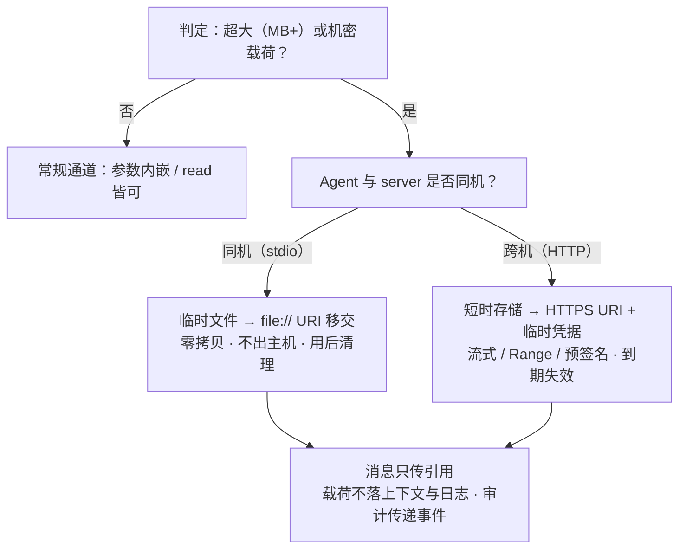

## 9. MCPP 扩展声明与协商

### 9.1 扩展标识与版本

MCPP 的能力需要 server 与 Agent 双向显式协商，遵循 MCP 扩展的协商机制（SEP-2133）。

- **协议版本**：MCPP 版本以 `MCPP-Version: 1.0`（当前草案）声明。Agent MUST 在每请求 `_meta` 中携带其支持的 MCPP 版本；Server SHOULD 忽略高于其实现的 MCPP 版本字段，按既有版本处理。
- **扩展命名空间**：MCPP 自身扩展的 capabilities 键使用保留前缀 `io.mcpp/`。Skill 传输能力**不新造 extension id**，直接复用官方 `io.modelcontextprotocol/skills`（其下新增的编排字段在 frontmatter `metadata."io.mcpp/*"` 中，见 5.2）。

> 设计说明：MCPP 不引入并行的 skills 扩展，而是「官方扩展为体，MCPP 字段为用」，避免生态分裂。

### 9.2 能力位

| 能力位 | 作用域 | 说明 |
| --- | --- | --- |
| `io.modelcontextprotocol/skills`（extension） | server declarations | 承诺实现 `skills/list` 与 `skills/get` |
| `io.modelcontextprotocol/skills.directoryRead` | extension setting | 承诺实现 `resources/directory/read` |
| `io.mcpp/server-catalog` | server declarations | Catalog endpoint 实现只读 `mcpp/servers/list` / `get` / `resolve`（3.7.1）；不声明即不得调用 |
| `io.mcpp/skill-orchestration` | agent-side（host 声明） | Agent 支持 `io.mcpp/depends_on` / `io.mcpp/tools` 编排字段的解析与拓扑加载 |
| `io.mcpp/context-budget` | agent-side | Agent 支持 `io.mcpp/context_budget` 预算约束 |

Server 的 skill 能力声明（示意，wire 细节属 MCP 层）：

```jsonc
"capabilities": {
  "extensions": {
    "io.modelcontextprotocol/skills": { "directoryRead": true }
  }
}
```

Agent（客户端）侧的 MCPP 编排能力属于宿主行为声明，主要用于 server 决定 instruction 措辞；Server 不得因 Agent 未声明编排能力而拒绝服务。

### 9.3 最低实现面

- 宣称实现 `io.modelcontextprotocol/skills` 的 Server，**MUST** 至少实现 `skills/list` 与 `skills/get`（空/局部列表合法）；
- 宣称 `directoryRead` 者，**MUST** 对其以独立文件服务的每个 skill 命名空间内目录支持该方法（方法本身通用，不限于 skill scheme）；
- `skills/get` 的未知 URI 返回 `-32602`，与 `resources/read` 未知资源一致；
- 宣称 `io.mcpp/server-catalog` 者，MUST 实现 3.7.1 的 `mcpp/servers/list`、`mcpp/servers/get`、`mcpp/servers/resolve`，且 `resolve` 无副作用；
- Agent 仅在看到对应声明后才调用相应方法；其余情况下 fallback 到 resources 渠道（3.4 的模板/指令基线）。

---

## 10. 安全与信任（Agent 视角）

MCPP 把安全规则写成 Agent 侧义务（与 SEP-2640 的安全模型一致），因为「能力如何被消费」最终发生在 Agent 层。

### 10.1 内容不可信与提示注入

- Agent **MUST** 将 MCP 下发的所有内容视为**不可信模型输入**：工具描述、资源注释、Skill 正文、指令字段，都可能被恶意或受损 server 用于注入。这包括 frontmatter 中的 description 被改为「要求执行敏感操作」的情形。
- 防御基线：与任何 server 提供文本同级的注入防御（隔离执行上下文、敏感操作二次确认、输出审计）。一个 server 被连接，不等于其内容获得权威地位。

### 10.2 origin 可见与原信任

- Skill 正文进入模型上下文时，Agent **MUST** 携带来源 server 的 **host-assigned 标签**显示（例如 `[来自服务器 office]`），MUST NOT 让远端 Skill 与本地文件系统 Skill 在上下文中不可区分；
- 决定是否遵循 Skill 指令的决策权 MUST 保留给模型本身（开放推理），宿主只能帮助模型看到来源；
- 跨 origin 资源读取是 confused-deputy 向量：由 skill A 触发的内容，Agent **MUST NOT** 顺带用它驱动对 server B 的 `resources/read`；任何跨 origin 读取 MUST 经显式、逐调用、点名双方的批准。
- 命名空间冲突即冒充面：恶意 server 可发布同名 Skill 冒充热门/本地的同名技能。Agent MUST 在 per-origin 命名空间内解析名称、MUST NOT 让远端 Skill 静默遮蔽或拦截其他来源的同名调用，SHOULD 向用户展示冲突。

### 10.3 批准与内容绑定

- **Skill 激活逐 Skill 批准**：作为 3.6 加载规则的补充，远端 Skill 的激活属于用户知情范围内的能力启用；宿主设计上 MAY 对本地可信任来源采用默认允许，但远端 Skill 的激活 **MUST** 至少经一次显式用户同意，且该同意不可跨 Skill、跨来源静默续用。
- **批准必须内容绑定（content-bound）**：持久化的批准 MUST 绑定批准时刻观察到的条目 `resources` 集合（每个 `{uri, digest}`）。此后条目若变化（文件旋转、增删）——无论来自 `skills/list` 还是 `skills/get` —— Agent **MUST** 视为原批准已撤销，重新征求同意后方可继续加载/执行。
- digest 校验保证的是「列表与所取内容一致」（防篡改、防过期），**不是**可信凭证：digest 与正文同源，联动改写的中间人可同时伪造两者。Match 不构成安全边界。
- 批准的 Skill 之外，不得因「同一文件空间内存在其他 SKILL.md」（嵌套）而使其生效（嵌套需自身激活，见 5.6）。

### 10.4 无隐式执行与权限授予

- Agent **MUST NOT** 因 MCP 下发的 Skill 内容（声明字段或正文指令）直接触发宿主机侧代码执行，除非该执行经逐 Skill 显式批准；
- Agent Skills 的 `allowed-tools` 等扩权字段，在 **MCP origin 的 Skill 上必须忽略**，除非用户就该 Skill 显式批准该项授予。远端 server 填写 `allowed-tools` 是请求提升宿主权限，不是声明自身属性；
- 上述批准与宿主自身的工具启用策略叠加；「Skill 该字段出现了」永不是权限依据。

### 10.5 缓存隔离与持久化

- Agent 若在本地磁盘缓存 MCP 下发的 Skill 内容，**MUST** 将缓存目录排除在所有文件系统 Skill 发现路径之外；自该位置加载 = 仍按「经 MCP 到达」对待，适用本节全部规则（含重启后、源 server 断开后）；
- 用户移除某 server 时，Agent SHOULD 移除其缓存内容；
- 敏感数据红线（贯穿全文）：API 密钥、token、PII 不得进入工具描述、Skill 正文、日志或错误文本；`x-mcp-header` 等路由元数据不得携带敏感参数（MCP 规范已禁止，MCPP 重申为 Agent 审计项）。

---

## 11. 一致性要求（Conformance）

### 11.1 Server / Skill 作者

| # | 要求 |
| --- | --- |
| S1 | Skill 目录 MUST 含根级 `SKILL.md`，frontmatter 至少 `name` + `description`，目录名 == `name` |
| S2 | skill 资源 URI MUST 遵循 `skill://{prefix/}{name}/{path}` 且末段 == `name`；SKILL.md 恒可寻址 |
| S3 | SKILL.md 资源 `mimeType` SHOULD 为 `text/markdown`，`name`/`description` 取自 frontmatter |
| S4 | 声明 skills 扩展者 MUST 实现 `skills/list`（空/局部列表合法）与 `skills/get`（未知 URI 返回 -32602） |
| S5 | `skills/list` 与 `skills/get` 条目中：`frontmatter` MUST 与 SKILL.md 逐字一致；`resources` 存在时 MUST 完整、含 SKILL.md、逐文件 `sha256:{hex}` digest |
| S6 | list 结果 MUST 确定性顺序；SHOULD 携带 `ttlMs`/`cacheScope` |
| S7 | 工具名遵守第 6.1 字符规则；`description` 写清适用场景与约束 |
| S8 | 状态型工具使用显式句柄，句柄过期错误以 `isError: true` 表述恢复方式 |
| S9 | frontmatter 的 `io.mcpp/` 字段仅使用本文档登记项；未知字段不阻塞 |
| S10 | 目录服务者的 skill 内相对路径 MUST 按 skill 根解析（含嵌套目录文件） |
| S11 | 实现项目 MUST 按 Agent Plugin 1.0.0 布局组织（`plugin.json` + `skills/` + `mcp.json`）；`name` 遵守第 3.2 约束 |
| S12 | 聚合 HTTP 出口（3.7）：各子端点为独立 MCP endpoint 与 origin，路径 MUST 明确可审计；端点间不得静默互访；stdio 不支持该形态 |
| S13 | 以 npm 包分发者（若采用，第 4 章）：包根即插件根；`package.json` 与 `plugin.json` 的 `name`/`version` MUST 一致；`keywords` MUST 含 `mcpp-plugin`；`files` 白名单含全部 MCPP 组件、MUST NOT 含凭据与运行数据 |
| S14 | 声明 `io.mcpp/server-catalog` 者（3.7.1）：只列出当前调用者可连接的已挂载 Child MCP；`id ↔ endpointPath` 唯一稳定且可审计；`resolve` 仅返回同 authority 的相对路径并校验 `entryDigest`；MUST NOT 下发、安装、启动、provision 或代理能力 |

### 11.2 Agent / Host

| # | 要求 |
| --- | --- |
| A1 | 三阶段生命周期：Discover 只摄入元数据；Evaluate 不加载正文；Consume 才读取 |
| A2 | 渐进式披露：SKILL.md 正文 MUST NOT 无条件全量注入；references 等按需懒加载 |
| A3 | per-origin 命名空间；host-assigned 标签标识 server，不依赖 `serverInfo.name` |
| A4 | 同名技能/工具跨 origin MUST NOT 静默遮蔽或替换 |
| A5 | Skill 加载 MUST 校验 digest 与 frontmatter 一致性；失败即弃用，可经 `skills/get` 刷新重试 |
| A6 | 空/局部 `skills/list` 不得判定「无 Skill」；URI 可直接读 |
| A7 | `depends_on` 拓扑加载、环检测、缺口报告（宣称 `io.mcpp/skill-orchestration` 时） |
| A8 | 阅读 Skill 时携带 origin 标记；模型有权且仅依赖此标记决策 |
| A9 | 远端 Skill 批准：内容绑定、逐 Skill、改集即撤销；MCP origin 的 `allowed-tools` 忽略 |
| A10 | 订阅/缓存遵循 `ttlMs`/`cacheScope`；`resources/updated` 后立即标为 stale，并在活跃引用或下次使用时重取 |
| A11 | MRTR input_required：暂停 → 用户决策 → 原请求重发；禁止代答 |
| A12 | 错误处置：执行错误回传模型自纠；协议错误有限重试；无界重试禁止 |
| A13 | 缓存隔离：远端 Skill 缓存不进本地 skill 发现路径，断开后仍按 MCP 对待 |
| A14 | 插件加载顺序按 3.5 REQUIRED：manifest → skills/ → mcp.json → 连接 server，失败按隔离规则处理 |
| A15 | 技能命令化时（5.9，若采用）：命令名 MUST 可追溯到归属 origin（per-origin 前缀等为可用策略）；注入 MUST 携带 origin 来源标记 |
| A16 | 多 server 共存（2.5 底线①）：跨 server 能力的呈现 MUST 可追溯到归属 origin；实现策略（分区、前缀、注入集）属 Agent 层 |
| A17 | 2.5 底线②：Agent 消歧 MUST NOT 静默遮蔽 / 替换任何来源的能力，能力消失或冲突悬而未决时必须可观测（A4） |
| A18 | 超大 / 机密载荷（8.6）：MUST 引用优先，不内嵌 JSON-RPC；载荷引用短期有效、不留日志、不入上下文摘要；谁创建谁清理 |
| A19 | Tool 懒加载与 Tool Search（6.6）：目录元数据入索引，定义按命中注入；零候选时如实报告，MUST NOT 杜撰工具 |
| A20 | registry 安装的插件（第 4 章）：按远端不可信内容对待（10.1）；origin 标签携带 registry 来源（4.3）；安装后仍按 3.5 顺序加载；升级时按 content-bound 复核批准（10.3），MUST NOT 静默沿用旧批准 |

### 11.3 判定

- 全部 MUST 项满足 —— conforming；
- 任一 MUST 项不满足（约定职责内）—— non-conforming，互操作不保证；
- SHOULD / RECOMMENDED 项满足与否需在实现说明中声明。

---

## 附录 A：本仓库参考实现

本仓库以两层结构落地 MCPP（即 1.1「项目身份」的实现示例）：

- [`packages/mcpp`](packages/mcpp)：规范行为即代码的 SDK——skills 扫描/摘要/资源挂载（`ResourceForSkills`，第 3.4 双通道投影参考实现）、双模式启动（stdio + streamable HTTP）、默认 `127.0.0.1:8457`、`createGateway` 聚合与只读 Server Catalog（第 3.7–3.7.1）、`plugin.json`/`mcp.json` 校验。
- [`examples/plugins/monorepo`](examples/plugins/monorepo)：聚合上层（monorepo 拓扑，第 3.7）——单一 HTTP 出口包含 `/catalog/mcp`、`/openspec/mcp` 与根路径 HTML + CDN Catalog demo；Catalog 仅解析静态 Child endpoint，不提供安装或下发。`openspec/skills` 打包第三方 OpenSpec 技能集（通道 A 素材），由子 server 投影为 `skill://` 资源（通道 B）。
- [`examples/plugins/.mcp.json`](examples/plugins/.mcp.json)：MCP 客户端级配置（`streamable-http` 指向聚合出口），与第 3.3 的插件级 `mcp.json` 同构——客户端把插件的便携 `mcp.json` 映射到自身原生 MCP 配置。

**待办标记**（通往完整 MCPP conforming）：

- 为聚合上层补齐插件清单 `plugin.json`（对应 3.2）；
- 实现 `skills/list` / `skills/get` / `directoryRead`（对应 S4/S5）与 `io.mcpp/*` 编排字段解析（对应 A7）；
- 为 `packages/mcpp` 补充 MCPP Registry 工具（第 4.1 的 `@mcpp/registry` 形态：search / install / publish / validate，对应 S13）。

## 附录 B：术语

| 术语 | 定义 |
| --- | --- |
| MCPP / MCP Plus | 本文档：MCP 2026-07-28 之上的 Agent 层交互规范 |
| Agent Plugin | agent-plugins.org 1.0.0 定义的部署单元：plugin.json + 可选 skills/ 与 mcp.json（第 3 章）；MCPP 的标准分发形态 |
| origin | Agent 可区分的能力来源：一个连接的 server、或一个插件（含其打包技能）各构成一个 origin；以 host-assigned 标签标识 |
| manifest（plugin.json） | 插件可移植清单：身份与元数据的闭合字段集（3.2） |
| mcp.json | 插件内 MCP 执行承载声明：`mcpServers` 的闭合字段集（3.3） |
| 双通道分发 | 插件技能的两条通道：`skills/` 打包（静态、filesystem origin）与 MCP `skill://`（动态、server origin），同源投影（3.4） |
| Skill | 目录 + SKILL.md（frontmatter + 指令正文）+ 可选的 references/scripts/assets |
| 渐进式披露 | Discover（元数据）→ Activate（正文）→ Execute（按需加载支持文件）的阶段模型 |
| content-bound 批准 | 批准绑定观察到的 `resources` 集合（{uri, digest}），集合变化即撤销 |
| 编排（orchestration） | MCPP 新增：依赖拓扑加载、工具绑定、上下文预算的 Agent 层协作 |
| registry | Agent 侧能力目录：每个能力只存元数据（name/description/origin/URI） |
| MCPP Registry | 插件分发与发现渠道：任意标准 npm registry 均构成（4.1）；MCPP 的 registry 工具集以标准 npm 包形态分发 |
| 部署形态（deployment form） | MCPP 插件能力的两类部署形态——monorepo server（形态一，中心化）与 MCPP Registry 下发（形态二，端侧 stdio）；正交、可并存，按企业部署与管理需求选择（第 4 章引言） |
| monorepo server 形态（形态一） | 单一 HTTP 出口路径路由多个 server，企业服务端集中部署与管理，Agent 经 streamable-http 连接（3.7） |
| MCPP Registry 下发形态（形态二） | 插件以标准 npm 包经 npm registry 下发，stdio server 在端点本地运行，分发/安装/更新复用 npm 生态（第 4 章） |
| 分发外壳（distribution shell） | npm 包作为插件的分发载体：解决发现、安装、更新；与 `mcp.json`（执行承载声明）职责正交（4.3） |