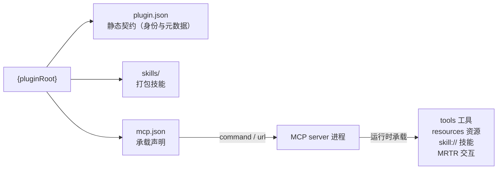
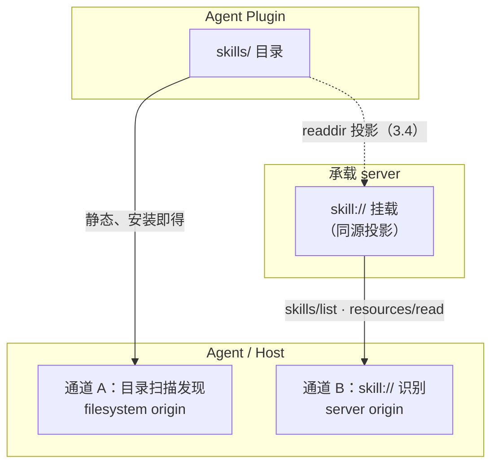
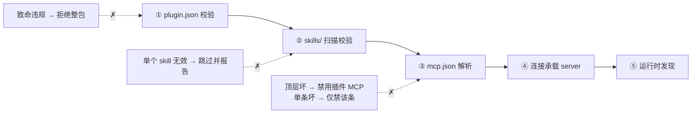

# 3. Agent Plugin：打包、发现与执行承载

[文档库首页](index.md) · [上一篇：核心模型](core-model.md) · [下一篇：MCP Mono Server](mcp-mono-server.md)

相关模块：[MCP Mono Server](mcp-mono-server.md) · [MCP Skills 与 Agents](mcp-skills.md)


MCPP 的实现即是一个 **标准的 Agent Plugin**（[agent-plugins.org](https://agent-plugins.org) 规范 1.0.0）：`plugin.json` 声明身份与元数据、`skills/` 打包技能、`mcp.json` 声明 MCP server 作为**执行承载**。MCPP 以这一可移植形态作为标准部署单元，本章规定其布局、约束与 Agent 侧加载顺序，以及它们与 [MCP Skills](mcp-skills.md) 和 [MCP Tools](mcp-tools.md) 的衔接关系。

## 3.1 插件形态

一个 Agent Plugin 是自包含目录，组件位于固定位置（**分发形态**——如何打包为 npm 包、如何经 MCP Registry 发现与安装——见 [MCP Registry](mcp-registry.md)）：

```
{pluginRoot}/
├── plugin.json          # REQUIRED：可移植清单（身份与元数据）
├── mcp.json             # OPTIONAL：MCP server 承载声明（执行载体）
├── skills/              # OPTIONAL：打包技能目录（每个直接子目录一个 skill）
└── ...                  # server 可执行、资源文件等
```

MCPP 视角下的职责划分：

| 组件 | 角色 | 生命周期 |
| --- | --- | --- |
| `plugin.json` | **静态契约**：插件身份、元数据、规格版本 | 安装/启用时校验一次 |
| `skills/` | **打包技能**：开箱即用的本地技能（filesystem origin） | 安装时即存在，随插件版本演化 |
| `mcp.json` 声明的 server | **运行时承载**：tools、resources、`skill://` 技能、MRTR 交互等动态能力 | 客户端按需启动/连接，运行时发现 |

一个 MCPP server 项目的可执行入口（stdio 或 streamable HTTP）就是 `mcp.json` 中 `command`/`url` 所指的目标；插件的动态能力全部经由该 server 以 MCP 2026-07-28 语义提供。



## 3.2 plugin.json：可移植清单（manifest）

[Manifest 规范](https://agent-plugins.org/plugin-authors/manifest)定义闭合（closed）字段集，MCPP 完全采用：

```json
{
  "$schema": "https://agent-plugins.org/schemas/1.0.0/plugin.schema.json",
  "name": "office",
  "version": "1.0.0",
  "description": "Office document processing plugin",
  "license": "MIT",
  "keywords": ["office", "documents", "markdown"]
}
```

| 字段 | 必填 | 语义 |
| --- | --- | --- |
| `$schema` | 是 | 选择校验与解释契约（插件必须声明规范 schema 标识） |
| `name` | 是 | 插件名与包标识（约束见下） |
| `version` | 否 | 插件版本，RECOMMENDED 使用 SemVer |
| `description` | 否 | 插件简介 |
| `author` | 否 | 对象：`name` / `email` / `url` |
| `homepage` / `repository` / `license` / `keywords` | 否 | 文档、仓库、SPDX 许可证、检索关键词 |
| `extensions` | 否 | 客户端私有数据，按 reverse-domain 命名空间组织 |

约束（MCPP 重申为规范性要求）：

- `name`：1–64 字符，仅小写 ASCII 字母、数字、连字符、点；首尾必须为字母数字；不得含 `--` 或 `..`；
- 未知顶层字段：schema 违规但**不致插件失效**——客户端报告并忽略；其他 schema 违规（如缺 `$schema` / `name`）**致命**——客户端拒绝发现与执行该插件；
- 插件私有数据 MUST 放 `extensions` 下，MUST NOT 扩展现有顶层字段。

## 3.3 mcp.json：MCP 执行承载

[MCP servers 规范](https://agent-plugins.org/plugin-authors/mcp-servers)定义闭合的 `mcp.json`：顶层只有 `$schema` 与 `mcpServers`。客户端将其映射到原生 MCP 配置；MCP 线级行为仍由 MCP 规范负责。

```json
{
  "$schema": "https://agent-plugins.org/schemas/1.0.0/mcp.schema.json",
  "mcpServers": {
    "office": {
      "type": "stdio",
      "command": "./bin/office",
      "args": ["--stdio"],
      "env": { "CONFIG": "${PLUGIN_ROOT}/config.json" },
      "cwd": "${PLUGIN_ROOT}"
    }
  }
}
```

承载约定：

- 传输类型：`stdio`（`type` + `command` 必填，可选 `args`/`env`/`cwd`）、`streamable-http`（`type` + `url` 必填，可选字面量 `headers`）、`sse`（已弃用，可选支持）；
- `command` 是**单个可执行 token**（裸可执行名或 `./` 开头的插件相对路径），不是 shell 命令；占位符展开不适用于 `command`；
- **stdio server 的推荐分发形态是 NPM 包**（见 [MCP Registry](mcp-registry.md) 及其权威设计 [`MCP_REGISTRY.md`](../MCP_REGISTRY.md)）：MCPP Store 生成包含 `command: "npx"` 和参数数组的 MCP JSON，参数中指定 MCPP NPM-compatible registry、package、version 与 bin；Client 只消费配置，不得把结果作为 shell 解释；
- 客户端提供 `PLUGIN_ROOT`（插件根）与 `PLUGIN_DATA`（跨更新持久化的可写数据目录）两个环境变量；`args`、`env` 值、`cwd` 中做 `${PLUGIN_ROOT}` / `${PLUGIN_DATA}` 文本展开（单趟、非递归）；插件不得覆盖这两个保留变量；
- 远程 `url` 必须为绝对 HTTP(S) URL，无 userinfo 与 fragment；非 loopback 必须 HTTPS；
- `headers` 是字面量、随包可见的数据，**MUST NOT** 含凭据或密钥；Agent Plugins 1.0.0 未定义便携 OAuth/凭证引用字段，认证由客户端管理；
- 包边界：所有 `./` 相对路径 MUST 解析在插件根内；禁止用符号链接等手段逃逸包。

MCPP 附加要求：

- 插件内 MCP server SHOULD 声明 `io.modelcontextprotocol/skills` 扩展（协商见第 9 章），使插件打包技能在运行时也可经 `skill://` 通道发现（见 3.4）；
- 承载 server 的工具、资源与技能元数据质量要求与第 5、6 章一致，不因「本地插件」降级。

## 3.4 skills/ 与 MCP skill 双通道

插件内的技能存在**两条分发通道**：

| 通道 | 载体 | origin | 特性 |
| --- | --- | --- | --- |
| A 打包通道（静态） | `skills/` 直接子目录（每个含 `SKILL.md`） | 插件自身（filesystem） | 离线可用、随插件版本化、安装即发现 |
| B 运行通道（动态） | MCP server 的 `skill://` 资源 / skills 扩展（第 5 章） | 承载 server | 动态更新、可编排、支持远程 server |



[Skills 规范](https://agent-plugins.org/plugin-authors/skills)规定通道 A 的布局：客户端只扫描 `skills/` 的**直接子目录**，不递归更深处；格式委托 Agent Skills 规范（MCPP 第 5.1–5.2 节内容适用于两种通道）。

MCPP 双通道规则：

- **同源投影**：插件内 server 的 `skill://` 挂载 MUST 与 `skills/` 目录内容同源同版（推荐实现为目录投影——本仓库 `ResourceForSkills.ts` 即实时 `readdir` 挂载，一份源两个通道），MUST NOT 维护两份漂移内容；
- **去重与遮蔽**：通道 A 与通道 B 属同一插件但 origin 不同（插件 vs server）。Agent 按 2.4 的 per-origin 命名空间处理：两通道同名校技能 MUST NOT 静默互相遮蔽；用户视角下应展示来源（本地打包 / server 承载）；
- **何时用哪条**：A 用于「安装即得、离线可用、可审计的固定技能」；B 用于「随 server 动态更新、参与 `depends_on` 编排、跨 server 组合」的技能。同一技能两通道并存合法，Agent 任取其一即可满足（B 的加载仍需 5.6 的校验）。

## 3.5 加载顺序与失败隔离

客户端加载一个插件的顺序 **REQUIRED**：

1. 校验 `plugin.json`（失败 → 拒绝整个插件，不发现任何组件）；
2. 扫描 `skills/` 直接子目录，逐个校验 `SKILL.md`（单个无效 → 跳过该技能、报告、继续）；
3. 解析 `mcp.json`（顶层无效 → 禁用该插件全部 MCP；单条 server 无效/不可用 → 仅禁用该条，其他 server、技能与扩展继续加载）；
4. 按 `mcp.json` 启动/连接承载 server，进入运行时发现（第 5、6 章）。



各步骤的失败互相隔离：技能坏不影响 server，server 坏不影响打包技能。

## 3.6 与核心模型的衔接

- **插件是一种 origin 形态**：插件（及其打包技能）与插件内承载 server 分别构成 origin；2.4 的 host-assigned 标签、命名空间与遮蔽规则同等适用；
- **信任分层**：`skills/` 打包技能属于「本地可信任」类别（10.3 的默认允许策略适用）；但**经 `mcp.json` 启动的承载 server 所服务的任何内容（含 `skill://`），无论进程是否本地，一律按 MCP origin 的不可信规则对待**——与 10.5 缓存隔离精神一致，本地进程不自动获得本地信任；
- 生命周期（2.2 三阶段）与渐进式披露（2.3）对两个通道同等生效。
