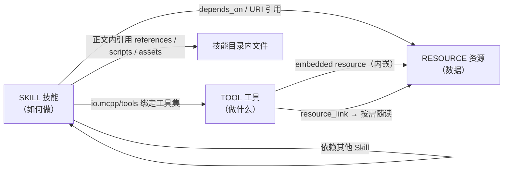
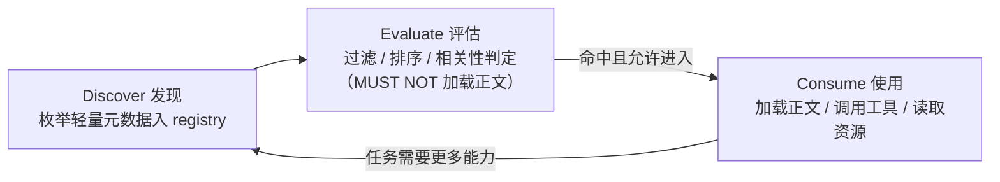
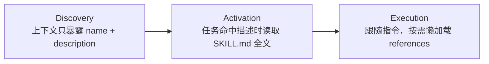
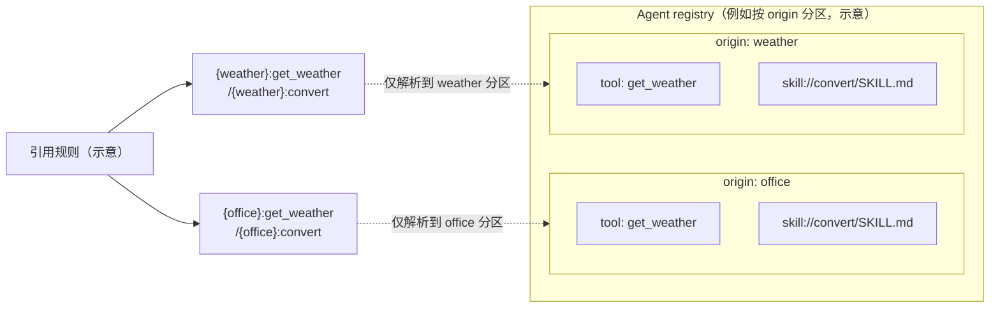

# 2. 核心模型

[文档库首页](index.md) · [上一篇：引言](introduction.md) · [下一篇：Agent Plugin](agent-plugin.md)

## 2.1 能力三角

MCPP 将 MCP 暴露给 Agent 的能力归纳为三类，其 Agent 侧语义为：

| 能力 | MCP 承载 | Agent 侧含义 | 典型内容量 |
| --- | --- | --- | --- |
| **Skills**（技能） | Resources + `skills/list`、`skills/get`（SEP-2640） | 「**如何做**」：多步骤工作流、编排指令。决定 Agent 如何调用其他能力 | 中等～大（可达数百行 Markdown），必须渐进披露 |
| **Tools**（工具） | `tools/list`、`tools/call` | 「**做什么**」：单个可执行动作 | 小（名称 + 描述 + schema） |
| **Resources**（资源） | `resources/list`、`resources/read` | 「**用到的数据**」：上下文、文档、模板 | 不确定，按需读取 |

三者可以相互引用，是 MCPP 最重要的编排事实：

## 2.2 交互生命周期

MCPP 规范 Agent 对每一项能力都依次经历三个阶段（循环迭代）：

- **Discover（发现）**：Agent 在启动、连接加入时建立能力目录（registry），只摄入轻量元数据（tool 名与描述、skill 名称与描述、资源注释），不加载正文；
- **Evaluate（评估）**：依据元数据决定「是否相关、是否值得使用」（过滤 audience、比对 priority、判断描述相关性）；
- **Consume（使用）**：真正加载正文 / 调用工具 / 读取资源，其间遵循渐进披露与校验规则。

MCPP **MUST** 保持三阶段分离：Evaluate 阶段 MUST NOT 加载能力正文，Consume 阶段才允许。

## 2.3 渐进式披露

MCPP 采用与 Agent Skills 一致的**渐进式披露**（progressive disclosure）模型：

好处：Agent 可以同时在手大量能力，而上下文占用极小。MCPP **REQUIRED** 在 Agent 侧实施该模型；能力完整正文（尤其 Skill 正文）MUST NOT 无差别、无条件注入上下文。

## 2.4 命名空间与 origin

MCP 2026-07-28 是无会话协议，工具名、资源名的唯一性只限于单个 server。Agent 可能同时连接多个 server，因此：

- 每个连接的 server 在 Agent 侧构成一个 **origin**（能力来源）；
- Agent MUST 为每个 origin 分配**宿主命名的标识**（host-assigned label），MUST NOT 依赖 server 自报的 `serverInfo.name` 作为身份与去重依据（多 server 可同名）；
- Skill 名称、Tool 名称、资源 URI 的冲突解析一律在 **per-origin 命名空间**内进行；
- 跨 origin 的同名能力 MUST NOT 互相遮蔽、静默替换（见[安全与信任](security.md)）。

MCPP 的编排与安全规则都建立在 origin 概念之上：依赖解析、资源读取、批准粒度都以 origin 为单位签发（插件作为一种 origin 形态，见 3.6）。

## 2.5 多 server 共存：指出冲突，把解法留给 Agent

**协议事实**：MCP 的能力唯一性只限于单个 server（2.4）。Agent 同时连接多个 server 时，同名工具、同名技能、同名资源**必然可能发生**——且 MCP 协议层不存在 server 之间的协调通道，冲突无法由两端协商避免。MCPP 对此只承担两项职责：**指出这一事实**，并**划定 Agent 消歧必须满足的协议底线**；具体的消歧策略是 Agent 宿主的内部决策（1.6 分工边界）。

MCPP 指出的三类问题：

- **① 同名撞车**：两个 server 均可暴露 `get_weather`、`skill://convert/SKILL.md` 等同名能力。这是预期常态而非实现缺陷；
- **② 注入失控**：server 数量越多，无差别注入导致的上下文占用、相互干扰与缓存串味越严重。缓解手段（注入集选择、按 origin 计量预算、缓存管理算法）属于 Agent 层，MCPP 不规定；协议侧抓手分别见 2.2（评估只依赖元数据）、7.2（annotations 过滤语义）、10.5（缓存条目携带来源）；
- **③ 归属不清**：能力混在一起后，用户、批准、审计无法判断「这个工具 / 技能 / 资源是哪个来源」。

**Agent 层的解法（示意，non-normative）**：宿主可能采用「以 host-assigned origin 标签作前缀」的策略——工具 `{origin}:{tool}`、命令 `/{origin}:{skill}`、资源 `{origin}:{uri}`，并对 registry 按 origin 分区存储。这只是一种可行形态：

**协议底线**（仅两条，均属可审计性与安全范畴，Agent 的任何实现都必须满足）：

- **可追溯呈现**：Agent 把跨 server 能力呈现给用户、批准流程或审计时，引用 MUST 无歧义地追溯到归属 origin；无法归属的引用不得呈现为已确认能力；
- **可观测变化**：Agent 的消歧处理 MUST NOT 静默遮蔽或替换任何来源的能力（A4）；能力消失、被覆盖或冲突悬而未决时，必须可观测（提示 / 报告 / 记录）。

---
