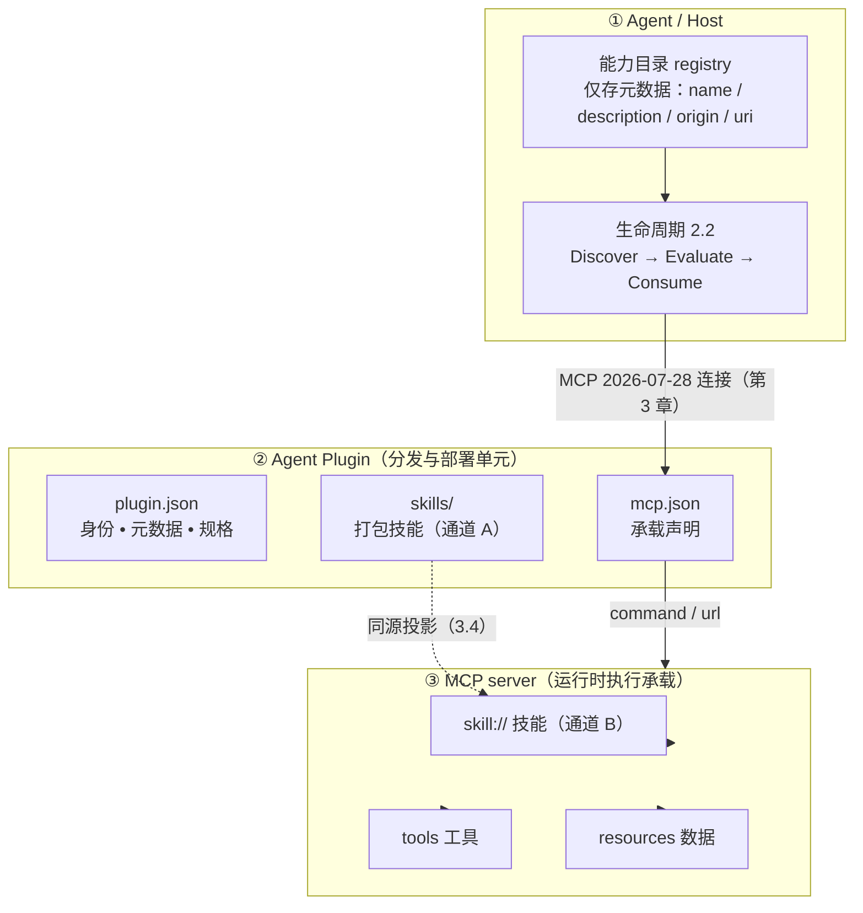

# 1. 引言

[文档库首页](index.md) · [下一篇：核心模型](core-model.md)

## 1.1 什么是 MCPP

MCP（Model Context Protocol）解决了「如何在客户端与服务器之间传递能力」的问题：定义工具、资源、提示词的传输格式与调用方法。但 MCP 规范本身**不关心 Agent 如何使用这些能力**——何时加载一个 skill、按什么顺序编排多个 skill、依据什么缓存工具目录、如何信任远端下发的指令内容，这些决策属于 Agent 层。

MCP Plus（以下简称 **MCPP**）是在 MCP 2026-07-28 之上的**协议扩展规范**，把上述 Agent 层决策标准化：

- 定义 **Agent Plugin** 作为标准分发与部署形态：`plugin.json` 身份清单、`skills/` 打包技能、`mcp.json` 声明的 MCP server 作为运行时执行载体（第 3 章），覆盖中心化 HTTP 挂载与端侧 stdio 两种执行形态；
- 定义 **MCP Registry**、**MCP NPM Registry** 与 **MCP Mono Server** 三个独立系统：NPM Registry 是 keyword、manifest 与版本唯一权威；Registry 动态投影 Store；Mono Server 透明转发 HTTP MCP；Dynamic Host 通过成熟 Worker Isolate 编排层部署 Server runtime（第 4 章）；
- 定义 **MCP Skills**（Skill 作为一等公民）的承载格式、传递约定与编排规则（依赖声明、拓扑加载、工具绑定），定义 **MCP Agents**（可下发的 subagent 配置资源）的承载、发现、激活与权限收敛规则，以及 **MCP Tools** 的 Agent 侧工具使用约定（第 5/6 章）；
- 定义 **MCP Resources** 的 Agent 层统一策略：资源**发现**（渠道、过滤、排序、缓存、新鲜度，第 7 章）与资源**使用**（读取、订阅、嵌入、引用、输入需求、状态句柄，第 8 章）；其中缓存与新鲜度细化为 **MCPP Cache**（7.3），服务端推送以标准 Resource Subscription 为唯一线级机制，并定义 `ChannelManager` / `Channel` / `send` / `receive` SDK 抽象（8.2）；
- 定义 **MCP Extension** 的扩展声明与双向协商约定（能力位、版本、最低实现面，第 9 章）；其中 Channel 服务端推送不新增 capability 或私有 JSON-RPC method；
- 为 server 与 Agent 提供可验证的 **一致性要求**（conformance requirements）。

MCPP 同时具有**双重身份**：

- **规范身份**：MCPP 是一份 **MCP 的规范化规范**（conforming spec）——不发明新的传输语义，只把 Agent 层决策（何时加载 skill、按什么顺序编排、如何缓存工具目录、如何信任远端指令）翻译为可执行、可验证的规范性条款；
- **项目身份**：MCPP 的实现是一个**标准的 Agent Plugin**——严格遵守 [agent-plugins.org](https://agent-plugins.org) 1.0.0 的 `plugin.json` / `skills/` / `mcp.json` 布局与约束，是一个可分发、可安装、可审计的标准插件；其执行能力由插件声明的 MCP server 承载。

两种身份互为表里：**项目形态**保证规范落地时可分发、可部署；**规范条款**保证项目行为在 Agent 层可预测、可交互。

MCPP 不脱离 MCP：**所有传输、JSON-RPC、认证、路由、无状态、订阅与 MRTR 语义一律由 MCP 2026-07-28 规范负责**。MCPP 的 Agent 层约定与已登记扩展遵循第 9 章；其中服务端 Channel 推送 **MUST** 完全映射为标准 Resources 与 Subscriptions，MUST NOT 另造 vendor-specific Channel capability 或 notification。

总览（全篇结构 —— Agent 生命周期 · 插件分发 · server 承载三层模型）：

图与章节对应：**①** 生命周期见 2.2、渐进披露见 2.3、origin 见 2.4；**②** 插件形态见第 3 章、分发渠道见第 4 章；**③** 技能/工具/资源分别见第 5、6 章与第 7、8 章。

## 1.2 范围与边界

本文档 **规定**（within scope）：

- Skill 的结构、URI 约定、发现与加载流程，以及 MCPP 新增的编排字段；
- Agent Plugin：插件清单 `plugin.json`、执行承载声明 `mcp.json`、`skills/` 打包技能与 MCP skill 双通道分发（第 3 章）、**MCP Mono Server** 聚合（HTTP 路径路由，3.7）；
- MCP Registry 体系：NPM keyword / manifest 动态形成 Store，不建双份定义表；version 跟随 dist-tag；Dynamic Host 将 Server package 部署到 Worker Isolate，Mono Server 透明转发 MCP；stdio 保持 Client 本地执行（第 4 章）；
- **MCP Tools**：工具目录的 Agent 消费约定——元数据质量、可追溯引用（2.5）、状态句柄、错误处理、懒加载与 Tool Search（6.6）；
- **MCP Resources · 发现**：`resources/list`、`resources/templates/list`、目录读取、缓存与注释（annotations）的使用策略（第 7 章）；
- **MCP Resources · 使用**：读取、标准订阅、双向服务端抽象（`ChannelManager` / `Channel` / `send` / `receive`）、嵌入、引用跟随、输入需求、状态句柄（第 8 章）；其中缓存细化见 **MCPP Cache**（7.3）；
- 超大载荷与私域数据的引用优先传递（8.6，stdio 同机 vs HTTP 跨机通道选择）；
- Channel 服务端推送的纯标准 MCP 绑定边界与安全信任边界；
- 技能的命令化（slash command）用户触达模式（5.9）；
- 多 server 共存：冲突事实、注入治理抓手与协议底线（2.5）；
- 一致性要求与检查清单。

本文档 **不规定**（out of scope，均指向 MCP 规范或 agent-plugins.org）：

- 传输层与消息格式（stdio / Streamable HTTP / header 路由 / `Mcp-Method` / `Mcp-Name`）；
- 无状态核心、每次请求的 `_meta`、`server/discover`、Multi-Round-Trip Requests 的传输语义；
- JSON Schema 2020-12 的具体语法、分页与缓存的线级字段定义（`cursor` / `ttlMs` / `cacheScope` 的取值规则见 MCP 规范）；
- OAuth / 授权 / 加密传输；
- Agent Plugins 的 schema 机器校验细节，以及安装器实现、启停、更新、卸载等客户端管理机制（属 agent-plugins.org 规范与宿主实现；Registry 仅规定只读目录和 transport 派发契约，见第 4 章）。

MCPP 文档凡涉及上述内容，只引用到 MCP 规范条目，不复述其动作细节。

## 1.3 读者

- **Agent / Host 实现者**：本文档第 2、3、7、8、10、11.2 章为其规范性要求；
- **MCP server / Skill 作者 / 插件作者**：第 3、4、5、6、9、11.1 章为其规范性要求；
- **SDK 维护者**：第 9 章的协商与能力位定义。

## 1.4 文档约定

- 关键词 **MUST、MUST NOT、REQUIRED、SHALL、SHALL NOT、SHOULD、SHOULD NOT、RECOMMENDED、MAY、OPTIONAL** 按 [BCP 14](https://datatracker.ietf.org/doc/html/bcp14)（RFC 2119 / RFC 8174）解释，仅当其以全大写出现时有效。
- 示例如无特别说明均为说明性（non-normative）。
- 「服务器」/「server」指 MCP server；「Agent」指承载模型、消费 MCP 能力的宿主（host）；「origin」指一个 Agent 可区分的能力来源，详见 2.4。

## 1.5 参考文件

| 文件 | 用途 |
| --- | --- |
| [MCP 2026-07-28 规范](https://modelcontextprotocol.io/specification/2026-07-28) | 传输、方法、字段的权威定义 |
| [MCP 2026-07-28 · Resources](https://modelcontextprotocol.io/specification/2026-07-28/server/resources.md) | 资源原语 |
| [MCP 2026-07-28 · Tools](https://modelcontextprotocol.io/specification/2026-07-28/server/tools.md) | 工具原语 |
| [MCP 2026-07-28 · Subscriptions](https://modelcontextprotocol.io/specification/2026-07-28/basic/patterns/subscriptions) | `subscriptions/listen`、订阅过滤、确认、取消与通知关联 |
| [MCP 2026-07-28 · Streamable HTTP](https://modelcontextprotocol.io/specification/2026-07-28/basic/transports/streamable-http) | 长期 POST response SSE 与现代无会话传输语义 |
| [SEP-2640 Skills Extension](https://github.com/modelcontextprotocol/experimental-ext-skills/blob/main/docs/sep-draft-skills-extension.md) | Skills 传输绑定（Draft）；MCPP 以其为基线并对齐演进 |
| [Agent Skills 规范](https://agentskills.io/specification) | SKILL.md 内容格式、frontmatter 与渐进式披露 |
| [Agent Plugins · Manifest](https://agent-plugins.org/plugin-authors/manifest) | 插件清单 plugin.json 的字段与约束 |
| [Agent Plugins · MCP servers](https://agent-plugins.org/plugin-authors/mcp-servers) | mcp.json 承载声明与传输约定 |
| [Agent Plugins · Skills](https://agent-plugins.org/plugin-authors/skills) | skills/ 目录布局与失败隔离 |
| [npm registry 文档](https://docs.npmjs.com/cli/v10/using-npm/registry) | MCP R 直接采用的包管理、版本、下载与权限语义；MCPP Store / MCP JSON 生成见 [`MCP_REGISTRY.md`](../MCP_REGISTRY.md) |
| 本仓库 [`examples/plugins/monorepo`](../examples/plugins/monorepo) | 参考实现（聚合出口 + skill:// 自动挂载 + CF 部署） |

## 1.6 分工边界：谁定义什么

MCPP 的价值在于把 **Agent 层交互的协议契约**标准化，而非替各层重复造轮子。规范中每一项要求都必须能对号入座：**凡已有规范覆盖的内容，MCPP 只引用、不重述；凡属宿主内部实现的决策，MCPP 只指出存在性与底线、不规定实现策略**。

| 层次 | 负责什么 | 本规范的处理 |
| --- | --- | --- |
| **MCP 2026-07-28** | 传输、JSON-RPC、无状态 / MRTR、认证、缓存字段（`ttlMs` / `cacheScope`）、工具 / 资源 / 提示词的线级格式 | 一律引用官方规范（1.2），不重述动作细节 |
| **Agent Skills 规范** | `SKILL.md` 内容格式、frontmatter 字段、渐进式披露概念 | 格式委托（5.1）；披露概念引用 2.3 |
| **Agent Plugins** | 插件打包布局、`plugin.json` / `mcp.json` schema、schema 校验、失败隔离 | 第 3 章定义「MCP server 承载执行」的衔接契约；第 4 章引用独立 Registry 设计；schema 细节引用 agent-plugins.org，安装/更新机制属宿主 |
| **Agent 宿主（Host）** | 消歧策略、注入集选择、上下文预算算法、缓存管理算法、命令 UI 呈现、审计存储等**实现决策** | 指出问题存在与协议底线（如 2.5「不得不静默遮蔽」），**实现策略明确标注属 Agent 层**，不得作为 MUST 规定 |
| **MCPP（本文档）** | Agent 层交互的协议级契约：能力身份（origin）、Skill 传递与编排字段、发现 / 使用策略的约束、扩展协商、安全底线、一致性要求 | 本文档 |

判定原则：**凡能写成「必须对所有对话双方成立」的，属 MCPP；凡能写成「某宿主内部怎么做」的，归 Agent 层**。对 Agent 层实现策略 MCPP 只能以 MAY / 「例如」给出方向性建议。

> 注意：SEP-2640 与 MCPP 均为草案形态。MCPP 以 SEP-2640 v1 基线为准；SEP-2640 正式发布后的字段若与本文冲突，以 MCP 官方为准，MCPP 落后之处在下一版本对齐。

---
