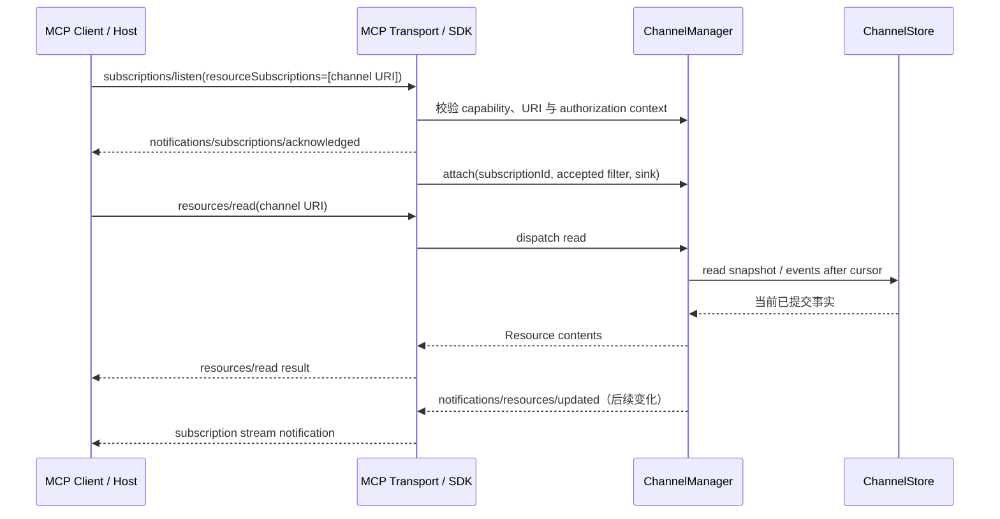
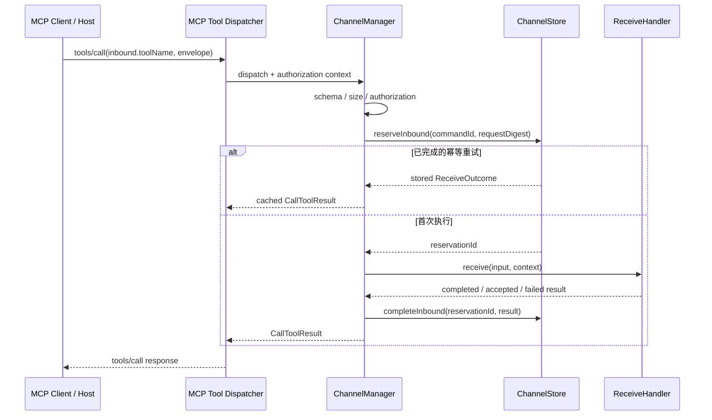

# 8.2 MCP Channel：资源订阅与双向交互

[文档库首页](index.md) · [上一篇：MCP Resources 使用](resource-usage.md) · [下一篇：Channel SDK 接口](channel-sdk.md)

类型接口：[Channel SDK 接口](channel-sdk.md) · 一致性条款：[S16–S21](conformance.md)


MCPP 的服务端推送 **MUST** 只使用 MCP 2026-07-28 的标准 Resource Subscription：Server 将可推送对象建模为可读取 Resource，Client 通过 `subscriptions/listen` 订阅稳定 Resource URI；对象变化时 Server 发送 `notifications/resources/updated`，Client 再以 `resources/read` 读取最新事实。通知只是**失效信号**，不是事件正文、可靠消息或 Agent turn。

- Server 声明 `resources.subscribe: true` 时，具体资源变化经 `subscriptions/listen` 的 `resourceSubscriptions` 过滤器投递；只有新增、删除或重命名 Resource 导致目录变化时，才在声明 `resources.listChanged: true` 后发送 `notifications/resources/list_changed`；
- Agent **MUST** 在 `notifications/resources/updated` 到达后将对应读取缓存视为 stale。若该资源正被用户查看或属于当前任务的活跃引用，Agent SHOULD 主动重取；其余场景在下次使用时重取；
- Agent SHOULD 只订阅「用户或当前任务正在关注」的 Resource，避免无界订阅；订阅确认后 SHOULD 立即执行一次 `resources/read` 建立基线，再处理后续更新；
- 订阅断开后 Client MUST 重新发送 `subscriptions/listen` 并重新读取 Resource。MCP 2026-07-28 的现代 Streamable HTTP 不使用 `Mcp-Session-Id`、独立 GET stream 或 `Last-Event-ID` 恢复订阅；stdio 重连同样不保留订阅状态；
- MCPP **MUST NOT** 使用自定义 Channel notification 或其他 vendor-specific 线级方法。Host 是否把更新加入模型上下文、展示 UI 或启动新的 Agent turn，属于 Host 策略，不是 MCP 推送语义。

## SDK 接口

完整的 TypeScript 风格接口与不变量见 [Channel SDK 接口](channel-sdk.md)。Channel 是 MCPP SDK 模块，不是 MCP primitive，也不得成为私有 capability 或 JSON-RPC method。

## SDK 注册与使用示例

```ts
interface ChatEvent {
  kind: "message" | "delivery-status";
  text: string;
  conversationId: string;
}

interface ChatCommand {
  kind: "reply" | "mark-read";
  text?: string;
  conversationId: string;
}

interface ChatCommandResult {
  accepted: boolean;
}

const chat = manager.register<
  ChatEvent,
  ChatCommand,
  ChatCommandResult
>({
  id: "support-chat",
  title: "Support chat",
  description: "Bidirectional support conversation events and commands.",
  schemaVersion: "1",
  direction: "duplex",
  observability: {
    metrics: true,
    audit: "metadata-only",
  },
  outbound: {
    resourceUri: "mcpp://channels/support-chat",
    mimeType: "application/json",
    mode: "event-log",
    schema: chatEventSchema,
    durability: "durable",
    retention: { maxEvents: 10_000, maxAgeMs: 7 * 86_400_000 },
    maxPayloadBytes: 64 * 1024,
    subscriberQueueCapacity: 64,
    enqueueTimeoutMs: 250,
    overflow: "disconnect-lagged",
  },
  inbound: {
    toolName: "support_chat_receive",
    toolDescription: "Reply to or mark a visible support conversation as read.",
    messageSchema: chatCommandSchema,
    resultSchema: chatCommandResultSchema,
    resultMode: "synchronous",
    annotations: {
      readOnlyHint: false,
      destructiveHint: false,
      idempotentHint: true,
      openWorldHint: true,
    },
    maxPayloadBytes: 16 * 1024,
    maxResultBytes: 16 * 1024,
    timeoutMs: 15_000,
    queueCapacity: 64,
    enqueueTimeoutMs: 250,
    overflow: "reject-before-start",
    maxConcurrency: 32,
    durability: "durable",
    retention: { maxCommands: 100_000, maxAgeMs: 7 * 86_400_000 },
  },
}, {
  store: durableChatStore,
  authorize: supportChatAuthorizer,
});

chat.receive(async (input, context) => {
  const result = await executeChatCommand({
    tenant: context.tenant,
    principal: context.principal,
    commandId: input.commandId,
    command: input.message,
    signal: context.signal,
  });

  await context.reply({
    kind: "delivery-status",
    text: "Command completed",
    conversationId: input.message.conversationId,
  }, {
    eventId: `command-result:${input.commandId}`,
  });

  return {
    status: "completed",
    result: { accepted: result.accepted },
  };
});

await chat.send(scope, incomingMessage, {
  publisher: serverServicePrincipal,
  eventId: "evt_01JABC",
});
```

`Channel.send()` 与 `ChannelManager.send(channel, ...)` 语义相同；`Channel.receive(handler)` 与 `ChannelManager.receive(channel, handler)` 语义相同。一个 Channel 同时最多有一个活动 receiver；重复注册必须失败，旧 receiver 只有在 `ReceiveRegistration.close()` 完成后才可替换。`close()` 必须停止接收新调用、等待或取消已接管调用并释放 handler 引用；对已经可能产生副作用的调用仍按 8.2.7 收敛，不能因关闭而自动重放。`ChannelManager.unregister(id)` 必须先从 Resource / Tool directory 移除绑定、拒绝新调用，再关闭 receiver 和相关 subscription sink；`ChannelManager.close()` 对全部 Channel 执行同等 drain / cancel / release 流程。Server SHOULD 在启动阶段完成 Channel 与 receiver 注册并冻结 Resource / Tool 映射；运行时动态增加或删除 Channel 时，必须分别同步 Resource / Tool 目录，并按声明发送标准 `notifications/resources/list_changed` / `notifications/tools/list_changed`。同一 Server 内 `ChannelId`、Resource URI 与 Tool name 均 MUST 唯一，任何绑定变更都不得静默迁移现有订阅或权限。

## 8.2.2 Channel 类型与 Resource 表示

MCPP SDK 对配置 `outbound` 的 Channel 至少应支持两类 Resource 投影：

1. **State Channel**：保存某对象的最新完整状态。`send` 是原子 replace / upsert；`resources/read` 返回当前 snapshot。适合构建状态、配置、在线状态等“当前值”语义；
2. **Event Log Channel**：追加不可变事件并分配单调递增 `sequence`；`resources/read` 返回可恢复窗口。适合 webhook、消息、审计事件与任务完成记录。

推荐使用稳定索引 URI 与分页读取 URI：

```text
mcpp://channels/build-events
mcpp://channels/build-events/events?after=41&limit=100
```

自定义 URI scheme 只承担 Resource 标识，符合 MCP 对自定义 Resource URI 的允许范围；它不是自定义 transport 或 JSON-RPC 方法。Client 订阅稳定索引 URI；索引 Resource 返回 head、保留边界和最近窗口，需要补读时再读取分页 URI。Server MAY 通过 `resources/templates/list` 暴露分页 URI template。

Event Log Resource 的推荐内容模型为：

```json
{
  "schemaVersion": "1",
  "channel": "build-events",
  "headSequence": 43,
  "truncatedBefore": 12,
  "events": [
    {
      "eventId": "evt_01JABC",
      "sequence": 42,
      "type": "build.failed",
      "occurredAt": "2026-08-25T10:00:00Z",
      "payload": {
        "runId": "1234"
      }
    }
  ]
}
```

- `eventId` MUST 在 Channel 的幂等域内稳定唯一；重试相同业务发送时必须复用同一 `eventId`；同一 `DeliveryScope + eventId` 且内容一致的重试 MUST 返回原提交结果并标记 `deduplicated: true`，默认 SHOULD NOT 再发 updated notification；需要修复上一次 delivery gap 时，调用方 MAY 以同一 `eventId` 和显式 `notifyOnDeduplicated: true` 只重发失效信号，不得追加第二条事件；同一键对应不同内容 MUST 以幂等冲突拒绝；
- `sequence` MUST 由 `ChannelStore` 在同一 `DeliveryScope` 内原子分配，用于检测重复、缺口和乱序；
- `headSequence` 表示当前已提交上界，`truncatedBefore` 表示保留策略已删除的边界；Client 发现自己的 cursor 落在该边界之前时，MUST 显式报告 gap 或重新建立 snapshot，不得假装连续；
- `payload` MUST 在写入边界完成 schema、大小、授权和敏感字段校验；Channel 内容仍是不可信模型输入；
- State Channel SHOULD 返回 opaque `version` 或 `lastModified` 供 Host 比较，但不得把它当授权凭证。

## 8.2.3 ChannelManager 的内部边界

`ChannelManager` 不只是 `sendNotification` 的薄封装，至少应包含以下高内聚组件：

```text
Server 业务事件
    │
    ▼
Channel.send() ── 校验 / 授权 / 幂等 ──► ChannelStore
    │                                          │
    ▼                                          ▼
PublishCoordinator ────────────────────► SubscriptionRouter
                                                │
                                                ▼
                                  resources/updated（Server → Client）

Client tools/call（绑定 Tool）
    │
    ▼
Tool Adapter ── schema / 授权 / commandId ──► InboundCoordinator
                                                │
                                                ▼
                                      Channel.receive(handler)
                                                │
                          ┌─────────────────────┴────────────────────┐
                          ▼                                          ▼
                  Tool result（直接结果）               context.reply() → send()
```

1. **Channel Registry**：保存 `ChannelId → ChannelSpec + Resource / Tool binding + codec + store`；拒绝重复 ID、重复 URI、重复 Tool name、无效 URI 与不兼容 schema；
2. **Resource Adapter**：统一实现 `resources/list`、`resources/templates/list` 与 `resources/read`，不得让 transport 层直接读取业务内部可变对象；
3. **Tool Adapter**：把 `tools/list` 中的入站 binding 和 `tools/call` 调度到对应 Channel；只接受封装字段 `commandId`、`message`、可选 `correlationId` / `replyToEventId`，完成大小与 schema 校验后才进入 receiver；
4. **Subscription Router**：保存活动订阅的 `subscriptionId`、已接受 filter、authorization context、取消信号与 SDK `SubscriptionSink`；现代协议中不得用自造 session ID 替代 `subscriptionId`；
5. **Publish Coordinator**：串联出站验证、存储提交与通知调度，保证“先提交，后通知”；若存储失败，MUST NOT 发送更新通知；
6. **Inbound Coordinator**：串联入站授权、`commandId` 幂等占位、并发限制、receiver timeout / cancellation、结果持久化与安全错误映射；有副作用 handler 一旦开始后超时，不得自动重放；
7. **Backpressure Controller**：每个订阅 sink 与入站 Channel 分别使用有界队列、有限 enqueue timeout 和有限并发；单个慢 Client / handler 不得阻塞 Channel 全局生产者，也不得导致无界内存增长；
8. **Lifecycle Controller**：订阅取消、Tool request 取消、HTTP stream 断开、stdio 退出、receiver 关闭、授权撤销或 Server shutdown 时及时注销状态并释放队列；
9. **Observability**：记录不含 payload 和身份明文的计数与延迟，例如 committed、deduplicated、notified、received、completed、delivery_unknown、lagged、disconnected、read_gap；token、cookie、消息正文和敏感 URI query 不得进入日志。

MCP SDK 已提供 subscription sink 时，`ChannelManager` MUST 通过该 sink 发送出站通知，而不是直接写 SSE、stdout 或任意全局 peer。以官方 Rust SDK `rmcp` 的抽象为例，最接近的底层能力是 `SubscriptionContext::sink().notify_resource_updated(...)`；MCPP 的 `ChannelManager` 位于其上，负责多 Channel、多订阅者、入站 Tool dispatch、授权、存储、背压与投递策略。`receive()` 同样不得直接读取 transport；所有 Client → Server 消息必须先经 MCP SDK 的 `tools/call` dispatcher。

## 8.2.4 订阅建立与竞态收敛

标准交互顺序为：



- Server MUST 只接受已注册、当前身份可读且允许订阅的 URI；acknowledgment 只回显实际接受的子集；
- acknowledgment 必须是该订阅的第一条消息，所有后续通知携带与原 `subscriptions/listen` request ID 相同的 `io.modelcontextprotocol/subscriptionId`；该关联由 MCP transport / SDK 负责，`ChannelManager` 不得伪造；
- “ack 后、sink attach 前”或“初次 read 期间”发生变化时，Client 的 ack 后基线读取必须能够观察已提交状态。Event Log Channel 通过 sequence/cursor 补齐；State Channel 通过完整 snapshot 收敛；
- 同一订阅流内通知 enqueue 顺序 SHOULD 与对应 Channel 的提交顺序一致；跨 Channel 不承诺全局顺序，Client 始终以读取到的 Resource 事实为准；
- 授权在订阅建立和每次 `resources/read` 时都必须校验。授权撤销后 Manager MUST 停止投递并取消对应订阅，不能因为旧 stream 尚存活而继续泄露更新信号。

## 8.2.5 send 的事务与返回语义

一次 `send` 至少依次执行：

1. 解析 Channel 与 `DeliveryScope`，验证发布者是否有写入权限；
2. 校验事件 schema、大小、`eventId` 和幂等键；
3. 在 `ChannelStore` 中原子提交状态或追加事件，并生成 `sequence` / `version`；
4. 获取**提交之后**仍有权读取且 filter 包含该 URI 的活动订阅者快照；
5. 向每个订阅 sink 的有界队列 enqueue `notifications/resources/updated`；
6. 返回不包含 payload 或订阅者身份明文的 `SendReceipt`。

建议返回以下 TypeScript 数据结构：

```ts
interface SendReceipt {
  eventId: EventId;
  sequence?: number;
  resourceVersion: string;
  committedAt: string;
  deduplicated: boolean;
  subscribersMatched: number;
  notificationsEnqueued: number;
  subscriptionsLagged: number;
}

type SendOutcome =
  | { status: "committed"; receipt: SendReceipt }
  | {
      status: "committed-with-delivery-gaps";
      receipt: SendReceipt;
    };
```

`send()` 成功只表示 Resource 变化**已提交**，以及可投递通知已按策略 enqueue；它不表示 Client 已收到、已执行 `resources/read`、用户已看到、模型已处理或 Agent turn 已完成。调用方不得把 `notificationsEnqueued === subscribersMatched` 当作业务 acknowledgement。`SendOptions.publisher` 必须由可信 Server 执行上下文提供，不能从 webhook body、Tool arguments 或 Client 自报字段复制。

提交成功后，通知 enqueue 失败不得回滚已提交 Resource，也不得把 `send()` 伪装成“从未发生”。`send()` SHOULD 返回包含 receipt 的 `status: "committed-with-delivery-gaps"`（或等价的可区分 outcome），使调用方能以同一 `eventId` 安全查询/重试通知策略；调用方 MUST NOT 因不确定结果改用新 `eventId` 重发业务事件。进程在“提交完成、receipt 返回前”崩溃时，重试相同 `eventId` 必须由 Store 收敛到原提交。

Server MUST 明确 Channel durability：

- **Durable**：事件或状态跨进程重启保存；适合不可丢业务事件；
- **Process-local**：只在当前进程生命周期保存；Server 必须在 metadata / 文档中明确断开和重启会丢失，不能用于要求恢复的事件。

可靠事件 Channel SHOULD 使用 Durable store、稳定 `eventId`、单调 sequence 和保留窗口。通知可以重复，Client read 也可能重复返回事件，因此消费方 MUST 以 `eventId` 幂等；MCP Resource Subscription 不提供 exactly-once delivery。

慢订阅者队列满时，Manager MUST NOT 静默无限丢弃并继续声称可靠：应将该订阅标记为 lagged，终止或取消对应 stream，使 Client 重新 `listen + read` 恢复。因为事实已经先写入 Store，断开通知流不会丢失 Durable Channel 的已提交事件。

## 8.2.6 多租户与定向投递

MCP 2026-07-28 的现代 HTTP 模式是无 session 的；MCPP SDK 不提供按自造 `sessionId` 全局定向发送的 API。定向投递使用服务端授权域：

```ts
interface DeliveryScope {
  tenant: string;
  audience:
    | { kind: "all-authorized" }
    | { kind: "principals"; principals: readonly string[] }
    | { kind: "topic"; topic: string };
}
```

- `DeliveryScope` 是 Server 内部路由与存储分区，不得原样泄露进 notification；
- `SubscriptionRouter` 必须用订阅请求的 authorization context 判断可见性，只有同租户且 audience 匹配的订阅者才收到 updated notification；
- `resources/read` 必须应用与通知路由完全一致或更严格的可见性规则，防止“收到信号但越权读内容”或“未收到信号却通过可猜 URI 越权读取”；
- 对某 principal 的定向事件不得存入其他 principal 可读的共享 snapshot；需要共享 Channel URI 时，Store 必须按 authorization context 生成隔离视图；
- 外部 webhook 的 room / chat / topic 标识不是身份凭证。Server 必须先认证 sender，再把事件映射到 `DeliveryScope`。

## 8.2.7 receive 的入站与双向语义

`receive()` 是 Server SDK 的 handler 注册函数，不是从 transport 主动拉取消息的阻塞读取函数，也不是新的 MCP method。对于每个配置 `inbound` 的 Channel，`ChannelManager` MUST 在 `tools/list` 中暴露 `inbound.toolName`，其 input schema 为以下 envelope：

```ts
interface ChannelToolInput<TInbound> {
  commandId: string;
  message: TInbound;
  correlationId?: string;
  replyToEventId?: string;
}
```

Client 通过标准 `tools/call` 调用该 Tool 后，Manager 至少按以下顺序处理：

1. 从 transport / MCP request context 建立 `AuthorizationContext`，不得采信 Tool arguments 内伪造的 tenant、principal 或 authorization 字段；
2. 校验 envelope、`messageSchema`、payload 大小和 Tool 可见性；无 receiver、receiver 正在关闭或入站队列已满时，在 handler 开始前返回明确且可重试的 Tool-level error；
3. 调用 `authorize.canReceive()`；未授权时返回稳定的拒绝结果，错误文本不得泄露 Channel、其他租户或 principal 是否存在；
4. 计算规范化 request digest，并通过 `ChannelStore.reserveInbound()` 以 `(channelId, authorizationContext, commandId)` 原子占位；
5. 对相同键且 digest 相同的已完成调用返回原 `ReceiveOutcome`，不重复执行 handler；相同键但 digest 不同必须返回幂等冲突；进行中的重复请求返回原 `operationId` 或稳定 `in-progress` 结果；
6. 在 `maxConcurrency`、`timeoutMs` 和 MCP cancellation signal 下调用唯一 `ReceiveHandler`；`completed` 的 result 必须通过 `resultSchema` 和 `maxResultBytes` 校验，`accepted` 必须携带稳定 `operationId`，业务失败必须映射为不含敏感细节的 `safeErrorCode`；
7. 在返回 `tools/call` 前持久化 `completed` / `accepted` / `failed` 结果。完成结果映射为标准 `CallToolResult.structuredContent`；业务拒绝或上游失败映射为 `isError: true` 的 Tool-level error，只有 schema / routing 等无法执行请求的情况才使用 JSON-RPC protocol error。



`receive()` 的可靠性边界：

- handler 开始前失败（例如无 receiver、队列满或授权失败）可以安全重试，并且不得占用 `commandId` 的完成记录；handler 一旦开始，其 `completed`、`accepted` 或业务 `failed` 结果都必须持久化，同一幂等键只能重放原结果；handler 一旦可能产生副作用，timeout、cancel、连接断开或进程崩溃都不能证明副作用未发生，此时 Store MUST 将 `commandId` 收敛为 `delivery-unknown`（或保留 `in-progress` 供业务恢复），Server MUST NOT 自动重放 handler；
- Client 重试必须复用同一 `commandId`。Server 重启后若仍承诺 Durable inbound，幂等记录必须持久化；Process-local inbound 必须在文档中声明重启后无法证明旧 command 是否执行；
- `commandId` 只用于副作用去重，不能作为授权凭证、Resource cursor 或跨 tenant 全局键；
- cancellation 是协作式信号。handler 必须尽快停止尚未执行的工作并释放资源，但不能用 cancellation 回滚已经提交的外部副作用；
- receiver 返回 `{ status: "accepted", operationId }` 表示异步工作已可靠接管；后续结果 SHOULD 经 `context.reply()` 调用同一 Channel 的 `send()` 发布，或由另外的标准 Resource / Task 暴露；不得让原 Tool request 无限等待；
- `context.reply()` 与 handler 直接返回相互独立：前者先提交出站 Resource 再通知订阅者，后者仅结束当前 `tools/call`。Tool response 失败不得回滚已经成功的 `reply()`；`reply()` 从当前 `ReceiveContext` 注入 publisher，默认 `DeliveryScope` 只包含当前 tenant / principal，调用者若通过 `ReplyOptions.scope` 扩大 audience，Manager 必须重新执行 `canPublish()`，不得把 Client 输入直接当回复范围；
- `replyToEventId` 与 `correlationId` 仅用于关联与展示，Manager 必须校验调用者对被引用事件可见，不得据此扩大权限。

需要业务处理确认时，可以把确认命令建模为 `TInbound` 的一个 discriminated union 分支，例如 `{ kind: "ack", throughSequence }`；无需再为每个 Channel 自动创建第二个确认 Tool。确认 handler 只能推进当前 authorization context 的业务消费游标，不能改变 MCP transport 是否交付的事实。模型未调用绑定 Tool 时不得推断为已确认。

## 8.2.8 Host 侧消费策略

收到 Resource 更新后，Host 的标准处理流水线 SHOULD 是：

```text
updated notification
  → 标记缓存 stale
  → resources/read
  → 校验 Resource schema / origin / sequence / authorization
  → 幂等写入 Host 事件队列
  → UI 展示、等待用户确认、加入下一轮上下文或启动 Agent turn
```

最后一步不属于 MCP。MCPP conforming Host MUST 将 server-pushed 内容视为不可信输入，不得让一条 Resource 更新绕过用户批准、工具权限、租户隔离或自动执行策略。
