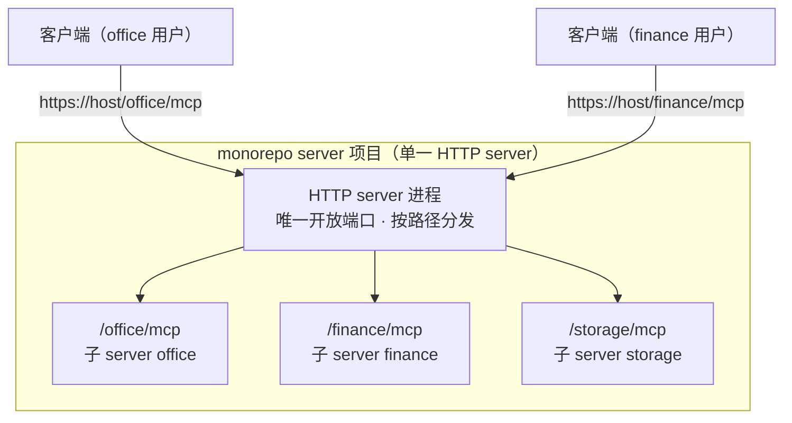
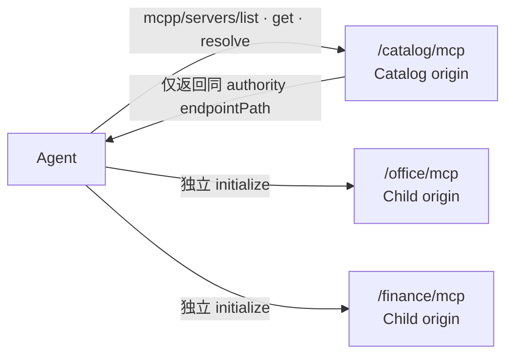

# 3.7 MCP Mono Server：monorepo 多 server 聚合（HTTP 路径路由）

[文档库首页](index.md) · [上一篇：Agent Plugin](agent-plugin.md) · [下一篇：MCP Registry](mcp-registry.md)

Registry 与 Dynamic Host 的完整权威设计见 [`MCP_REGISTRY.md`](../MCP_REGISTRY.md)。

一个 MCPP server 项目可以是 **MCP Mono Server（monorepo 聚合形态）**：**单一 HTTP server 进程**（唯一对外开放的端口）托管**多个 MCP endpoint**，以 **URL 路径路由**分发——`/xxx/mcp` 是子 server xxx 的 MCP 端点，`/yyy/mcp` 是子 server yyy 的 MCP 端点。客户端按路径（URL）连接对应的子 server，各自独立协商。

**模式定义**：

- 每个路径是一个**独立的 MCP endpoint**：拥有自有的能力集、协议协商、扩展声明（第 9 章）、skill 资源与插件技能挂载；**不**做端内能力转发或拼装（本设计不涉及「单端点聚合多 server 能力」的代理形态）；
- 每个端点从客户端视角构成**一个 origin**——URL 即 origin 的天然标识（2.4 host-assigned 也通常是主机的 URL 路径标识）；端点间工具/技能的唯一性本就互不相扰，跨端点引用以 URL 可追溯（2.5 底线①自然满足）；
- 挂载关系是**静态配置**（启动注册表：路径 ↔ 子 server 实例），客户端无需感知各端点内部实现；
- 端点的暴露清单可由**只读 Server Catalog endpoint**公开（3.7.1）；也可经 host 侧注册表或运维配置声明。无论发现途径为何，客户端均按需连接（对应 `mcp.json` 中多条 `url` 条目，见 3.3）。

**MCPP 约束**：

- 各端点**独立边界**：独立授权与资源隔离（可共享 TLS 端口，但应用层按端点隔离），符合最小暴露原则（第 10 章安全边界按 origin / 端点生效）；
- 端点路径分配 MUST 明确且可审计；端点间不得静默互访（一端点能力不得被伪装成另一端点的能力，A4 精神在 server 侧同成立）；
- **stdio 不适用本形态**：stdio 是一对一进程管道，无 URL / 路径概念。需要多 server 时，stdio 形态只能是一进程一 server + 客户端多条 stdio 配置（3.3），不提供路径路由聚合。
- **形态定位**：3.7 的 Mono Server Router 是多 HTTP endpoint 数据面；第 4 章 Dynamic Host 在其上增加 NPM 拉取、校验、隔离生命周期与动态路由。stdio 是 Client 本地 transport，不属于 Mono Server 或 Dynamic Host，也不得转换为 HTTP。

## 3.7.1 Server Catalog：已挂载端点的发现与连接解析

monorepo MAY 在同一 authority 下额外挂载一个 **Catalog endpoint**（推荐路径 `/catalog/mcp`）。Catalog 本身是独立 MCP endpoint / origin，声明 `io.mcpp/server-catalog`（第 9 章），仅用于发现、查询与解析本进程中已静态挂载的 Child MCP；它**不是**能力聚合代理，也不改变 3.7 的 Child endpoint 隔离边界。

**静态条目与方法**：一个 Catalog entry 至少包含稳定 `id`、`title`、`description`、`version`、可选 `tags` / 能力摘要 / `auth.required` 与 content-bound 的 `entryDigest`。其仅描述可连接服务，不是 Tool、Resource 或 Skill 的权威事实；完整能力必须在连接 Child endpoint 后通过标准 MCP 方法重新发现。

| 方法 | 输入 | 输出与副作用 |
| --- | --- | --- |
| `mcpp/servers/list` | 可选 `cursor`、`query`、`tags`、`capabilities` | 轻量 Catalog entry 分页；只读、无副作用 |
| `mcpp/servers/get` | `serverId` | 单个 Catalog entry；未知 ID 返回 `-32602` |
| `mcpp/servers/resolve` | `serverId`、用户已审阅的 `entryDigest` | `{ transport: "streamable-http", endpointPath }` 与授权前置条件；摘要变化 MUST 拒绝，要求刷新与重新批准；只读、无副作用 |

**endpoint 解析与 Agent 装配**：Catalog MUST 仅返回以 `/` 开头的 `endpointPath`，不得含 scheme、authority、userinfo、query、fragment、`.` 或 `..` 段。Agent MUST 将它解析到 Catalog 的同一 scheme / host / port，MUST NOT 因 Catalog 条目自动跨 origin 重定向或携带凭据。用户明确选择条目后，Agent 以 `entryDigest` 调 `resolve`，验证路径，再创建本地 connection binding 并独立 initialize Child endpoint；后者构成新 origin，适用第 2.4、5–10 章的全部发现、缓存、批准与隔离规则。

**目录授权与路径生命周期**：Catalog MUST 先按调用者当前权限过滤条目，MUST NOT 以目录泄露不可连接服务的名称、用途或存在性。`id ↔ endpointPath` 绑定 MUST 稳定、唯一且可审计；Child endpoint 移除时，其路径 MUST NOT 静默改指向其他服务，旧 binding 失败后 Agent MUST NOT 自动连到同名、相似或替代服务。

**绝对禁止的动作**：Catalog **MUST NOT** 下发 npm 包、tarball、`command`、`args`、shell 指令或本地凭据；MUST NOT 安装、更新、卸载、启动本地进程、创建 runtime、按租户 provision 或代理拼装 Child MCP 能力。任何此类行为分别属于 npm Registry / Agent Plugin 生命周期或独立的受审计控制面，超出本节。`resolve` 永远是纯查询，不能以“连接装配”之名制造副作用。

Registry、NPM、Dynamic Host 与 Mono Server 的部署衔接见 [MCP Registry 体系](mcp-registry.md)。
