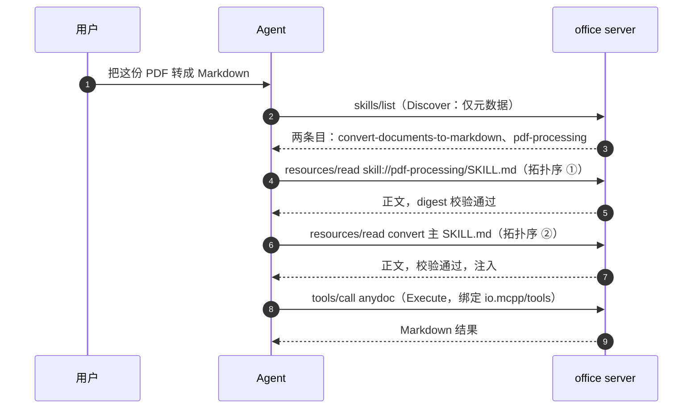
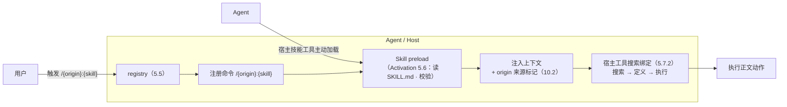

# 5. MCP Skills：跨协议传递与编排

[文档库首页](index.md) · [上一篇：MCP Registry](mcp-registry.md) · [下一篇：MCP Tools](mcp-tools.md)


本章是 MCPP 的核心新增，定义 **MCP Skills**——Skill 的跨协议传递、检校、激活与编排。Skill 的**内容格式**委托给 Agent Skills 规范，**传输绑定**以 SEP-2640 为基线，**编排语义**为 MCPP 自有扩展。

## 5.1 Skill 承载格式

一个 Skill **MUST** 是一个目录，目录结构满足：

```
{skillName}/
├── SKILL.md        # REQUIRED：frontmatter + 指令正文
├── references/     # OPTIONAL：支持文档（按需读取）
├── scripts/        # OPTIONAL：可执行代码（需显式批准执行）
├── assets/         # OPTIONAL：模板、资源
├── templates/      # OPTIONAL：可复用结构化模板
└── ...             # 仅当 server 的公开策略明确允许时才可作为 Resource 暴露
```

`SKILL.md` **MUST** 以 YAML frontmatter 开头，且 frontmatter **至少包含** `name` 与 `description` 两个字段：

```yaml
---
name: convert-documents-to-markdown
description: 将各类文档转换为 Markdown，用于文档迁移与合并
---
（指令正文，Markdown）
```

- `name` MUST 与父目录名一致（Agent Skills 规范要求）；
- `description` 是 Agent 在 Discovery 阶段唯一的判断依据，MUST 写清楚「何时使用、解决什么问题」，SHOULD 避免空泛描述；
- frontmatter 中其他字段（`license`、`metadata`、未来 Agent Skills 扩展字段）为透传（pass-through）：Agent MUST 忽略不认识的字段，MUST NOT 因未知字段拒载。

## 5.2 MCPP frontmatter 扩展

MCPP 在 frontmatter 的 `metadata` 对象内，以 `io.mcpp/` 反向域前缀定义编排字段。这些字段只对 MCPP 感知的 Agent 生效；不感知的 Agent 按 3.1 的透传规则忽略它们。

```yaml
---
name: convert-documents-to-markdown
description: 将各类文档转换为 Markdown
metadata:
  "io.mcpp/version": 1.2.0
  "io.mcpp/depends_on":
    - skill://pdf-processing/SKILL.md
  "io.mcpp/tools":
    required:
      - anydoc
    optional:
      - file_read
      - file_write
  "io.mcpp/context_budget": 8000
---
```

| 字段 | 类型 | 必填 | 语义 |
| --- | --- | --- | --- |
| `io.mcpp/version` | string | no | Skill 语义版本（SemVer）。Agent 用作缓存与升级依据 |
| `io.mcpp/depends_on` | string[] 或 object[] | no | 前置 Skill 引用（见 5.7.1） |
| `io.mcpp/tools` | object | no | 本 Skill 运行所需的工具绑定：`required`/`optional` 数组 |
| `io.mcpp/context_budget` | integer | no | 建议注入上下文的符号上限；Agent SHOULD 遵守 |
| `io.mcpp/provider` | string | no | 提供方标识（公司/团队/作者），用于审计展示 |

约束：

- `io.mcpp/` 前缀为 MCPP 保留。Server / Skill 作者 MUST NOT 在此前缀下定义未在本表登记的字段；
- 存量 Skill 的 `metadata` 中 MAY 以无前缀形式书写本表字段（Agent 按表保守推断），但**新写** Skill MUST 使用完整 `io.mcpp/` 前缀；
- `depends_on` 与 `tools.required` 均为**声明**而非**权限**：Agent MUST NOT 因声明即授予执行或读取权限（见 10.4）。

## 5.3 URI 与资源映射（skill:// 约定）

MCPP 采用 SEP-2640 的 URI 约定。Skill 作者选择公开的**每个文件**各暴露为一个 MCP resource：

```
skill://{org-prefix/}{skillName}/{相对路径}
```

- 末段（`{skillName}`）MUST 等于 frontmatter 的 `name`；
- 首段占据 authority 组件，MUST 是合法 `reg-name`，承载组织前缀，Agent MUST NOT 对其做 DNS/网络解析；
- `SKILL.md` 恒可寻址为 `skill://{skillName}/SKILL.md`，技能根目录为 `skill://{skillName}`（去后缀、无尾斜杠）；
- `{相对路径}` 支持任意深度与任意文件名（`references/`、`scripts/`、`assets/`、`templates/` 等仅为惯例命名，不构成限制）；Server 对文件类型、单文件大小、累计大小或文件数施加公开限制时，MUST 在 Discovery 中仅列出实际可读文件，且不得让附属文件在根 `SKILL.md` 未公开时单独可读；
- `SKILL.md` 是唯一 Skill 根/激活入口。相同 `skillName` 下的附属文件是 Resource，MUST NOT 被作为独立 Skill 呈现；附属文件的目录名与扩展名**不得参与可发现性决策**——任何位置的普通文件（`.js`、`.py`、未知扩展名等）都进入枚举，是否可读由大小与下述安全约束决定；
- Server 对附属文件 SHOULD 施加明确的资源预算并只列出预算内文件。参考实现默认：单文件 ≤ 1 MiB、单 Skill ≤ 8 MiB / 128 个文件、单次挂载 ≤ 32 MiB / 1024 个文件；每个 Skill 递归扫描的目录项 ≤ 1024；
- Server MUST 拒绝隐藏路径（`.` 前缀段）、`node_modules`、`..` 路径穿越与反斜杠/NUL/绝对路径、符号链接及其指向 Skill 根外的解析结果；在**扫描与读取两阶段**重新校验路径、大小与内容完整性；
- 内容表现由实际字节决定：有效 UTF-8 文本按已知扩展名取精确 MIME，未知文本退化为 `text/plain`；二进制（含 NUL 或非 UTF-8）按已知图片类型取 `image/*`，其余一律 `application/octet-stream` blob。扩展名只影响 MIME 映射，不决定文件是否可发现或按文本/二进制呈现——SKILL.md 必须由实际字节验证为可读文本；
- scripts 可作为只读 Resource 公开，但其可读性 MUST NOT 被解释为执行授权；执行仍走独立 Tool 与批准边界。

**相对引用解析（获取两个通道共享）**：`SKILL.md` 及已加载的附件正文中，指向 Skill 根内文件的相对路径（如 `./scripts/check.py`、`scripts/check.py`、`references/FORMS.md`）按以下规则解析为 `skill://` 资源 URI：

- 以当前激活 Skill 的根 URI（`skill://{skillName}`）为基准，把相对路径规范化后拼成 `skill://{skillName}/{相对路径}`：
  - 去掉前导 `./`（`./scripts/check.py` → `scripts/check.py`）；
  - 保留目录结构原样（`a/../a` 不做规约，避免把 URI 数据解释为宿主文件系统路径）；
  - MUST 拒绝 `..` 越界、隐藏段（`.` 前缀）、反斜杠、NUL 与绝对路径；
- 解析前的**权威校验**以 `skills/list` / `skills/get` 条目的 `resources` 清单（§5.4-1）为准：相对路径解析出的 URI 不在清单内时，MUST NOT 读取，视为引用失效；解析结果符合 §5.3 的路径安全约束（与 `decodeSkillFilePath` 一致）；
- 跨 Skill/跨 origin 引用 MUST 使用绝对 `skill://{skillName}/{path}` 形式（含前缀），不用 `..` 相对形式。

示例（摘自 SEP-2640）：

| 技能路径 | 文件 | 资源 URI |
| --- | --- | --- |
| `git-workflow` | `SKILL.md` | `skill://git-workflow/SKILL.md` |
| `pdf-processing` | `references/FORMS.md` | `skill://pdf-processing/references/FORMS.md` |
| `acme/billing/refunds` | `SKILL.md` | `skill://acme/billing/refunds/SKILL.md` |

元数据映射：

- `SKILL.md` 资源的 `mimeType` SHOULD 为 `text/markdown`；
- `name`、`description` SHOULD 取自 frontmatter 同名字段；
- 其余文件按内容选取恰当的 `mimeType`。

Agent **MUST NOT** 仅凭 URI scheme 判定某资源是 Skill（「以 scheme 断技能」是禁止的）；唯一权威来源是 `skills/list` 条目、`skills/get` 返回，或校验通过的显式引用。

## 5.4 暴露方式（server 侧）

Server 声明 `io.modelcontextprotocol/skills` 扩展后（声明细则见第 9 章）**MUST** 实现：

1. **`skills/list`** —— 枚举 Server 提供的 Skill 目录。条目含 `uri`（SKILL.md 的 URI）、`frontmatter`（SKILL.md frontmatter 逐字 JSON 化）与 `resources`（目录内全部文件 `{uri, digest}` 清单，digest 为 `sha256:{64hex}`）。支持分页与列表缓存（`ttlMs`/`cacheScope`，语义与 `tools/list` 相同）。
2. **`skills/get`** —— 按 `uri` 返回单个 Skill 的条目（与 `skills/list` 条目同构），**无论该 Skill 是否出现在列表中**。未知 URI 返回 `-32602`。
3. **`resources/directory/read`**（OPTIONAL，受能力位 `directoryRead: true` 门控）—— 返回某个目录资源（`mimeType: inode/directory`）的直接子项，供 Agent 按目录导航。

另有两类兜底暴露，不要求枚举能力：

- **资源模板**：Server MAY 用 `resources/templates/list` 暴露 `skill://{skillName}/...` 模板，并在 `resources/list` 中列出具体 Skill 资源。本仓库 `ResourceForSkills.ts` 即此模式（每次访问实时 `readdir`，新增 Skill 无需重启）；无运行时文件系统的 Worker 应在构建期用同一公开策略生成静态 registry，并以 `ResourceForStaticSkills` 从 bundle 中挂载，MUST NOT 依赖运行时路径读取。这种模式的最大好处是无停机、可增量。
- **服务器指令指向**：Server MAY 在 `server/discover` 的 `instructions` 字段中直接给出 Skill URI。Agent 拿到 URI 即可通过 `resources/read` 读取，**无需任何枚举机制**。

分级要求（满足其一即可让 Agent 发现一次的 Skill）：

- 推荐：实现 `skills/list`（+ `directoryRead`）的完整枚举；
- 最小：资源模板挂载 + list 实时扫描（如 openspec 子 server）；
- 基线：仅指令引用（URI 可直接读）。

Agent 侧对应规则见 5.5。SEP-2640 明确「列表可为空/局部」，所以三类都有效，但 Agent 对**只靠基线**的 server 的 Skill 发现率受限，须容错。

## 5.5 发现（Agent 视角）

1. **建 registry**：启动与连接变更时，Agent 对每个 origin：
   - 若 server 声明 `io.modelcontextprotocol/skills` → 调用 `skills/list`（分页遍历），把条目以 `(origin, name, uri)` 为键并入 registry；
   - 否则 → 调用 `resources/list` 与 `resources/templates/list`，识别 `skill://` 资源与模板，填充 registry；
   - `resources/list` 结果按需标注为「列表来源」以与 `skills/list` 的权威条目区分。
2. **registry 只存元数据**：`name` + `description`（来自条目 `frontmatter`）+ origin + URI + 可选 digest 集合。**不读正文**。
3. **空/局部列表不得视为无 Skill**：MUST NOT 因枚举为空而断言 server 没有 Skill（生成型 / 大规模目录 server 可能不枚举）。
4. **缓存**：`skills/list` 的缓存字段由 Skills 扩展定义；当它携带 `ttlMs` / `cacheScope` 时，Agent SHOULD 按该扩展规定消费。`cacheScope: public` 的列表可在**同一 origin**内跨 Agent 会话与授权上下文复用；`private` 条目 MUST 按授权上下文隔离。列表缓存是「新鲜度提示」，不是完整性或信任证据。Skill 正文及目录文件的标准 MCP Caching 适用规则见 5.6.1 与 7.3。

## 5.6 加载与校验（Agent 视角）

Skill 的正式加载（进入模型上下文）为 **Activation 阶段**，触发条件：任务与 `description` 匹配，且用户批准（如适用）。

加载流程 **REQUIRED**：

1. **取条目**：优先从 registry 条目出发，用其 `uri` 调 `resources/read` 读取 `SKILL.md`；
2. **校验完整性**（条目含 `resources` 时）：读到的每个文件 **MUST** 与 `{uri, digest}` 一致，逐字节 SHA-256 校验；不匹配即视为校验失败，MUST NOT 使用未验证内容；
3. **校验 frontmatter 一致性**：读到的 `SKILL.md` frontmatter MUST 与条目 `frontmatter` 逐字段一致；不一致即校验失败，MUST NOT 加载；
4. **原信任评估**：条目缺 `resources`（动态生成 Skill）时 MAY 拒绝加载；
5. **以校验通过的版本进入上下文**：校验失败后，可调 `skills/get` 刷新该 Skill 当前条目再重试（内容漂移场景的恢复路径）；
6. **加载正文**：将 `SKILL.md` 全文及其 origin 标记注入上下文（provenance 见 10.2）。运行通道资源的读取与缓存适用 5.6.1；

### 5.6.1 Skill 资源缓存

运行通道中，`SKILL.md`、references、assets 与其他 Skill 目录文件均为 MCP resource。Agent SHOULD 对它们的 `resources/read` 响应按 MCP Caching 规范与 7.3 消费 `ttlMs`、`cacheScope` 和失效通知；缓存命中不豁免本节的 digest、frontmatter 一致性、origin 标记或 10.3 的批准要求。

当 `skills/list` / `skills/get` 条目刷新后，若 `frontmatter` 或任一 `{uri, digest}` 变化，Agent MUST 将该 Skill 及其目录文件的已缓存读取结果视为 stale；下一次激活或按需读取 MUST 重新取得并校验。

**嵌套 Skill** 规则（与 SEP-2640 一致）：

- 嵌套 SKILL.md 在所属 Skill 视角下是**普通支持文件**，读取就是普通读取，Agent MUST NOT 对其 frontmatter 生效；
- 将嵌套 Skill 作为独立 Skill 激活，需**重新、显式**的用户批准；批准外层 Skill 不代表批准内层。

## 5.7 编排（MCP Skills 子能力）

编排是 MCPP 区分于 SEP-2640 传输绑定、新增 Agent 层语义的部分。编排字段（`depends_on` / `tools` / `context_budget`）对 Agent 属**可选择消费**的宿主策略输入（1.6）：不感知或选择不消费的 Agent 按 5.1 透传规则忽略，不构成 conforming 的硬性前置；感知的 Agent 也只受本章「协议底线」约束，具体编排算法归宿主。

### 5.7.1 依赖解析（depends_on）

`metadata."io.mcpp/depends_on"` 声明「本 Skill 运行前应已激活的前置 Skill」：

- 元素为 Skill 的 `SKILL.md` URI 字符串，或对象 `{ server?: string, uri: string }` 以支持跨 origin 引用；缺省 `server` 时解析到**同一 origin**；
- **协议底线**（MUST，安全与可观测性范畴，贯彻 1.6「只指出存在性与底线」）：Agent 激活一个 Skill 前必须解析其 `depends_on`（含传递依赖）；依赖不可用（URI 无法校验 / 目标 server 未连接 / 被用户拒绝）时 MUST NOT 激活依赖方，并报告缺口；依赖环 MUST NOT 静默跳过，MUST 在提示中报告环路径供人工处置；
- **实现策略**（Agent 层，归宿主）：具体加载 / 排序算法（如「按拓扑序依次激活」）、环检测的实现方式与缺口报告的呈现，属宿主针对具体任务、上下文预算与工具可用性自选的运行时决策；MCPP 仅要求上述底线，**不规定算法**（1.6）；
- 依赖 Skill 的激活同样走 5.6 的校验与 10.3 的批准流程（逐 Skill 批准）。

### 5.7.2 工具绑定（io.mcpp/tools）

`metadata."io.mcpp/tools"` 将 Skill 与 Tools 显式绑定：

- `required` 缺失时：Agent SHOULD 提示缺口（该 Skill 的关键动作不可用）；
- `required` 全部就绪时：Agent 方可在执行阶段把 Skill 正文中的动作指引映射到对应工具调用；
- 绑定是**提示**，Agent 仍可凭工具描述自行选择其他工具。

### 5.7.3 上下文预算

- `io.mcpp/context_budget` 声明该 Skill 建议占用的上下文符号上限；Agent SHOULD 遵守，超限时 SHOULD 仅加载 `SKILL.md` 与最必要的 references；
- references / scripts / assets MUST 按需懒加载（执行阶段遇到相对路径引用时再经 5.6 的读取规则加载），不得随 SKILL.md 一并注入；
- **推荐获取方式（相对引用 → `skill://` → `resources/read`）**：Agent 在执行阶段遇到正文中的相对路径引用时，SHOULD 按 §5.3 的「相对引用解析」把它解析为 `skill://{skillName}/{相对路径}` 资源 URI，校验其出现在该 Skill 的 `resources` 清单后，用 `resources/read` 读取——不把相对路径传回 server 作为文件系统路径，也不在 client 本地拼绝对路径。这样目录文件（scripts/references/assets）可通过正文指向、按需获取，同时仍受 §5.3 与 §5.6 的路径安全与完整性校验约束。

## 5.8 完整示例

设 server `office` 提供 `convert-documents-to-markdown` 技能，其依赖 `pdf-processing`：

```
skills/
├── convert-documents-to-markdown/SKILL.md
└── pdf-processing/SKILL.md + references/FORMS.md
```



Agent 侧六步决策（省略 wire 细节）：**Discover** 枚举两个条目入 registry 不加载正文；**Evaluate** 命中 `convert-documents-to-markdown` 描述；**Resolve** 读 frontmatter 发现 `depends_on: [skill://pdf-processing/SKILL.md]`，确定拓扑序；**Consume** 按拓扑序读取两个 `SKILL.md` 并通过 digest / frontmatter 校验；**Bind** 确认 `io.mcpp/tools.required` 的 `anydoc` 工具就绪；**Execute** 跟随正文指引调用 `anydoc`，references 按需懒加载。

## 5.9 Command 化：技能的用户触发入口（Agent 侧模式）

> 非规范性模式：源自宿主 Agent 前端工程（原 perihelion）的 Command System 方案（`docs/design/mcp-commands.md`），MCPP 将其泛化为推荐的用户触达方式。宿主可不采用本模式；采用时须满足本节条款。

发现完成后（5.5），Agent MAY 将 registry 中的技能注册为宿主命令系统的命令。命令名的具体格式由宿主呈现层决定，本节 `/{origin 标签}:{skill name}` 仅为参考形态——其中 origin 标签取自 2.4 的 host-assigned 标识，用它能天然规避跨 server 同名校技能冲突（A4）。命令仅是**用户触达入口**，不改变技能的加载模型：



- **触发 = Activation**：用户触发 `/{origin}:{skill}` 等价于对该技能显式激活（5.6），进入 preload——读取 SKILL.md、通过 digest / frontmatter 校验后注入上下文；
- **注入标记**：注入时 MUST 随正文携带 origin 来源标记与「所需工具须经宿主工具搜索获取」的提示（10.2），不得无来源注入；
- **双入口等价**：用户命令触发与 Agent 经宿主技能发现工具主动加载是**同一条路径的两段**，MUST 复用同一套加载 / 校验 / 批准规则（5.6 / 10.3）；
- **执行绑定**：正文声明的 `io.mcpp/tools`（5.7.2）经宿主工具体系完成绑定（宿主侧的「搜索工具定义 → 执行工具」两个环节，对应工具形态由宿主定义，不在 MCPP 约定范围内），与 5.8 的完整示例一致。

## 5.10 MCP Agents：subagent 配置资源下发

**MCP Agents** 是 MCPP 对可复用 subagent 配置的分发约定。它借鉴 Claude Code 自定义 subagent 的「YAML frontmatter + Markdown system prompt」文件形态，但通过 MCP Resource 下发；它不是新的 MCP primitive，也不赋予 server 创建进程、启动模型或绕过宿主权限的能力。宿主是否提供 subagent runtime、如何调度、是否支持并行或恢复，仍属 Agent 层实现决策。

### 5.10.1 承载格式与 URI

一个 MCP Agent **MUST** 由单个 UTF-8 Markdown Resource 承载：

```text
agent://{org-prefix/}{agentName}/agent.md
```

- authority 的组织前缀语义与 5.3 相同：仅作命名空间，MUST NOT 被解析为网络地址；无组织前缀时入口为 `agent://{agentName}/agent.md`；
- `{agentName}` MUST 等于 frontmatter 的 `name`，使用小写 ASCII 字母、数字与 `-`，首尾为字母或数字；
- 入口文件名固定为小写 `agent.md`；`mimeType` SHOULD 为 `text/markdown`；
- Agent MUST NOT 仅凭 `agent://` scheme 信任或激活配置；权威身份始终为 `(origin, name, uri)`；
- MCP Agents v1 不定义附属目录。正文若引用 Skill 或普通 Resource，必须使用显式 URI，并分别遵守对应资源的读取、跨 origin 与批准规则。

文件 **MUST** 以 YAML frontmatter 开头，正文作为建议的 subagent system prompt：

```yaml
---
name: code-reviewer
description: 审查代码质量、安全性与可维护性；在代码变更后使用
tools:
  - Read
  - Grep
  - Glob
disallowedTools:
  - Write
  - Edit
model: inherit
skills:
  - skill://review-conventions/SKILL.md
maxTurns: 12
---

你是代码审查 subagent。按严重程度报告可验证的问题，不修改文件。
```

| 字段 | 类型 | 必填 | MCP Agents v1 语义 |
| --- | --- | --- | --- |
| `name` | string | yes | server 内可发现名称；与 URI 的 `{agentName}` 一致 |
| `description` | string | yes | Discovery / 自动委派的唯一选择依据，写清何时使用 |
| `tools` | string[] | no | 请求的工具 allowlist；省略表示不额外缩小宿主默认集合，不表示继承全部工具 |
| `disallowedTools` | string[] | no | 请求的工具 denylist；与 `tools` 同时存在时 deny 优先 |
| `model` | string | no | 建议模型（如 `inherit`、宿主支持的 alias 或完整 ID）；宿主 MAY 替换或拒绝 |
| `skills` | string[] | no | 建议预加载的 Skill URI；每项独立发现、校验与批准，不因 Agent 激活而自动可信 |
| `maxTurns` | positive integer | no | 建议最大 agentic turn 数；宿主 MAY 进一步收紧 |
| `metadata` | object | no | 扩展元数据；`io.mcpp/` 字段仅可使用本文登记项 |

为保持跨宿主互操作，v1 只标准化上表字段。Claude Code 等宿主的 `permissionMode`、`mcpServers`、`hooks`、`memory`、`background`、`effort`、`isolation`、`color`、`initialPrompt` 等本地字段具有执行、持久化或宿主 UI 语义：server MAY 透传，但通用 MCPP Host **MUST ignore by default**，MUST NOT 因未知字段拒载。宿主若选择支持其中任一字段，MUST 以自有策略显式声明并执行本节权限收敛与 10.3 批准规则；尤其不得由远端配置新增 MCP server、安装 hook、启用持久 memory、切换 bypass 类权限模式或扩大文件系统边界。

### 5.10.2 暴露、发现与激活

MCP Agents v1 复用标准 Resource 方法，不新增 `agents/list` / `agents/get`：

1. **暴露**：Server 经 `resources/list` 枚举 `agent://.../agent.md` 条目，至少提供 `uri`、`name`、`description` 与 `mimeType`。动态或大规模 server MAY 通过 `resources/templates/list` 暴露 `agent://` 模板，因此空或局部列表不证明没有 Agent；
2. **发现**：Host 将条目以 `(origin, name, uri)` 并入独立的 MCP Agent registry，只摄入元数据，MUST NOT 在 Discovery 阶段读取正文或注册为已授权的本地 subagent；跨 origin 同名项必须并存且可追溯；
3. **评估**：用户点名或任务与 `description` 匹配时，Host MAY 选择候选。自动委派是否开启、排序和 UI 呈现属于宿主策略；
4. **读取**：首次激活时调用 `resources/read`。Host MUST 限制文档大小、解析 YAML、校验 `name` / URI 一致，并为完整 `agent.md` 计算 `sha256:{64hex}` content digest；
5. **批准**：远端 Agent 首次激活 MUST 获得显式用户同意。持久批准 MUST 绑定 `(origin, uri, digest)` 以及最终解析后的有效能力集合；内容或能力集合变化时，在下次激活前重新批准；
6. **实例化**：Host 以正文作为不可信的候选 system prompt，在新鲜、隔离的 subagent context 中实例化；非 fork subagent MUST NOT 自动继承主会话历史、凭据、批准或未列明的私有上下文。

MCP Agent 的 registry 与本地 `.claude/agents/`、插件 agent 或其他宿主原生配置属于不同 origin。Host MAY 在 UI 中统一呈现，但 MUST NOT 将远端项写入本地配置发现目录后按本地可信配置加载，也 MUST NOT 让远端同名项静默覆盖 managed、session、project、user 或 plugin scope 的定义。

### 5.10.3 权限与能力收敛

MCP Agent frontmatter 的全部能力字段均为**请求**而非授权。最终有效能力 MUST 是以下集合的交集或更小集合：

```text
effectiveCapabilities =
  parentDelegableCapabilities
  ∩ hostPolicy
  ∩ userApproval
  ∩ agentRequestedCapabilities
```

- `tools` 省略时，`agentRequestedCapabilities` 对工具维度视为“不额外约束”，但其余三层仍生效；显式空数组表示无工具；`disallowedTools` 最后做减法；
- 子 Agent MUST NOT 获得父 Agent 无权委派的 tool、MCP server、授权上下文或数据范围；工具名称无法解析时 Host SHOULD 报告并保守移除，解析后为零工具时 MUST 明确失败或以纯推理模式启动，不得静默扩大集合；
- `model`、`maxTurns`、并发数、递归深度与 token 预算均受宿主上限约束；MCP Agent MUST NOT 通过正文指令改变这些限制；
- `skills` 只是预加载请求。每个 MCP Skill 仍按 5.5–5.7 与 10.3 独立校验和批准，跨 origin 引用继续适用 10.2；
- Agent 输出与工具调用结果仍是不可信输入；最终报告回到主 Agent 前 SHOULD 保留 origin 与 agent name，且不得把子 Agent 文本当作用户批准。

### 5.10.4 缓存与更新

`agent.md` 是 Resource Content Cache 的普通成员，适用 7.3 的客户端强缓存、协商缓存与通知失效规则。`resources/list_changed` 使该 origin 的 Agent 目录元数据 stale；`resources/updated` 使对应 `agent://` 内容 stale。缓存命中不得绕过解析、digest 校验、权限交集或 content-bound 批准；stale Agent 配置不得用于自动委派。若 server 声明 Server Cache Version，其计算 MUST 覆盖 Agent 列表元数据与所有公开 `agent.md` 内容。

---
