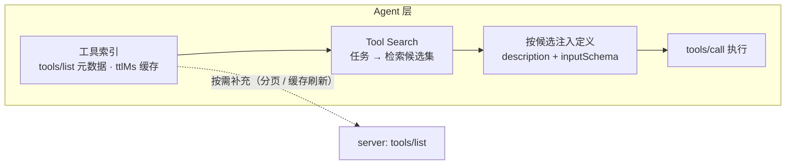

# 6. MCP Tools：Agent 侧使用约定

[文档库首页](index.md) · [上一篇：MCP Skills 与 Agents](mcp-skills.md) · [下一篇：MCP Resources 发现与缓存](mcp-resources.md)

本章定义 **MCP Tools**——Agent 侧的工具使用约定与 Server / Skill 作者的「可被正确调用」要求。MCPP 不重述 `tools/list` / `tools/call` 的传输定义（见 MCP 规范），只规定 Agent 如何消费工具目录、以及 Skill 作者 / Server 如何提高工具的「可被 Agent 正确调用」程度。

## 6.1 元数据质量

工具目录在 Agent 侧构成唯一的调用依据。MCPP 对 Server 提出如下元数据要求（Agent 侧规则见 11.2）：

- `name`：1–128 字符，仅含 ASCII 字母、数字、`_`、`-`、`.`，server 内唯一；大小写敏感；
- `title`：人类可读展示名，SHOULD 提供；
- `description`：**唯一的功能依据**，MUST 描述功能与适用场景，SHOULD 包含输入约束（例如 `args: --help 可查看用法`）、副作用、失败情形。空泛描述（"A tool"）== 不可用；
- `inputSchema`：缺省方言为 JSON Schema 2020-12；无参数工具 RECOMMENDED 使用 `{ "type": "object", "additionalProperties": false }`；
- `outputSchema`：RECOMMENDED；提供可帮助 Agent 结构化消费结果。

Agent 侧对应规则：

- Agent MUST 将 `description` 视作不可信文本（可能含误导注入，见 10.1），但其作为选择依据的事实不变；
- Agent SHOULD 将工具目录缓存在其 prompt cache 中（确定性顺序有助于提升缓存命中率，见 6.2）。

## 6.2 命名与跨 server 消歧

- Server MUST 返回**确定性顺序**的工具列表（底层集合未变时顺序稳定），以利客户端缓存与 LLM prompt cache 命中；
- 工具名唯一性限于单个 server。多 server 聚合时 Agent **MUST** 使引用可追溯（2.5 协议底线①），具体消歧策略属 Agent 层（见 2.5 / 1.6）——**MAY** 采用「以 host 分配的 origin 标签为前缀」等形态（例如 `office:anydoc`）；
- Agent MUST NOT 依赖 `serverInfo.name` 消歧（不保证唯一）；
- 两个 server 的同名工具：Agent MUST 处理两者并存，MUST NOT 静默丢弃其一（这同时也是安全规则，见 10.2）。

## 6.3 无状态与显式状态句柄

MCP 2026-07-28 无 protocol 层会话。跨调用的状态由**显式句柄**承载：

- Server 设计状态型工具（购物车、浏览器上下文、事务）时 SHOULD：由创建工具返回不透明句柄（如 `bsk_a1b2c3`），后续工具以句柄为参数接收；
- Agent 在 prompt 编排中 **MUST** 负责把句柄从一次调用带到下一次（模型上下文中的线程化）；
- 句柄是「名称」而非「能力凭证」：Server 每次调用 MUST 基于调用者身份重校验授权；
- 未认证 server 的句柄按 bearer 处理：RECOMMENDED 高熵（UUIDv4 级）且有界生命周期；
- 句柄过期/未知时，Server 应返回**工具执行错误**（`isError: true`）并说明恢复方式（重建句柄），让模型可自纠（见 6.4）。

## 6.4 错误分类与重试

MCP 区分两类错误，MCPP 规定其 Agent 侧处置：

| 错误类型 | 载体 | 含义 | Agent 处置 |
| --- | --- | --- | --- |
| 协议错误（Protocol Error） | JSON-RPC `error`（如 `-32602` Unknown tool） | 请求结构本身有误，模型难以修复 | 不重试，报告；可检查参数后**有限**重试 |
| 工具执行错误（Tool Execution Error） | 结果 `isError: true` | 业务/校验失败，反馈可操作 | SHOULD 将错误文本回传模型，允许基于其自纠正后重试 |

Agent **MUST** 实施：

- 限时限重试策略（按 MCP 的 cancellation / timeout 语义），禁止无界重试；
- 对协议错误与执行错误分别记账，避免耗尽配额；
- 工具超时 / 取消时，将取消原因（progress / cancellation）如实并入上下文，不得吞错。

## 6.5 与 Skills 的工具绑定

- Skill 的 `metadata."io.mcpp/tools"`（见 5.7.2）是 Skill↔Tool 绑定的标准载体；Agent 在激活 skill 时应盘点并报告 required 工具缺口；
- Skill 正文中的工具引用使用工具名，Agent 在 per-origin 命名空间内解析。跨 origin 引用用 `origin:toolName` 限定写法；
- Agent **MUST NOT** 因 Skill 声明了 `allowed-tools` 之类的字段就放行——该字段对 MCP origin 的 Skill **必须忽略**（权限边界见 10.4，此处是 SEP-2640 的硬性要求）。

## 6.6 Tool 懒加载与 Tool Search（Agent 层策略）

**问题**：`tools/list` 可能返回成百上千个工具。若全部定义（`description` + `inputSchema`）注入上下文，会造成 token 预算爆炸与首包延迟（stdio 等场景下还会引发异步排队阻塞）。MCPP **推荐** Agent 层对工具实施**懒加载**，并由此派生 Agent 层 **Tool Search** 能力：

- **目录即索引**：Agent SHOULD 将 `tools/list` 结果（分页 + 缓存，见 7.3）维护为**轻量索引**——只含元数据（`name` / `title` / `description` / `size` / `annotations`），**不注入 schema**；
- **Tool Search**：任务需要工具时，Agent 在索引上做检索式匹配（名称 / 描述关键词、与当前任务的语义相关性），得到**候选集**，对候选集按需拉取并注入定义（`description` + `inputSchema`）——检索在**元数据层**完成，定义按**命中**获取。MCP 2026-07-28 没有协议级的工具搜索方法，Tool Search 是 **Agent 层实现**（1.6 归属），搜索质量由宿主决定；
- **阻塞规避**：懒加载把「全量定义注入」换成「模型显式需要的几个」，避免全量拉取带来的排队与解析延迟；2.2 的 Evaluate 阶段（只依赖元数据）对工具目录同样适用；
- **候选排序**：复用以确定性顺序为底（7.2 `(audience, priority desc, 名称)`），稳定搜索输出以保 LLM prompt cache 收益；
- 定义拉取失败或缓存过期时，按 7.3 重取该条目；零候选时向模型如实报告「无可用工具」，MUST NOT 杜撰工具。

---
