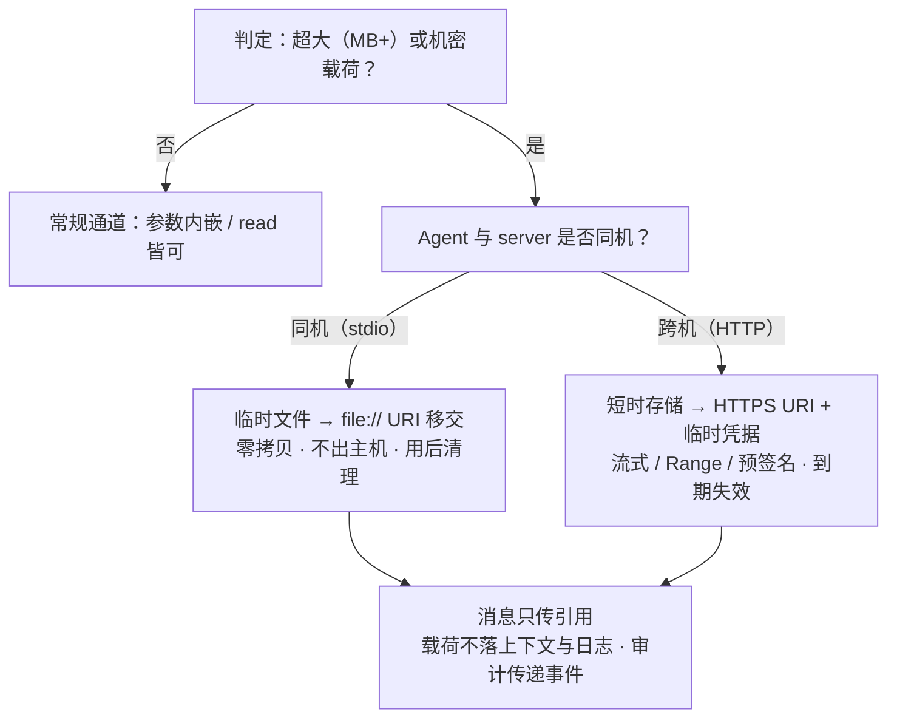

# 8. MCP Resources：资源使用（Agent 层）

[文档库首页](index.md) · [上一篇：MCP Resources 发现与缓存](mcp-resources.md) · [下一篇：MCP Channel](mcp-channel.md)

第 8.2 节已独立为 [MCP Channel](mcp-channel.md)；SDK 类型契约见 [Channel SDK 接口](channel-sdk.md)。

## 8.1 读取

- `resources/read` 以 URI 为参数；返回一个或多个 contents（text / blob 均可）：
  - text：`text/markdown` 类直接入上下文；
  - blob：二进制按 `mimeType` 与宿主渲染约定处理，Agent MUST 正确处理 base64。
- Server 可在一个 read 中返回多个 content（如目录资源读多文件）；Agent **SHOULD** 支持该形态并逐一按 URI 记账。
- **相对引用根解析**：Skill 正文内的相对路径 MUST 针对「包含 `SKILL.md` 的目录」（skill 根）解析，而非 scheme 根。`references/GUIDE.md` 在 `skill://acme/billing/refunds/SKILL.md` 中解析为 `skill://acme/billing/refunds/references/GUIDE.md`。嵌套 Skill 的相对引用解析到自己目录的根。
- `https://` scheme 的资源：按 MCP 规定，若 Agent 可直接联网获取，则 MAY 直接 fetch（而不用经 server 中转）；其余场景 Agent SHOULD 走 `resources/read`。
- 读取结果同样受 `ttlMs` / `cacheScope` 缓存（见 [MCPP Cache](mcp-resources.md)）。
- 资源不存在时 server 返回 `-32602`（兼容 `-32002`）。Agent MUST NOT 将「存在但为空」与「不存在」混淆——server 不得以空 `contents` 数组代表不存在。

## 8.3 嵌入与引用

- **Embedded resource**（内嵌资源块）：资源全文直接在工具结果内返回，含其 annotations。Agent 无需再 read，直接作为事实入上下文；并按其 origin 记账与展示（嵌入内容不得伪造本地来源）。
- **Resource link**（资源链接块）：工具返回 URI + 元数据，指向额外上下文。Agent **MUST NOT** 假定该 URI 出现在 `resources/list` 中；需要内容时按 7.1 直接 read（若 server 允许）；
- 二者的 annotations（audience/priority）同样指导 Agent 决定「自动纳入」还是「按需跟随」。

## 8.4 输入需求（MRTR）

工具调用或资源读取中途，server 可返回 `resultType: "input_required"`，伴随 `inputRequests`（e.g., elicitation）与 `requestState`：

- Agent 收到 input_required **MUST**：暂停执行 → 将输入请求呈现给用户（合法合规地取得确认/填参）→ 将 `inputResponses` 与 `requestState` 附于原请求重发（`id` 必须变更）；
- Agent **MUST NOT** 替用户默认接受（action 恒由用户给出）；
- 用户拒绝时，Agent MUST 将该结果并入上下文并停止该动作，不得绕过或伪造响应；接收方会对 `requestState` 做防篡改校验（server 生成）。

## 8.5 状态句柄

无会话环境下跨调用状态一律走显式句柄（见 6.3）。对象包括但不限于：购物车、浏览器上下文、事务、任务 handle（Tasks 扩展）。规则同 5.3；Access token 类句柄 MUST 按 5.3 的 bearer 规则处置。

## 8.6 超大载荷与私域数据传递（引用优先）

**约束背景**：JSON-RPC 消息是内存数据结构——超大文件（MB 量级以上）或机密载荷内嵌进消息会带来体积失控、blob base64 膨胀（约 +33%）、不可流式、不可审计等问题。MCPP 对这类私域数据传递给出**引用优先**（reference-first）约定：

- **内嵌为反例**：超大 / 机密载荷 **MUST NOT** 内嵌于 JSON-RPC 消息——工具参数、`text` / `blob` content、embedded resource 均属消息内通道，不适用于批量载荷；
- **引用优先**：消息只携带**引用**（URI / 文件路径 / 短时句柄），载荷经承载适应的外部通道传递；
- **载荷通道由承载形式决定**（stdio 与 HTTP 各有不可替代的适用面）：

**stdio（同机）**——私域数据的**最低暴露面**：

- stdio server 与宿主共享同一文件系统权限域：`file://` URI 或相对路径即可完成移交，**零拷贝、零网络暴露**，数据不出主机；
- 传递受 8.1 的 `file://` 批准规则约束（Agent MUST 获用户显式批准后再读）；
- 超大文件 **MUST NOT** 走 stdin/stdout 管道（管道为小消息设计，存在缓冲 / 背压 / 阻塞问题）；应走共享文件系统或显式移交 fd。

**HTTP（streamable-http）**——跨主机的唯一通道，也是真正的大文件通道：

- 载荷可寻址传输：HTTPS 直传、Range / 分块 / 断点续传、预签名 URL、分片上传（committed upload）都在 HTTP 层完成，JSON-RPC 层只传 `uri`；
- 私域控制靠**短时凭据 + 生命周期**：URI / token 单用途、到期即失效；传输安全由 TLS 与 MCP 授权模型（OAuth）覆盖（均属 MCP 层，MCPP 不重述）。

**统一规则**：

- 声明巨型输入的 Tool 参数 SHOULD 用 `uri`（string + `format: uri`）而非常规 `content` / `blob`（6.1 元数据质量）；
- 载荷内容 MUST NOT 以摘要 / 明文进入模型上下文与日志（仅引用可见）；引用不留日志，用完即废；
- 清理责任：谁创建谁清理；临时区生命周期绑定请求 / 会话；审计记录传递事件（方向、大小、来源 origin、引用生命周期）。

