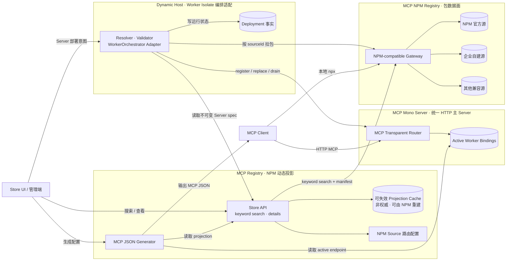
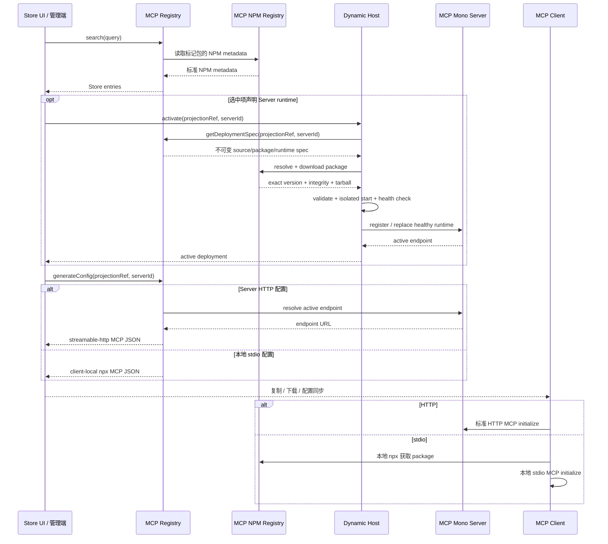

# MCP Registry：Registry、NPM、Mono Server 与 Dynamic Host
> 状态：讨论稿 v0.4（2026-08-24）
> 依赖：[MCPP](MCPP/index.md)、MCP 2026-07-28、Agent Plugin 1.0.0、NPM registry 语义
> 定位：定义 MCP Registry、MCP NPM Registry、MCP Mono Server 三个系统的边界，以及 Dynamic Host 在三者之间的受控部署关系。
## 1. 四个概念，一个部署链
三个独立系统分别拥有目录、包和 HTTP endpoint 三类事实；Dynamic Host 是连接它们的部署能力，不是第四个 Registry：
| 概念 | 管理对象 | 权威事实 | 不负责 |
| --- | --- | --- | --- |
| **MCP Registry** | `McpRegistryProjection` | 按 NPM keyword 搜索并从 package manifest 动态投影的 MCP Store 视图 | 不持久化定义表，不保存 tarball，不运行 endpoint |
| **MCP NPM Registry** | NPM package | package metadata、keywords、版本、dist-tags、tarball、integrity、用户与权限，是插件目录与版本唯一权威 | 不运行 MCP |
| **MCP Mono Server** | HTTP MCP endpoint | 当前已挂载 endpoint、route、origin 与可连接状态，并向 Worker Isolate 透传 MCP | 不搜索插件，不解析 NPM，不编排 Worker |
| **Dynamic Host** | `DynamicDeployment` | Worker Isolate 部署的精确版本、integrity、生命周期和目标 route | 不成为 Store，不存包，不拥有 endpoint Catalog，不处理 stdio |
唯一允许的 Server 部署链：
```text
MCP NPM Registry package（keyword 标记）
    → MCP Registry 动态投影
    → Dynamic Host Worker Deployment
    → MCP Mono Server endpoint
    → HTTP MCP JSON
    → MCP Client
```
stdio 走另一条独立链路：
```text
MCP NPM Registry keyword result
    → MCP Registry 动态投影
    → stdio MCP JSON
    → MCP Client 本地 npx
```
stdio 链路不经过 Dynamic Host 或 Mono Server。
Registry 体系只有一份持久目录事实：MCP NPM Registry。package 通过约定 keyword（推荐 `mcp-plugin`）进入候选集，MCP Registry 再读取 package manifest 动态生成 Store projection；projection 可以缓存，但不是第二份权威表。
MCPP Server 可以部署 Store、Dynamic Host、Mono Server 与 NPM Gateway，但逻辑职责不得因为同进程部署而合并。
## 2. 设计边界
### 2.1 MCP NPM Registry：直接采用 NPM
以下能力全部采用 NPM 的标准行为：
- package name 与 scope；
- package metadata 与 packument；
- SemVer、dist-tags 和版本选择；
- publish、deprecate、unpublish；
- tarball 下载和缓存；
- integrity 与 lockfile；
- public/private package；
- user、organization、team 和 package access；
- token、登录、认证和权限检查；
- mirror、proxy 和私有 registry；
- `npm`、`npx` 的安装与执行语义。
MCP NPM Registry 可以是 NPM 官方源、企业自建源或其他 NPM-compatible registry。兼容性以标准 NPM Client 能否读取和执行包为准。
本文不增加：
- MCP 专属包上传协议；
- MCP 专属版本算法；
- MCP 专属 ACL、角色或 token；
- 与 NPM 并行的 artifact 存储格式；
- MCPP 自定义的依赖解析或 lockfile。
### 2.2 MCP Registry：NPM 动态投影控制面
MCP Registry 不持久化 Store 定义表，只提供：
- 按每个 NPM source 的约定 keyword 搜索候选 package；
- 从 packument 和 package 中的 `package.json` / `plugin.json` / `mcp.json` 动态归一化 Store projection；
- 提供搜索、详情和 MCP JSON；
- 接受显式的 Server 激活、升级、停用和回滚意图。
NPM 是 keyword、package、manifest 和版本 selector 的唯一权威。Registry projection 可以按 NPM 缓存语义缓存，但必须可从 NPM 完整重建，不得形成双份存储。
Registry 不下载 tarball、不启动 runtime、不拥有 HTTP route；这些动作委托给 Dynamic Host 和 Mono Server。
### 2.3 MCP Mono Server：统一 HTTP 主 Server
MCP Mono Server 是对外唯一主 Server，管理 HTTP MCP endpoint 并透传 MCP 请求：
- 为每个 Worker Child MCP 分配独立且可审计的 route / origin；
- 对外 route 使用 NPM package name、精确版本、Server id 与 manifest `endpointPath` 构成稳定身份，例如 `/mcp/npm/%40example%2Fopenspec-mcp%401.0.1/default/openspec/mcp`；Deployment UUID 只用于内部 binding，不进入客户端配置；
- 稳定 route 只绑定完全匹配且健康的精确版本，不接受 dist-tag，也不得静默回退到其他版本；未激活时返回 `MCP_VERSION_NOT_ACTIVE`；
- 接收 Dynamic Host 对健康 Worker binding 的原子 register / replace / drain / unregister；
- 将客户端 MCP 请求和响应按 route 透明透传到对应 Worker Isolate；
- 保持每个 Child endpoint 独立 initialize、session、授权、背压和取消语义；
- 报告 endpoint 的 active / draining / unavailable 状态。
Mono Server 不聚合或改写 Child 的 tools/resources/prompts，不查询 NPM，也不编排 Worker。
### 2.4 Dynamic Host：Worker Isolate 编排适配器
Dynamic Host 不自研插件沙箱或调度器，而是封装成熟的 Worker Isolate 编排层：
- 从 MCP Registry 获取由 NPM manifest 动态形成的不可变 Server deployment spec；
- 从 spec 指定的 MCP NPM Registry 拉取 package，并固定 dist-tag 当次解析出的精确版本与 integrity；
- 调用 Worker Isolate orchestrator 完成部署、资源限制、健康检查、扩缩容、drain 和销毁；
- 将健康 Worker binding 注册到 Mono Server，维护 Deployment 状态；
- Dynamic Host 可以持久化“期望运行的 Deployment”及已解析精确版本、integrity 与 endpoint 元数据，用于进程或机器重启后重建 Worker；该运行状态不是 Store 定义表，也不取代 NPM 的 package/version 权威；
- 重启恢复只能复用已固定的精确版本，不得重新解析原 dist-tag 而隐式升级；恢复期间稳定 route 报告 unavailable，健康检查通过后在同一 route 重新激活；
- 升级失败时保留旧 route，停用时先 drain 再停止。
MCPP 只定义 `WorkerOrchestrator` adapter 与部署状态，不重复设计 isolate 调度、资源回收和节点编排。Dynamic Host 不修改 NPM 数据、不直接服务 MCP Client，也不接受 stdio。
### 2.5 故障与可用性边界
- **MCP Registry 不可用**：Store、配置生成和新部署不可用；已运行 Mono Server endpoint 继续服务；
- **MCP NPM Registry 不可用**：新拉取、升级和本地首次 `npx` 可能失败；已缓存或已运行的 Server runtime 不自动停止；
- **Dynamic Host 不可用**：生命周期动作暂停；Mono Server 保留当前 active route；
- **MCP Mono Server 不可用**：HTTP MCP endpoint 不可用；Registry 条目和 NPM package 不被删除，stdio 不受影响；
- **新 Deployment 失败**：不得覆盖或撤下旧 active Deployment；失败事实只写入 Dynamic Host 状态。
### 2.6 MCP Client：纯消费者
MCP Client 只消费 `mcpServers` 配置：HTTP 连接 Mono Server endpoint；stdio 使用本地 `npx` 从 MCP NPM Registry 取包。Client 不调用 Store 或 Dynamic Host。
## 3. 两张表与多来源分层
### 3.1 分层关系

逻辑边界不因同进程部署而变化：
| 系统 | 可写事实 | 只读依赖 | 对外消费者 |
| --- | --- | --- | --- |
| MCP Registry | 可失效 projection cache、source 路由配置 | NPM keyword / manifest、active endpoint | Store UI / 配置服务 |
| MCP NPM Registry | package、keywords、dist-tags、tarball、NPM ACL | 无 MCP 语义依赖 | Registry、Dynamic Host、Client |
| Dynamic Host | Deployment | Registry deployment spec、NPM package | 管理端；通过 WorkerOrchestrator 向 Mono Server注册 binding |
| MCP Mono Server | endpoint route、active Worker binding | Dynamic Host 提供的健康 binding | MCP Client；透传 MCP 到 Worker |

### 3.2 使用关系

关键依赖方向：
- MCP Registry 可以读取 NPM metadata 和 Mono Server active endpoint，但不能写 package 或 route；
- Dynamic Host 只能通过 Registry interface 获取不可变部署规格，不能持久化或改写 Store projection；
- Dynamic Host 可以向 Mono Server 注册健康 runtime，但不能代替 Mono Server 服务 Client；
- Mono Server 只接收 runtime 生命周期动作，不依赖 Registry 或 NPM；
- MCP Client 只连接 Mono Server，或在本地从 MCP NPM Registry 获取 stdio package。
## 4. 兼容的插件模式
### 4.1 NPM MCP 包
最小 NPM MCP 包可以只包含标准 `package.json` 和可执行入口：
```json
{
  "name": "@acme/filesystem-mcp",
  "version": "1.2.0",
  "bin": {
    "filesystem-mcp": "./dist/cli.js"
  }
}
```
MCPP Server 可以通过配置或包 metadata 知道该包对应的 MCP transport 和入口。包的名称、版本、依赖、下载和访问权限仍由 NPM 管理。
### 4.2 Agent Plugin 包
Agent Plugin 模式保留其标准目录：
```text
{packageRoot}/
├── package.json
├── plugin.json
├── mcp.json
├── skills/
└── ...
```
MCPP Server 读取：
- `plugin.json`：Store 展示信息与插件身份；
- `mcp.json`：MCP server 和 transport 定义；
- `skills/`：可选的插件能力摘要或后续分发入口；
- `package.json`：NPM package identity、版本和可执行入口。
Agent Plugin 是 MCPP Server 理解插件语义的一种标准输入，但包本身仍通过 NPM/MCP R 托管。
### 4.3 Server runtime 声明
只有显式声明 Server runtime 的 package 才有资格进入 Dynamic Host。仅存在 `package.json.bin` 或 `mcp.json` stdio 定义，不构成 Server 声明。
建议 MCP R 映射记录经过校验的 Server 入口：
```ts
type HostedServerDefinition = {
    id: string;
    transport: "streamable-http";
    runtime: "serverless";
    entry: string;
    export?: string;
};
```
入口必须位于 package root 内，并实现 MCPP Dynamic Host 支持的 Server adapter。普通 stdio 定义只能生成本地 MCP JSON：
```text
stdio ≠ serverless
stdio ≠ hosted-stdio
stdio MUST NOT be bridged to HTTP
```
推荐组合包可同时包含 Server runtime 与 stdio bin；两者是两个独立 server 定义，Store 分别生成 HTTP 与本地 stdio 配置。
## 5. NPM 权威投影模型
### 5.1 NPM Source 路由
MCP Registry 配置多个 source，但不复制其 package 数据：
```ts
type NpmSource = {
    id: string;
    title: string;
    registry: string;
    registryEnv?: string;
};
```
`registryEnv` 可指定环境变量，例如 `MCPP_NPM_SOURCE_COMPANY_URL`；设置时只重定向该 source 的 base URL，`sourceId`、package identity、dist-tag 与权限语义不变。

### 5.2 Store 动态投影
Store 按约定 NPM keyword 查询每个 source，再读取 manifest 形成非持久 projection：
```ts
type McpServerDefinition =
    | { id: string; transport: "streamable-http"; runtime: "serverless"; entry: string; endpointPath: string; export?: string }
    | { id: string; transport: "stdio"; runtime: "client-local"; bin?: string; args?: string[] };

type McpRegistryProjection = {
    sourceId: string;
    packageName: string;
    versionSelector: string; // 默认 "latest"，也可为其他 dist-tag
    display: { name: string; description: string; tags?: string[] };
    servers: McpServerDefinition[];
};
```
projection 的稳定引用为 `(sourceId, packageName, versionSelector)`。NPM keyword、packument、dist-tag 和 package manifest 是唯一权威；缓存丢失后必须可完整重建。

`versionSelector` 跟随 dist-tag，不在 Store 固定 exact version。每次 Dynamic Host 部署或 Client 本地 `npx` 时由 NPM 解析；只有 `DynamicDeployment` 记录当次 `resolvedVersion + integrity` 作为运行证据。

一个 Agent Plugin 可以映射任意数量 `servers[]`，本规范暂不设置数量上限；实现仍需施加请求大小和资源预算。

## 6. Store 能力
Store 是 NPM keyword / manifest 的动态展示与配置 interface，不持久化插件定义，也不面向 MCP Client。
Store 至少提供：
- 跨 NPM source 的 keyword 搜索；
- 插件详情、Agent Plugin 摘要和任意数量 server 定义；
- 为选定 server 生成 MCP JSON。
建议方法：
| 方法 | 用途 |
| --- | --- |
| `mcpp/store/list` | 对 keyword 查询结果分页 |
| `mcpp/store/search` | 按 query / tags / transport / source 查询 NPM |
| `mcpp/store/get` | 从 NPM manifest 动态读取详情 |
| `mcpp/store/config` | 为选定 projection 生成 MCP JSON |
Store 不提供 `put/remove`。私有包可见性原样继承 NPM-compatible source；Projection Cache 只优化查询，不形成权威副本。
## 7. MCP JSON 配置
MCP JSON 是 Store 和 MCP Client 之间唯一的功能交付边界。MCP Client 不调用 Store API，只消费最终配置。
配置沿用 Agent Plugin `mcp.json` 的顶层结构：
```ts
type McpJson = {
    $schema?: string;
    mcpServers: Record<string, McpJsonServer>;
};
type McpJsonServer =
    | { type: "streamable-http"; url: string }
    | {
        type: "stdio";
        command: "npx";
        args: string[];
      };
```
Store 负责把 `sourceId`、package、dist-tag 和 transport projection 展开成可消费配置；Client 不需要理解 Registry projection。
## 8. Dynamic Host 与 Server HTTP 配置
Dynamic Host 是 Mono Server 与成熟 Worker Isolate 编排层之间的 adapter，只接受 `runtime: "serverless"`：
```text
resolve → download → validate → stage → start → health-check → active
                                                        ↓
                                                      failed
active → draining → stopped
```
激活流程：
1. 按 projection 的 `sourceId + packageName + versionSelector` 请求 NPM；
2. 由 NPM 将 dist-tag 解析为精确版本并返回 integrity；
3. 校验 package、manifest、入口路径及 Worker adapter；
4. 通过 `WorkerOrchestrator` 创建 Isolate、施加资源限制并执行健康检查；
5. 健康后原子切换 Mono Server route，使主 Server 透传 MCP 到新 Worker；
6. 旧 Worker 进入 draining；失败时保留旧 endpoint；
7. 升级和回滚创建新的 Deployment 事实。
Deployment 不是第三张 Registry 表，而是 MCPP Server 内部运行事实：
```ts
type DynamicDeployment = {
    id: string;
    projectionRef: string;
    serverId: string;
    sourceId: string;
    packageName: string;
    resolvedVersion: string;
    integrity: string;
    endpoint: string;
    state: "staging" | "starting" | "active" | "draining" | "failed" | "stopped";
};
```
Store 只为 `active` Deployment 输出 HTTP 配置：
```json
{
  "mcpServers": {
    "filesystem": {
      "type": "streamable-http",
      "url": "https://mcpp.example.com/plugins/filesystem/main/mcp"
    }
  }
}
```
Client 按 URL 连接并执行 MCP initialize。Dynamic Host 不接收 `runtime: "client-local"`，不启动 stdio，不代理 stdin/stdout，也不实现 stdio 到 HTTP 的转换。
## 9. stdio：仅 Client 本地配置
stdio 的设计目的就是本地化执行，其 runtime 固定为 `client-local`。Store 只把 NPM source 路由展开进 `npx` 参数：
```json
{
  "mcpServers": {
    "filesystem": {
      "type": "stdio",
      "command": "npx",
      "args": [
        "--yes",
        "--registry",
        "https://mcpp.example.com/npm/company/",
        "--package",
        "@acme/filesystem-mcp@latest",
        "filesystem-mcp"
      ]
    }
  }
}
```
这里的 `/npm/company/` 由 projection 的 `sourceId = "company"` 生成；package version 使用当前 dist-tag，Client 本地解析时 NPM 仍是权威。完整流程：
1. Store UI 或管理端搜索并选择插件；
2. 调用 `mcpp/store/config` 生成 MCP JSON；
3. 通过复制、下载或配置同步把 JSON 交付给 MCP Client；
4. Client 以参数数组启动 `npx`；
5. MCPP NPM Gateway 按 `sourceId` 代理到对应 NPM 来源；
6. `npx` 启动后，Client 通过 stdio 执行标准 MCP initialize。
MCPP Server 不代理进程 stdin/stdout；MCP Client 不需要连接 Store。Dynamic Host 必须拒绝 stdio 定义，即使对应 package 同时包含可执行 `bin`。
## 10. MCP NPM Source 直接路由
`/npm/{sourceId}/` 直接路由到 `NpmSource.registry`，不在 MCPP 内设计第二套 proxy、mirror 或 artifact cache。部署可通过 `NpmSource.registryEnv` 指定的环境变量重定向 base URL：
```text
有效 registry URL = env[registryEnv] ?? registry
```
重定向只改变网络目的地，不改变 `sourceId`、package name、dist-tag、NPM 权限或 Store identity。目标必须保持 NPM-compatible；凭据仍按 NPM 模式处理，环境变量值不得进入日志或 MCP JSON。
```text
/store/                 # Store UI / 查询 / MCP JSON
/npm/{sourceId}/        # 直接路由到有效 registry URL
/plugins/.../mcp        # Mono Server HTTP MCP endpoint
```
路径仅为推荐布局。
## 11. Agent Plugin 映射
当 NPM 包包含 Agent Plugin 时，MCPP Server 将其映射到 Store：
| Agent Plugin | MCPP Store |
| --- | --- |
| `plugin.json.name` | 插件名称或稳定 ID 输入 |
| `plugin.json.description` | Store 描述 |
| `plugin.json.version` | 展示版本；包版本仍由 NPM 管理 |
| `plugin.json.author` | 发布者展示信息 |
| `mcp.json` server | `servers[]` |
| `skills/` | Store 能力摘要或安装后内容 |
| `package.json.name` | stdio MCP JSON 的 `--package` 参数 |
| `package.json.bin` | stdio MCP JSON 的最终可执行参数 |
如果 `plugin.json`、`mcp.json` 和 `package.json` 互相冲突，MCPP Server 应将该包标记为不可派发并展示校验错误；具体 NPM 包是否还能被下载，由 NPM 决定。
## 12. Store 与 NPM 搜索的关系
Store 是 NPM MCP keyword 搜索的语义投影：
- NPM keyword 决定候选集，是目录唯一权威；
- Store 读取 package / Agent Plugin manifest 形成 MCP 展示和 runtime projection；
- Store 可以独立排序和分类，但不得持久化第二份定义表；
- 包的出现、版本、可读性和执行权限均由 NPM 决定。
## 13. 最小一致性要求
### 13.1 MCPP Server
- **S1**：必须把 NPM 包管理与权限模式视为外部既有事实，不实现并行的 MCP 包协议；
- **S2**：Store 必须从 NPM keyword / manifest 动态投影，MUST NOT 持久化第二份插件定义表；
- **S3**：必须兼容普通 NPM MCP 包和 Agent Plugin；一个插件可映射任意数量 server；
- **S4**：version selector 必须跟随 NPM dist-tag，只有 NPM 可解析版本；Deployment 必须记录当次 exact version 与 integrity；
- **S5**：Dynamic Host 必须通过成熟 Worker Isolate orchestrator adapter 部署显式 `runtime: "serverless"` 的 package；
- **S6**：Mono Server 必须透明转发 MCP 到 active Worker，保留独立 endpoint / session / authorization / cancellation；
- **S7**：Store 只能为 active Worker Deployment 输出 HTTP 配置；
- **S8**：stdio 固定为 `client-local`，不得进入 Dynamic Host 或 Mono Server；
- **S9**：`/npm/{sourceId}/` 必须直接路由到配置或环境变量重定向的 NPM-compatible URL；
- **S10**：不得复制 NPM 的权限、token、版本解析、package metadata 或插件定义权威副本；
- **S11**：不得要求 MCP Client 调用 Store 或 Dynamic Host API。
### 13.2 MCP Client
- **C1**：只消费已经生成的 MCP JSON，不直接调用 Store API；
- **C2**：`streamable-http` 配置按标准 MCP HTTP endpoint 连接；
- **C3**：`stdio` 配置按 `command` 和 `args` 参数数组启动，不解释为 shell；
- **C4**：NPM 登录、权限、版本和 integrity 行为交给配置指定的 NPM Client；
- **C5**：HTTP 连接或 stdio 子进程启动后独立执行 MCP initialize。
## 14. 首轮实现范围
第一阶段实现：
1. 多 NPM Source 路由配置与环境变量重定向；
2. NPM keyword search、manifest projection、可失效缓存和 MCP JSON；
3. Agent Plugin 到任意数量 MCP server 的动态映射；
4. dist-tag selector 与 Deployment exact version / integrity 证据；
5. `WorkerOrchestrator` adapter、Worker Isolate 生命周期和 Deployment 状态机；
6. Mono Server 透明 MCP 路由、健康切换、drain 和回滚；
7. HTTP active deployment 与本地 stdio 配置；
8. `/npm/{sourceId}/` 直接路由；
9. Client HTTP 与本地 stdio 消费验证。
不实现：第二份 Store 定义表、自定义 NPM 权限/版本/tarball、stdio 服务端运行或 HTTP 转换、无审批 Server 激活。

## 15. 已确定决策
| # | 决策 |
| --- | --- |
| 1 | Store 通过 NPM keyword 查询和 manifest 动态投影，不保存定义表 |
| 2 | version 跟随 dist-tag，NPM 是唯一版本权威；Deployment 留存 exact version / integrity |
| 3 | 一个 Agent Plugin 映射的 MCP server 数量暂不限制 |
| 4 | Mono Server 作为统一主 Server，透明转发 MCP 到 Worker Child endpoint |
| 5 | Dynamic Host 采用成熟 Worker Isolate 编排层，MCPP 只定义 adapter |
| 6 | NPM source 直接路由；环境变量可重定向 source base URL |
