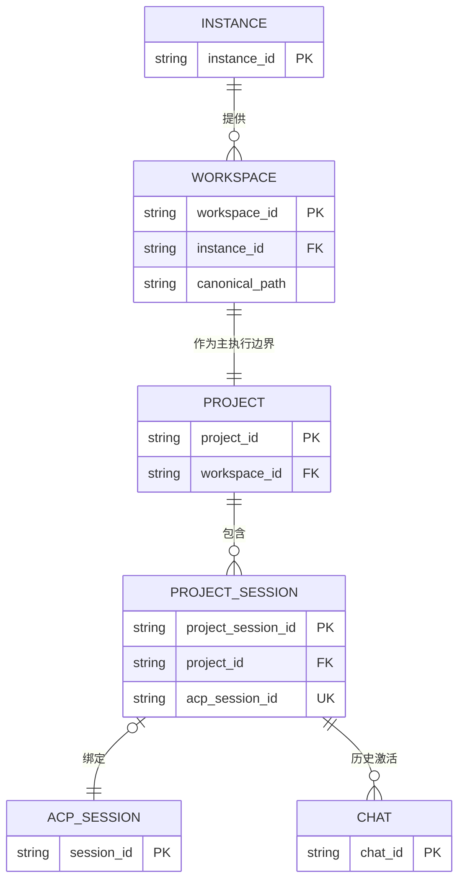
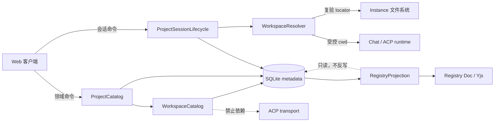
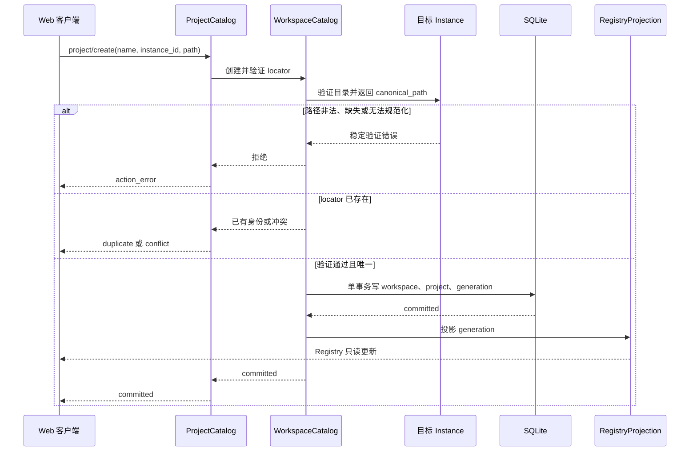
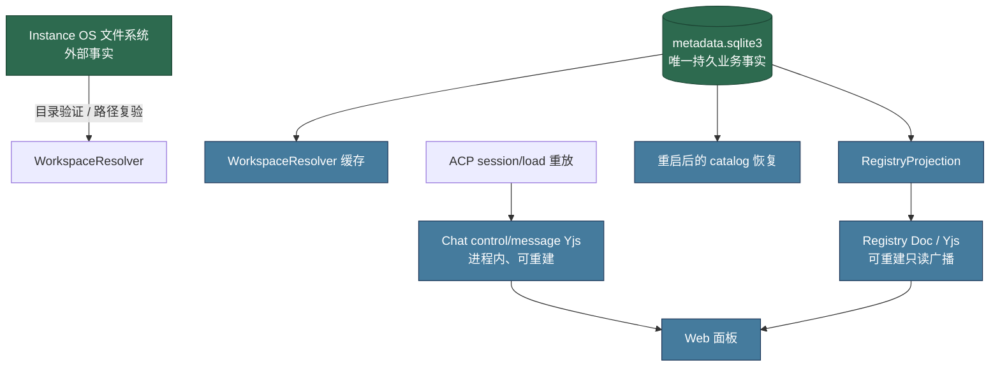
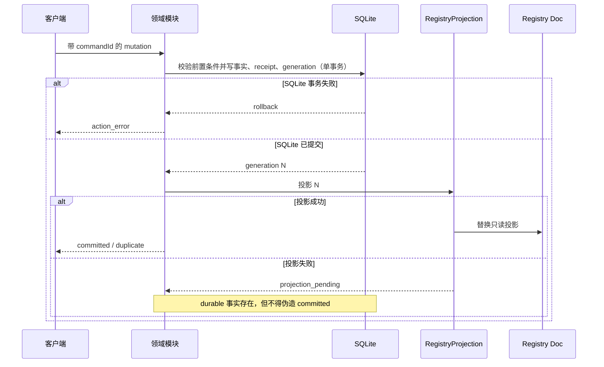
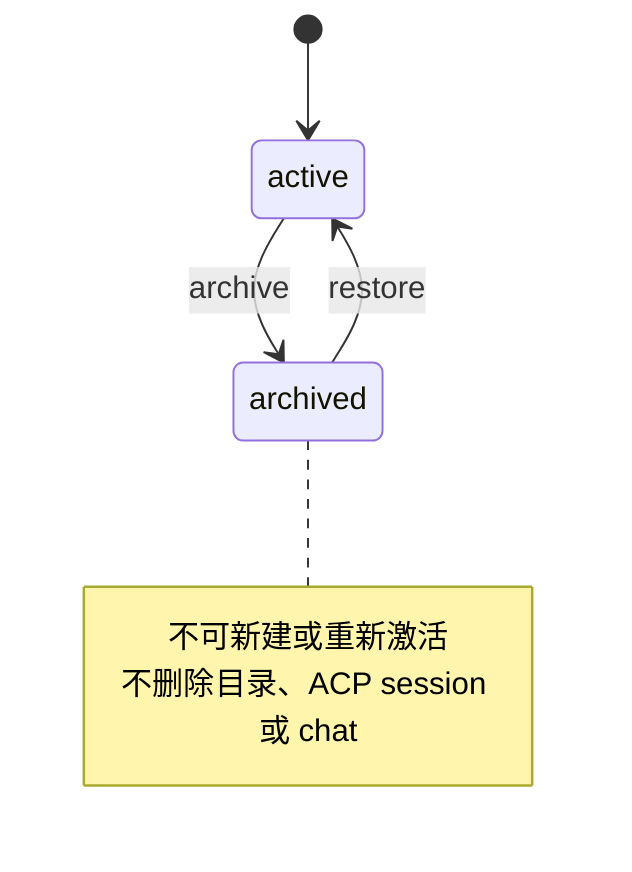
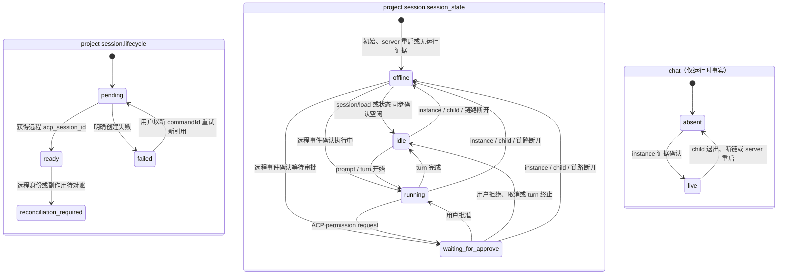
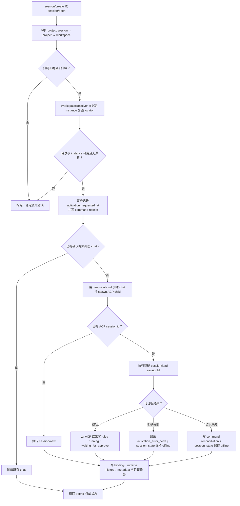
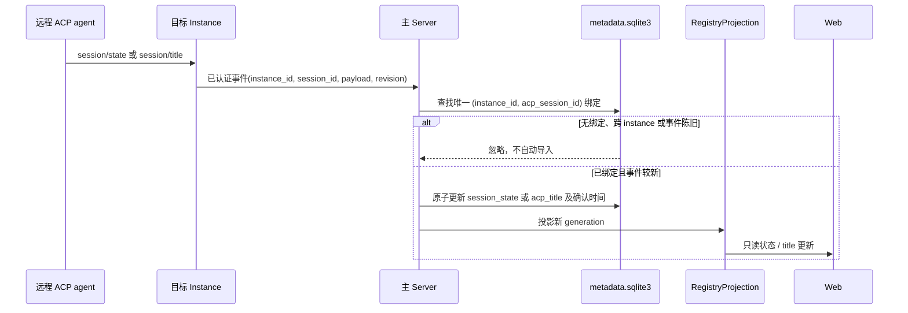

# Workspace 权威设计

> 状态：权威设计 v1.0
>
> 日期：2026-08-19
>
> 范围：定义 Peri Studio 中 **workspace** 的领域语义、身份、运行边界、持久化、命令与安全规则。本文件是 workspace 语义的唯一权威来源；涉及 `project`、`project session`、ACP `session` 与 runtime `chat` 的定义仍以 [`../terminology.md`](../terminology.md) 为准。
>
> 与总架构的关系：本文件细化 [`../architecture.md`](../architecture.md) §3.0 的 project / project session 扩展。总架构规定的 server/instance 拓扑、SQLite 唯一落盘产物、Yjs 只读投影和副作用恢复规则均优先适用。本文不改变 ACP wire protocol。
>
> 参考：借鉴 t3code 的「服务端拥有执行环境、客户端只消费事实、project 与 thread 分离」原则；不移植其 Git worktree、事件溯源和远程 environment 实现，因为它们不是 Peri Studio 当前的领域需求或持久化模型。

---

## 1. 决策摘要

1. **workspace 是执行边界，不是 UI 分组。** 它精确绑定一个 `instance_id` 与一个绝对目录路径，决定该目录下 ACP 子进程的工作目录和会话发现范围。
2. **project 是导航分组，不是 workspace 的别名。** 一个 project 必须拥有一个主 workspace；project 的名称、归档状态和用户展示配置不改变 workspace 身份。
3. **project session 是持久入口，chat 是短生命周期 runtime。** 打开同一个 project session 可以在不同时刻创建不同 chat；这些 chat 必须在该 project 的主 workspace 中运行。
4. **路径不是全局身份。** `(instance_id, canonical_path)` 才是 workspace 的物理定位；不同 instance 上相同字符串路径不相同，符号链接文本路径也不得制造第二身份。
5. **SQLite 是 workspace、project 与 project session 的唯一持久事实。** Registry Doc、内存索引和浏览器状态都是可重建只读投影；它们从不反向修改领域事实。
6. **workspace 路径与 instance 路由创建后不可修改。** “移动项目”“更换实例”不是 rename；它们是将来显式设计的迁移工作流。在该工作流存在前，必须创建新的 workspace/project 并由用户选择如何处理旧入口。
7. **不自动发现、不自动导入、不自动创建 Git worktree。** ACP `session/list` 只能产生候选，用户显式确认后才能将 ACP session 纳入 project catalog。

这些决策将“目录”“用户项目”“ACP durable thread”和“子进程 runtime”分离，避免重启、路径变化或标题相同导致错误地复用会话或向错误目录发出副作用。

---

## 2. 术语与禁止混用

| 术语 | 定义 | 标识 | 允许承担的职责 | 明确不是什么 |
| --- | --- | --- | --- | --- |
| **workspace**（工作区） | 一个 instance 上经验证、规范化后的可执行目录 | `workspace_id` | 决定 `cwd`、实例路由、目录级 ACP 发现域 | UI 分组、Git 仓库、ACP 会话、chat |
| **workspace locator** | workspace 的物理位置对 | `(instance_id, canonical_path)` | 唯一性、路由和安全校验 | 跨 instance 的全局路径身份 |
| **project**（项目） | 用户可见的持久导航分组，拥有一个主 workspace | `project_id` | 标题、归档、project session 的归属 | 工作目录文本、runtime 容器 |
| **project session**（项目会话） | project 下一个对远程 ACP session 的持久引用与本地投影 | `project_session_id` | 保存远程身份、最后已知 session 状态和最近确认 title；作为恢复入口 | ACP session 本身、正在运行的进程 |
| **ACP session**（会话） | ACP agent 维护的 durable thread | `session_id` | `session/load`、`session/prompt` 的 ACP 作用域；产生 session/title 事件 | server 生成的 UUID、UI 列表项 |
| **chat**（对话） | server 为一次 ACP 进程激活创建的运行容器 | `chat_id` | child 生命周期、Yjs 控制/消息投影 | 可跨重启复活的持久入口 |

### 2.1 命名约束

- Rust、SQLite、协议与文档中，`session_id` **只**表示 ACP session；持久入口必须写作 `project_session_id`，运行容器必须写作 `chat_id`。
- 新的领域代码不得用 `workspace` 指代 `project`，也不得继续扩展遗留 `WorkspaceRegistry` 作为持久事实源。
- 为兼容既有协议而保留的 `WorkspaceSummary`、`workspace/create`、`workspace/remove` 只能存在于 `WorkspaceCompatibility` adapter 中；它们不是新功能的接口。
- Web wire 中遗留字段 `sessionId` 表示 project session 时，解析后的领域模型必须显式命名为 `project_session_id`，不得把它传入 ACP 方法。

### 2.2 关系与基数



- 一个 workspace 只属于一个 instance；一个 instance 可提供多个 workspace。
- 一个 project 在本版本恰好拥有一个主 workspace；同一 workspace 也恰好服务一个 project。此一对一关系故意避免“一个项目多个目录”隐含且不受控的运行选择。
- 一个 project 可没有 project session；一个 project session 可处于尚未获得 ACP session id 的 `pending` 或 `reconciliation_required` 状态。
- 一个 project session 至多绑定一个 ACP session id；同一个 ACP session id 在 catalog 中全局最多出现一次。
- 一个 project session 可留下多个历史 chat，但同一时刻最多一个**活动** chat。`last_chat_id` 只是提示，绝不是恢复身份或排他锁。

---

## 3. 模块与 seam

workspace 领域只暴露少量深模块；调用方不能绕过它们直接写 SQLite、操作 Registry Doc 或以任意路径 spawn instance child。



| Module | Interface | Implementation 负责隐藏的复杂度 | 不得依赖 |
| --- | --- | --- | --- |
| `WorkspaceCatalog` | 创建、查找、归档 workspace locator；返回稳定领域错误 | 路径语法/存在性/规范化、唯一性、SQLite 事务、generation | ACP transport、Yjs、chat executor |
| `ProjectCatalog` | 创建/重命名/归档/恢复 project，并按 `project_id` 解析其主 workspace | project 与 workspace 的原子建立、SQLite catalog、投影屏障 | instance sender、outbox |
| `ProjectSessionLifecycle` | 创建、导入、打开、归档/恢复 project session | durable command 去重、ACP 副作用状态、runtime history、恢复对账 | UI 本地状态 |
| `WorkspaceResolver` | 以 `project_id` 或 `workspace_id` 解析可执行 locator | 归档判断、instance online 校验、路径复验、错误分类 | 标题猜测、chat 历史 |
| `RegistryProjection` | 将 SQLite snapshot 广播为只读 Registry Doc | generation fence、全量重建、兼容 mirror | 领域决策、业务写入 |
| `WorkspaceCompatibility` | 处理旧 `workspace/*` action | 遗留 action 到新命令的适配和 legacy mirror | 新 UI/新接口的调用路径 |

**seam 规则：**

- 只有 `WorkspaceResolver` 可以把 workspace locator 转换为 instance `spawn` 所需的 `cwd`；chat 创建方不能接受浏览器直接给出的 `cwd`。
- 只有 `ProjectCatalog` 和 `ProjectSessionLifecycle` 可以变更 `projects` 与 `project_sessions` 表。
- `RegistryProjection` 是单向 adapter：SQLite → Registry/Yjs。投影失败必须使 mutation 停留在可诊断的 `projection_pending`，不能由浏览器或 Registry 反写 SQLite。
- 测试必须穿过这些 interface 验证行为；不以私有表结构或 Yjs map 的偶然布局作为业务测试入口。

---

## 4. workspace 的身份、路径与信任边界

### 4.1 Locator 的形成

创建 workspace 时，server 必须在目标 instance 上完成验证闭环；全部成功后才可持久化 locator：



验证要求：

1. 拒绝空字符串、NUL、控制字符、超长值和非绝对路径。
2. 以目标 instance 的文件系统语义确认路径存在且是目录；server 不可用自身文件系统代替远端 instance 校验。
3. 规范化为 `canonical_path`：解析 `.`、`..` 与符号链接，移除语义上多余的分隔符；不能解析或解析结果不是目录时失败。
4. 以 `(instance_id, canonical_path)` 检查唯一性。命中已有活跃 workspace 时返回其稳定身份或冲突，不得创建第二条记录。
5. 在同一 SQLite 事务中写入 workspace、其 project（若为新建流程）及 catalog generation；提交后再建立 Registry projection。

`display_path` 可保留用户输入用于展示，但**永不**参与路由、唯一性或 ACL 判断。若当前 instance 协议尚无目录规范化 RPC，创建操作必须返回 `WORKSPACE_VALIDATION_UNAVAILABLE`，而不是把未经 instance 证实的字符串存为 workspace。

### 4.2 路径漂移

路径在持久化后可能被用户删除、重命名、重新挂载，或被符号链接重新指向。每次会产生副作用的激活都必须复验 locator：

- 路径缺失或不再是目录：拒绝激活，返回 `WORKSPACE_UNAVAILABLE`；不得退回 server 默认目录，也不得沿用过期 `cwd`。
- canonical_path 与持久值不同：停止激活，返回 `WORKSPACE_PATH_DRIFTED`，要求用户明确创建/迁移 workspace；不得静默更新。
- instance 不在线：返回 `INSTANCE_UNAVAILABLE`；不得把相同路径路由到另一 instance。
- project 或 workspace 已归档：普通打开/新建拒绝；恢复 catalog 后才可激活，历史 chat 不受归档动作强制终止。

此策略优先避免错误目录执行，而非以“尽量继续”为名扩散副作用。

### 4.3 安全限制

当前产品仅支持 loopback 单机，但 workspace interface 必须按 instance 本地文件系统设计，以免未来远程化时将 server 路径误当成执行路径。

- 浏览器提供的路径、project id、session id 和 instance id 均是不可信输入，必须进行格式、授权和归属校验。
- workspace 路径是敏感元数据：只向已认证且获授权的本机 principal 投影；日志只记录 `workspace_id`、`instance_id` 和稳定错误码，除诊断模式下的受控本地日志外不记录完整路径。
- 禁止 workspace action 携带任意环境变量、shell 字符串、可执行命令或符号链接解析开关；进程命令和环境仍由 server/instance 的受控配置决定。
- 路径校验不是 sandbox。ACP 子进程的实际文件权限由运行用户和 OS 决定；若未来支持多用户或远程 instance，必须在引入前另立 ACL 与文件授权设计，不能把 locator 当作授权凭证。

---

## 5. 持久化模型与事实层级

### 5.1 逻辑 schema

现有 `projects` 表以 `cwd` 和 `instance_id` 承担 workspace 语义。目标 schema 应将该语义显式化，避免 project/workspace 同义泄漏：

```sql
workspaces(
  id TEXT PRIMARY KEY,
  instance_id TEXT NOT NULL,
  canonical_path TEXT NOT NULL,
  display_path TEXT NOT NULL,
  created_at TEXT NOT NULL,
  updated_at TEXT NOT NULL,
  archived_at TEXT,
  UNIQUE(instance_id, canonical_path)
)

projects(
  id TEXT PRIMARY KEY,
  workspace_id TEXT NOT NULL REFERENCES workspaces(id) ON DELETE RESTRICT,
  name TEXT NOT NULL,
  created_at TEXT NOT NULL,
  updated_at TEXT NOT NULL,
  archived_at TEXT
)
```

`project_sessions`、`metadata_commands`、`session_activations` 与 `session_runtime_history` 继续使用已有的身份和生命周期约束。为让重启后的 UI 及恢复编排读取明确事实，`project_sessions` 的目标形态还必须具备下列字段：

```sql
project_sessions(
  -- 既有身份与归属字段
  id TEXT PRIMARY KEY,
  project_id TEXT NOT NULL,
  acp_session_id TEXT UNIQUE,

  -- ACP 权威事件的最近确认投影；不可由用户编辑或标题猜测写入
  acp_title TEXT,
  acp_title_updated_at TEXT,

  -- 仅当未来支持用户本地重命名时使用；展示优先级高于 acp_title，但绝不写回 ACP
  custom_name TEXT,

  -- 面向 UI 与重启恢复的远程 session 最后已知状态；不证明旧 chat 仍存活
  session_state TEXT NOT NULL CHECK(session_state IN
    ('idle','running','waiting_for_approve','offline')),
  session_state_updated_at TEXT NOT NULL,

  -- activation command 的短暂对账信息，不是 session 的长期状态机
  activation_error_code TEXT,
  activation_requested_at TEXT,
  activation_confirmed_at TEXT,

  -- 引用槽位/归档等既有字段
  lifecycle TEXT NOT NULL,
  archived_at TEXT,
  last_chat_id TEXT,
  last_opened_at TEXT,
  created_at TEXT NOT NULL,
  updated_at TEXT NOT NULL
)
```

`session_state` 是 project session 面向 UI 和重启恢复的**最后已知远程状态**：`idle` 表示已确认可用且没有活动 turn；`running` 表示 ACP 正在执行；`waiting_for_approve` 表示 ACP 正在等待 permission approval；`offline` 表示 server 当前无法确认可用运行态。它不表示旧 `chat_id`、ACP child 或 instance connection 在重启后仍然存活；live runtime 只能以 instance hello/heartbeat 与 ACP 帧等进程内证据确认。

`activation_*` 只记录最近一次 `session/load` 或新 session 激活命令的请求、确认时间和可证明错误，供幂等与对账使用。它不是 project session 状态，UI 不得将“正在发送命令”持久化伪装为 session 长期状态。激活结果由 ACP 事件或精确 `session/load` 结果写入相应的 `session_state`；投递不确定性仍按总架构收敛到 command receipt / reconciliation，绝不自动重发 `session/new`。

`acp_title` 是目标 instance 转发的 ACP session 事件、`session/list` 或 `session/load` 成功结果所给出的最近确认 title。server 在同一 SQLite mutation 中更新该字段和 `acp_title_updated_at`，再投影到 Registry。title 只用于展示和排序，**绝不**参与绑定、去重、恢复或授权；没有 `acp_session_id` 的 pending 引用不得伪造 ACP title。迁移完成前，现有 `projects.cwd + projects.instance_id` 是临时的物理 locator 表达；新代码必须经 `WorkspaceResolver` 访问，而非直接读取这两个字段。

### 5.2 事实源与派生物



| 数据 | 权威所有者 | 持久性 | 可否重建 | 说明 |
| --- | --- | --- | --- | --- |
| workspace / project / project session | SQLite `metadata.sqlite3` | durable | 否 | 唯一业务事实源 |
| command receipt 与 activation 对账 | SQLite | durable | 否 | 保证 metadata action 幂等并记录不确定副作用 |
| workspace/project/session Registry | `RegistryProjection` | 内存/Yjs 广播 | 是 | 只读面板事实 |
| `WorkspaceResolver` 缓存 | server 内存 | 进程内 | 是 | 不可替代 SQLite 判断 |
| chat control/message Yjs | server 内存 | 进程内 | 是 | 由 ACP `session/load` 重放恢复，不复制成第二份历史 |
| instance 文件系统路径 | instance OS | 外部事实 | 否 | 需激活时重新验证 |

### 5.3 一致性与投影屏障

对纯 metadata mutation，提交与广播顺序固定如下：



只有 SQLite 已提交且 Registry 已投影，才可向客户端发送 `committed`；重复 command 返回相同语义的 `duplicate`。SQLite 成功、投影失败时，命令保持 `projection_pending`；恢复或重试投影后才能对外成为 committed。不得以“数据库已经写入”为由让浏览器自行拼接新的 catalog 状态。

涉及 ACP 的 `session/create` / `session/open` 另外服从总架构的 no-redelivery barrier：SQLite 记录 pending 或 reconciliation 状态不能证明 ACP 副作用是否发生，不能触发自动重放。

---

## 6. 状态机与命令

### 6.1 workspace 与 project 状态

workspace 和 project 都使用独立、可逆的 `archived_at`：



- archive 是导航和新激活门控，不是物理删除；绝不删除目录、Git 数据、ACP session 或 chat Yjs。
- project 归档必须同时使其主 workspace 不可用于新激活；恢复 project 恢复同一 workspace 的使用资格。
- workspace 的独立归档仅供将来的管理接口使用；在一对一模型中，不能让 active project 指向 archived workspace。
- 归档中已有 chat 不被 kill；但 runtime 结束后，不得通过已归档 project session 再次激活。

### 6.2 project session 的持久生命周期与远程状态

`lifecycle`、`archived_at` 与 `session_state` 不能合并为一个枚举：前者表达引用槽位是否存在且可用，后者表达远程 ACP session 的最后已知用户可感知状态；chat 是否 live 是第三个、仅进程内可证明的事实。`activation_*` 是命令对账记录，不参与 session 状态机。



- `offline` 不表示 ACP session 已删除，只表示 server 不能确认其当前可用运行态；持久的 `acp_session_id`、`acp_title` 与 project 引用仍然有效。
- `waiting_for_approve` 只用于 ACP permission approval。未来若需支持 elicitation，另设 `waiting_for_input` 或持久化 `waiting_reason`，不得含混复用 approval 状态。
- server 重启、instance 断线或 child 退出时，所有受影响 project session 必须原子投影为 `offline`；不得保留 `running` 或 `waiting_for_approve` 作为实时宣称。
- `archived` 仍是 `archived_at` 覆盖状态，不应写入 `session_state`；不得把 archive 写成 ACP session 已关闭或删除。`reconciliation_required` 仍是引用/命令对账状态，不能替代 `offline`。

### 6.3 命令矩阵

| 命令 | 输入 | 前置条件 | 成功后的事实 | 禁止行为 |
| --- | --- | --- | --- | --- |
| `project/create` | 名称、instance、路径 | instance 可验证目录；locator 未被占用 | 原子创建 workspace + project | 不校验路径即持久化；创建 ACP session |
| `project/rename` | `project_id`、名称 | project active | 仅更新名称 | 修改 workspace、cwd 或 instance |
| `project/archive` / `restore` | `project_id` | 状态匹配 | 更新导航可见性 | 关闭 chat、删除 session |
| `session/create` | `project_id`、可选标题 | project/workspace active 且 locator 复验通过 | 建立 pending project session，随后受控激活 | 以用户 cwd 覆盖 workspace；不确定时重放 |
| `session/open` | `project_session_id` | 属于 active project；具 ACP id；locator 复验通过 | 写入 `activation_requested_at`，新建 chat，并精确 `session/load`；根据已确认 ACP 状态投影 `idle`、`running` 或 `waiting_for_approve`；若连接不能确认则保持 `offline` | 复活旧 chat；按标题选择 ACP session |
| `session/state`（远程事件） | `instance_id`、ACP `session_id`、状态、事件序号/时间戳 | 已认证 instance；精确绑定到唯一 project session；事件新于已确认版本 | 原子更新 `session_state`、时间与 Registry 投影 | 浏览器直接改状态；以旧 chat 推断状态 |
| `session/title`（远程事件） | `instance_id`、ACP `session_id`、title、事件序号/时间戳 | 已认证 instance；精确绑定到唯一 project session；事件新于已确认版本 | 原子更新 `acp_title`、确认时间与 Registry 投影 | 从浏览器接受为 ACP title；以 title 匹配 session；覆盖 `custom_name` |
| `session/import` | `project_id`、ACP `session_id` | 用户从同 locator 的新鲜 discovery 明确选择 | 建立 `origin=imported` catalog 项 | 从过期候选/不同 cwd 导入；自动导入 |
| `session/discover` | `project_id` | workspace active；按 exact locator 可建立查询通道 | 仅返回候选 | 创建 session、写 catalog、改变 chat |
| legacy `workspace/create/remove` | 遗留载荷 | compatibility adapter 校验 | 映射到 project/workspace 的可逆 mutation | 成为新客户端接口 |

所有 mutation 使用全局 `commandId` 去重，且同一 id 的 `command_type` 与 payload fingerprint 必须一致；不一致返回稳定冲突错误并不产生副作用。

---

## 7. runtime 激活与恢复

### 7.1 激活算法

对 `session/create` 或 `session/open`，激活路径固定如下：



绝不能通过 `last_chat_id`、标题、路径字符串近似匹配或 `session/list` 的排序结果决定加载目标。

### 7.2 ACP session 事件投影



ACP 是 `session_state` 与 `acp_title` 的唯一权威来源。若协议不提供单调 revision，则 server 只能接受该 instance connection 内按接收顺序的较新事件，并记录确认时间；断线重连后以 `session/list` 或 `session/load` 的返回重新校准。状态或 title 更新失败不应改变已确认的 ACP 事实，但必须留下可重试的 projection 状态。

### 7.3 server 重启

server 重启后：

- SQLite 重建 project、workspace、project session、最近确认 `session_state` / `acp_title` 和 navigation projection；启动恢复时必须将所有没有当前 instance/child 存活证据的 session 统一投影为 `offline`，UI 不得将重启前的 `running` 或 `waiting_for_approve` 当作实时状态。
- 旧 chat 不视为仍存活；只有 instance hello/heartbeat 的存活证据才能确认 runtime。
- 用户显式打开 `offline` project session 时，重新验证 workspace 并以持久的 ACP session id 创建新 chat、执行一次 `session/load`；成功后只可根据精确 ACP 结果更新为 `idle`、`running` 或 `waiting_for_approve`。
- `activation_*` 仅供显示命令错误、幂等和对账；用户再次打开仍需重新验证 workspace，且不允许仅凭该字段复用旧 chat。
- 重启前进入 ACP stdin 的 `session/new` 若未形成可证明的终态，必须保留或收敛为 `reconciliation_required`；不得“恢复创建”。

### 7.4 session discovery

discovery 的键严格为 `(instance_id, canonical_path)`，不是 project 名称、显示路径或 chat 标题。可复用已 binding 的非终态 chat；没有时才创建私有、server-owned 查询进程，完成 `initialize → session/list → kill`。私有进程不创建 chat、project session 或用户可见 Registry 条目。

---

## 8. Git 与 worktree 的明确非目标

workspace 可以恰好是 Git 仓库根、子目录或完全不含 Git 的目录。Peri Studio 不从这些情况推导额外语义：

- 不在 `project/create` 时探测或要求 Git。
- 不自动创建、切换、删除或清理 Git worktree。
- 不把 branch、commit、repository root 或 worktree path 写入 project session 身份。
- 不让同一个 ACP session 在不同路径之间“迁移”。路径改变意味着新的 workspace 语义，需未来显式迁移设计。

这与 t3code 的 worktree-per-thread 策略有意不同。Peri Studio 的可靠性重点是 ACP durable session 与 runtime chat 的精确恢复；在没有完整 VCS 事务、回滚和跨进程文件锁设计前，自动 worktree 会放大而不是收敛副作用。

---

## 9. 当前实现差距与落地顺序

本设计规定的目标模型与当前实现存在一个刻意可见的过渡差距：现有 `ProjectRecord` 仍内嵌 `cwd` 与 `instance_id`，遗留 `WorkspaceRegistry` 仍存在兼容职责。它们不能被误读为领域最终形态。

| 阶段 | 变更 | 验收证据 |
| --- | --- | --- |
| W1 | 新增 `workspaces` 表及 `projects.workspace_id`，从既有 `projects(id,cwd,instance_id)` 无损回填 | 迁移前后 project id、路径、instance、session 归属一致；重复 locator 被唯一约束拒绝 |
| W2 | 以 `WorkspaceCatalog` / `WorkspaceResolver` 收口所有 project 创建、session 激活与 discovery 路径 | 搜索证明没有 chat spawn 直接消费 Web cwd 或 `projects.cwd` |
| W3 | Registry 改为从 SQLite workspace/project snapshot 单向投影；遗留 map 仅在 compatibility adapter 写入 | server 重启后仅用 SQLite 可重建所有导航投影 |
| W4 | 为 instance 增加受控的目录验证/规范化请求，并在激活时复验 | 目录删除、符号链接漂移、instance 不可用分别得到稳定错误，零错误 spawn |
| W5 | 删除或隔离旧 `WorkspaceRegistry` 写路径；保留有限版本的 `WorkspaceCompatibility` | 新协议白名单和 Web 均不再产生 `workspace/*` action；旧客户端兼容测试仍通过 |
| W6 | 为 `project_sessions` 增加 durable `session_state` / 状态时间戳、activation 对账时间戳和 ACP title 确认时间；接入远程 state/title 事件投影 | server 重启或 runtime 断线后受影响 session 均为 `offline`；恢复后 UI 展示精确 ACP 状态；旧 chat 不会被误判 live；陈旧或未绑定事件零写入 |

每阶段均须提供：SQLite migration 测试、commandId 幂等测试、server 重启恢复测试、错误路径测试，以及跨 ACP stdin 的 `session/load` 精确身份端到端测试。任何阶段都不得把 cwd、完整 token、ACP 正文或用户文件内容写入测试 fixture、浏览器错误或普通日志。

---

## 10. 不变量与审计清单

以下断言应作为后续实现、评审和测试的强制检查项：

1. 任意副作用 spawn 的 cwd 都来自已复验的 workspace locator，而非浏览器输入。
2. `project_id`、`workspace_id`、`project_session_id`、ACP `session_id`、`chat_id` 从不互相替代。
3. 同一 `(instance_id, canonical_path)` 最多一个 active workspace；同一 ACP `session_id` 最多一个 project session。
4. `project/rename` 永远不改变 locator；archive/restore 永远不删除目录、ACP session 或 chat。
5. `project_sessions.session_state` 与 `acp_title` 是 SQLite 持久投影；`offline` 不等于远程 session 已删除，任一状态也不等于存在 live chat，`acp_title` 不得参与身份判断。
6. 远程 state/title 事件只能按 `(instance_id, acp_session_id)` 更新已绑定 project session；未绑定、跨 instance 或陈旧事件不得自动导入或覆盖。
7. Registry/Yjs 被删除或丢失时，SQLite 足以重建 catalog；反之不成立。
8. 路径缺失、漂移或 instance 离线时 fail closed，绝不使用默认 cwd 或其他 instance 回退。
9. 重启后的 session reopen 必须使用精确持久 ACP id 执行一次 `session/load`，而不是复用旧 chat 或猜测。
10. discovery 没有用户确认时绝不创建 catalog 条目；导入候选只在同一 exact locator 内有效。
11. `session/new` 进入不确定投递状态后，系统不自动重试；用户只能使用同一 commandId 对账或明确开始新的入口。
12. 新功能不调用 legacy `workspace/*` interface；兼容逻辑是单向 adapter，且可删除。

---

## 11. 被拒绝的替代方案

### A. 继续让 project 直接携带 `cwd`

拒绝。它把 UI 分组和执行 locator 合并，使多路径、路径迁移、目录漂移和 instance 路由无法有独立生命周期，也让调用方容易直接将 client cwd 送入 spawn。

### B. 以绝对路径作为全局 workspace id

拒绝。同一文本路径在不同 instance 上可指向完全不同目录；符号链接也会制造别名。必须使用 `(instance_id, canonical_path)`。

### C. 以 Git repository root 定义 workspace

拒绝。ACP 可在非 Git 目录、仓库子目录或具有特殊工作目录的项目中运行。Git 不是本产品执行正确性的前置条件。

### D. 一个 project 自动管理多个 workspace 或每个 session 一个 worktree

拒绝。没有用户显式路由选择、VCS 生命周期、隔离策略和恢复语义时，这会令 session/open 的执行位置不确定。未来若需要，应新增 `workspace binding` 聚合与迁移协议，不能复用当前一对一字段偷偷扩张。

### E. 把 Registry/Yjs 当作 workspace 的持久事实

拒绝。Yjs 面向实时只读投影和客户端恢复，不具备 SQLite metadata command receipt 的事务与对账语义；双持久事实会使重启恢复无法裁决。

### F. 遇到路径漂移自动更新或回退

拒绝。路径漂移可能意味着用户有意切换目录或符号链接遭修改。自动更新会把 ACP 的文件副作用导向未经确认的位置。

---

## 12. 后续文档约束

实现 W1 前，应将总架构中“project 继承 workspace 的名称、cwd 与 instance 路由语义”的描述替换为本文件的显式一对一模型，并更新术语表中的 project/workspace 条目。协议新增 `workspace_id` 或 locator 校验能力时，必须同步更新 `peri-studio-proto` schema、action whitelist、错误码表与契约测试；不得仅更新 Web 类型。
