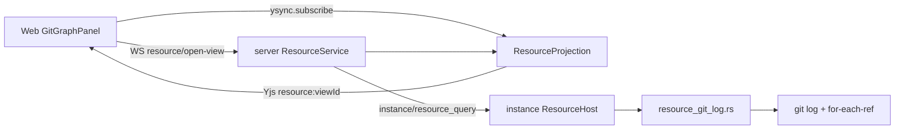
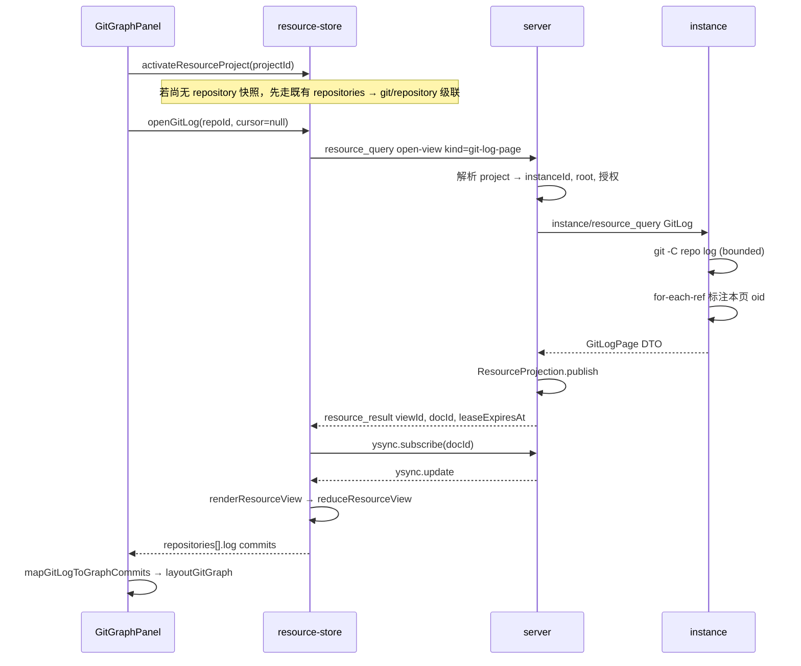

# Git Graph 数据传输方案

> 状态：**权威设计 v1.0**（2026-08-31）
>
> 范围：Web Resource Workbench 的 **Git Graph** 面板从 project 绑定 instance 上的 Git 仓库读取**有界提交历史**，经 server 投影到浏览器。本文是 Git Graph 数据面的唯一权威说明；总线与安全边界继承 [`remote-fs-git-protocol.md`](remote-fs-git-protocol.md)。
>
> 前置：Git Graph **可视化与布局引擎**已在 `web/widgets/resource/git/` 与 `ui-sandbox` 定稿；当前生产数据为 mock（`git-graph-mock.ts`）。本文只定义 **machine → server → 前端** 的数据契约与落地顺序。

---

## 1. 决策摘要

1. **沿用 Resource 短租约 Yjs 投影**，与 Source Control（`git/repository`、`git/group-page`）同一管道；**不**走 `hub:registry` 长订阅，也**不**在浏览器执行 `git log`。
2. **新增视图种类 `git/log-page`**：按 `repoId` 分页返回提交 DAG 元数据（hash、parents、message、author、date、refs）；**布局与 SVG 路径只在客户端**由 `git-graph-engine.ts` 计算。
3. **instance 是唯一 Git 执行点**：固定 argv、`git` 子进程、有界 stdout 解析；raw stdout/stderr、绝对路径、任意 ref 字符串不得穿透到 Web。
4. **分页与代次**对齐现有 `GitGroupPage`：`source_generation` + `next_cursor`；mutation 后 `generation` 变化则旧 graph 页视为 stale，须刷新或重开视图。
5. **与 SCM 共享 `repoId` 与 `generation`**：Graph 不单独发明仓库身份；打开 Graph 前须已 `activateResourceProject` 且存在 `git/repository` 快照（与 Explorer/SCM 一致）。

---

## 2. 在整体架构中的位置



| 层 | 模块 | Git Graph 职责 |
| --- | --- | --- |
| **instance** | `ResourceHost` → `Repository::query(GitLog)` | 在已发现的 `repoId` 上执行有界 `git log`，解析为 `GitLogPage` DTO |
| **server** | `ResourceService` + `ResourceProjection` | 解析 `projectId` → workspace/instance/root；发布 `git_log_page` Y.Doc；租约/TTL/单写 |
| **proto** | `peri-studio-proto::resource` | `ResourceViewKind::GitLogPage`、`InstanceResourceQueryKind::GitLog`、DTO 形状 |
| **web** | `entities/resource` → `panel/lib/resource-*` → `widgets/resource/git` | 订阅投影、`reduceResourceView` 合并页、映射为 `GitGraphCommit`、驱动 `GitGraphPanel` |

**明确不采用的路径**

| 路径 | 原因 |
| --- | --- |
| `hub:registry` / Machine 拓扑 | 全局实例注册表，不含 per-repo 提交历史 |
| HTTP blob | 提交元数据体量小且需与 `generation` 同屏；diff/文件内容才走 blob |
| 浏览器直连 instance | 违反资源协议安全边界 |
| server 预计算 graph layout | 布局属视图模型，应留在客户端引擎；wire 只传 DAG 事实 |

---

## 3. 现状与缺口

| 能力 | Source Control（已落地） | Git Graph（目标） |
| --- | --- | --- |
| instance 查询 | `GitSnapshot`、`GitChanges`、`GitDiff`、`GitMutate` | **`GitLog`**（待实现） |
| `ResourceViewKind` | `git_repository`、`git_group_page` | **`git_log_page`**（待实现） |
| server 投影 | `resource_projection.rs` 分支 | **`GitLogPage` 分支**（待实现） |
| web entity | `renderResourceView` 四种 view | **`git_log_page`**（待实现） |
| web store | `reduceResourceView` 级联 SCM | **log 页合并 + `openMoreGitLog`**（待实现） |
| UI | `SourceControlPanel` 读 `resourceWorkspace()` | `GitGraphPanel` 仍用 **`MOCK_GIT_GRAPH_COMMITS`** |

权威 FS/Git 总线见 [`remote-fs-git-protocol.md`](remote-fs-git-protocol.md) §3–§7；其中 §7.2 已规划 `git/refs`，**未实现**。Git Graph **第一阶段可内联 refs 到每页 commit**；独立 `git/refs` 视图留作 ref 选择器/ checkout 后续阶段。

---

## 4. 数据模型

### 4.1 Wire DTO（proto，camelCase JSON）

```ts
/** 单页提交历史；与 GitGroupPage 同级，均为有界只读页。 */
type GitLogPage = {
  repoId: string;
  sourceGeneration: string;   // 绑定 git/repository.generation
  commits: GitLogCommit[];
  nextCursor?: string;
  /** 当前 HEAD oid，供 UI 高亮；与 repository 快照一致时可省略校验 */
  headOid?: string;
};

type GitLogCommit = {
  /** 页内稳定键，默认等于 oid */
  commitId: string;
  oid: string;
  shortOid: string;           // 例如 8 字符，instance 生成
  message: string;            // subject；body 第一阶段不传输
  authorName: string;
  authorDate: string;         // ISO-8601，instance 统一格式化
  parents: string[];          // 父提交 oid 列表，顺序与 git 一致
  refs: GitRefLabel[];        // 指向该 oid 的 ref，有界
};

type GitRefLabel = {
  name: string;               // 展示名，如 main、origin/main、v1.0.0
  kind: 'head' | 'branch' | 'remote' | 'tag';
};
```

### 4.2 Yjs 投影视图（`resource:{viewId}`）

与现有 resource Doc 一致，root 含：

| 键 | 含义 |
| --- | --- |
| `meta.view_type` | `"git_log_page"` |
| `meta.repo_id` | opaque repoId |
| `meta.project_id` | 浏览器侧 project |
| `meta.source_generation` | repo generation |
| `meta.next_cursor` | 分页游标 |
| `meta.availability` | `loading` \| `ready` \| `refreshing` \| `offline` \| `error` |
| `entry_order` | `Y.Array<commitId>` |
| `entries` | `Y.Map<commitId, GitLogCommit fields>` |

**禁止**在 Doc 内存放：SVG path、`layout` 坐标、diff、hunk、绝对路径、完整 refname 若含 `../`。

### 4.3 前端视图模型（widget）

`GitGraphPanel` 消费 `GitGraphCommit`（`web/widgets/resource/git/types.ts`）。映射在 **`features/resource/`**（推荐）或 `entities/resource` 纯函数完成：

| Wire `GitLogCommit` | Widget `GitGraphCommit` |
| --- | --- |
| `commitId` | `id` |
| `shortOid` | `hash` |
| `message` | `message` |
| `authorName` | `author` |
| `authorDate` | `date`（相对时间由 widget 或 formatter 派生） |
| `parents` | `parents` |
| `refs[]` | `refs[]`（`kind` → `tone`） |
| `oid === headOid` | `isHead` |

布局仍调用 `layoutGitGraph()`；**不得**要求 server 下发 path d。

---

## 5. 端到端时序

### 5.1 打开 Graph（首屏）



### 5.2 加载更多（分页）

- 用户滚动近底部或点击「Load more」→ `openGitLog(repoId, cursor=nextCursor)`。
- **新 `viewId`/新 Doc** 或 **同一 logical view 追加 transaction**：实现上推荐**新页 Doc + store 合并**（与 `git-group-page` 相同 merge 规则：`sourceGeneration` 一致则 append `entry_order`）。
- `next_cursor` 为 opaque 字符串，instance 可编码 `{ lastOid, skip }`；浏览器不得解析。

### 5.3 刷新（mutation / 手动）

| 触发 | 行为 |
| --- | --- |
| `git/commit` 等 mutation `committed` 且 `generation` 变化 | 清空该 repo 已缓存 `logPages`，自动 `openGitLog` 首屏（`cursor=null`） |
| 用户点击 Refresh | 同上，显示 `availability: refreshing` |
| instance 离线 | 保留最后有界页，`availability: offline` |
| `VERSION_CONFLICT` / stale cursor | 丢弃分页缓存，从首屏重查 |

Graph **不**订阅原始 `git/invalidated` 事件；只通过 **repository `generation`** 与 projection `availability` 收敛。

---

## 6. Proto 扩展（相对 v4）

在 [`proto/src/resource.rs`](../../proto/src/resource.rs) 增加（命名与 serde 与现有枚举一致）：

```rust
// ResourceViewKind
GitLogPage,   // wire: "git-log-page"

// InstanceResourceQueryKind
GitLog(GitLogQuery),

pub struct GitLogQuery {
    pub repo_id: String,
    pub cursor: Option<String>,
    pub limit: u32,
}

// InstanceResourcePayload
GitLogPage(GitLogPage),
```

**能力协商**（`instance/hello.caps.resources`）可选增加：

```jsonc
"gitLogPageSize": 200,
"maxGitLogPageSize": 500
```

未声明时 server 使用与目录页相同的默认/上限（`DEFAULT_DIRECTORY_PAGE_SIZE` / `MAX_DIRECTORY_PAGE_SIZE`）。

**协议版本**：新增 view kind 为**向后兼容扩展**；若 Frame enum 变更需按全局协议版本流程升级（见 remote-fs-git §4.1）。

---

## 7. instance 实现要点

**新模块**（建议）：`instance/src/resource_git_log.rs`，由 `resource.rs` 分发。

### 7.1 查询语义

- 输入：`repo_id`（必须来自同 workspace 内 `discover` 结果）、`cursor`、`limit`。
- 输出：按 **拓扑序**（`git log` 默认，最新在前）最多 `limit` 条 commit；每条含 **完整 oid** 与 **parents oid 列表**（merge commit 允许多 parent，上限例如 8）。
- **refs**：对返回集合内的 oid 执行有界 `git for-each-ref`，填充 `GitRefLabel`；单 commit refs 上限例如 16。
- **subtree / read-only repo**：与 SCM 相同，`RepoScope::WorkspaceSubtreeReadonly` 时 **允许 log 查询、禁止 mutation**（Graph 只读）。

### 7.2 CLI 约束（示意）

```text
git -C <validated-repo> log
  --date=iso-strict
  --pretty=format:<固定字段分隔>
  --max-count=<limit>
  [cursor 映射为 --skip=<n> 或基于 lastOid 的等价有界参数]
```

- 禁止 shell 拼接；路径参数 `--` 转义；stdout 字节上限与 SCM 共享 instance 侧配额。
- 解析失败返回 `GIT_NOT_AVAILABLE` 或 `UNAVAILABLE`，不泄漏 stderr。

### 7.3 与 `git/refs` 的关系

| 阶段 | 行为 |
| --- | --- |
| **G1（本设计）** | refs 随 `git/log-page` 每页附带 |
| **G2（后续）** | 独立 `git/refs` 分页视图，供 checkout / ref 过滤；Graph 可改为只显示 ref 子集 |

---

## 8. server 实现要点

1. **`ResourceService::open_view`**：`OpenResourceView { kind: GitLogPage, repoId, cursor, limit }` → `InstanceResourceQueryKind::GitLog`。
2. **`ResourceProjection::publish`**：新增 `InstanceResourcePayload::GitLogPage` 分支，写入 `view_type = git_log_page`，entries 为 commit map。
3. **授权**：与 `git/group-page` 相同 principal + project 归属；`repoId` 必须属于该 project workspace 已发现仓库。
4. **租约**：与其它 resource view 相同短 TTL；`ysync.unsubscribe` + sweeper 回收。
5. **不写 SQLite**：提交历史不持久化到 metadata；崩溃后由 instance 重查重建。

---

## 9. Web 实现要点

### 9.1 分层（[`frontend-architecture.md`](frontend-architecture.md)）

| 层 | 文件 | 职责 |
| --- | --- | --- |
| **entities** | `entities/resource/resource-view.ts` | 识别 `git_log_page`，解析 entries |
| **features** | `features/resource/map-git-log.ts`（新建） | `GitLogCommit` → `GitGraphCommit` 纯函数 + 单测 |
| **store** | `panel/lib/resource-state.ts` | `RepositoryState.log?: { commits, nextCursor, sourceGeneration }`；`reduceResourceView` 合并页 |
| **store** | `panel/lib/resource-store.ts` | `openGitLog`、`openMoreGitLog`；Graph rail 打开时 `activateResourceProject` |
| **widgets** | `widgets/resource/git/GitGraphPanel.tsx` | 删除 mock 依赖，读 workspace 信号 |
| **widgets** | `widgets/resource/ResourceWorkbench.tsx` | `view === 'graph'` 时触发 log 拉取 |

### 9.2 ResourceWorkbench 集成

当前 Graph rail **未**调用 `activateResourceProject`（仅 explorer/scm）。落地时必须：

1. 切换到 `graph` → `activateResourceProject(activeProjectId)`；
2. 等待 `git/repository` 就绪后 `openGitLog(repoId)`；
3. 多仓库时默认 **HEAD 所在 repo** 或 SCM 已选 repo（与 `SourceControlPanel` 选择语义对齐，需在 UI 规格中二选一并写死）。

### 9.3 空态与错误

| 状态 | UI |
| --- | --- |
| 无 git / 未发现 repo | `EmptyState`：「No Git repository in this project」 |
| `GIT_NOT_AVAILABLE` | 与 SCM 一致的内联错误 + Retry |
| 加载中 | `LoadingState` 于 graph 面板内，不阻塞整页 |
| 有页但 `nextCursor` 存在 | 底部「Load more commits」 |

---

## 10. 限额与安全

继承 [`remote-fs-git-protocol.md`](remote-fs-git-protocol.md) §8–§9，并追加：

| 项 | 建议值 | 说明 |
| --- | --- | --- |
| 每页 commit 数 | 默认 200，最大 500 | 与目录页同一量级 |
| 单页 encoded 快照 | ≤ 256 KiB（可配置） | 超限返回 `VIEW_TOO_LARGE` + 更小 `limit` |
| 每 commit parents 数 | ≤ 8 | 超出截断并记 metric |
| 每 commit refs 数 | ≤ 16 | 超出截断 |
| message 字节 | ≤ 4 KiB | 超出截断 subject |
| 并发 `GitLog` 查询 | 每 instance ≤ 4 | 与 git status 查询并发协调 |

审计：记录 `projectId`、`repoId`、页大小、错误码；**不**记录 commit message 全文进 info 日志（debug 亦须脱敏）。

---

## 11. 落地阶段

| 阶段 | 交付 | 验收 |
| --- | --- | --- |
| **G1** | proto + instance `GitLog` + 契约测试 | 固定 fixture repo 上 log 分页、merge commit、refs 解析正确 |
| **G2** | server 投影 + resource E2E | `open-view git-log-page` → Yjs 形状稳定；租约/TTL/越权拒绝 |
| **G3** | web store + entity + Graph 接线 | 去掉 mock；`bun run test` + browser 契约 |
| **G4** | sandbox 演示数据开关 | Layers 页可选「live fixture」说明；生产不接 mock |
| **G5**（可选） | 独立 `git/refs` + checkout | 依赖 remote-fs-git R8 部分能力 |

**建议 PR 顺序**：`proto` → `instance` → `server` → `web`（entity/store/widget），每步保持 clippy 零告警与契约测试绿。

---

## 12. 测试策略

| 层级 | 内容 |
| --- | --- |
| instance | 临时 git repo：linear / merge / tag / detached HEAD；cursor 连续分页；只读 subtree 拒绝 mutation 但不拒绝 log |
| server | in-memory `ResourcePort`；projection 单测不依赖 Yjs 内部 tombstone |
| web | `map-git-log` 单测；`reduceResourceView` log 合并；`GitGraphPanel` 用 fixture commits 渲染 smoke |
| browser | visual-fixture 增加 `scenario=git-graph`（可选）：真实 instance 或固化 JSON 夹具 |

---

## 13. 明确拒绝

- 在 Yjs 或 WS 中传输 **SVG / layout path / lane index**。
- 一次加载 **完整 history** 或无分页 `git log -all`。
- 用 **Machine 注册表** 或 **chat/session doc** 携带 commit DAG。
- 浏览器 **WebWorker git** 或用户本机 git 作为数据源。
- 将 Git Graph 与 **ACP session 历史** 混为同一投影（commit ≠ chat message）。

---

## 14. 相关文档

| 文档 | 关系 |
| --- | --- |
| [`remote-fs-git-protocol.md`](remote-fs-git-protocol.md) | 总线、Yjs 租约、HTTP blob、Git SCM DTO、安全边界 |
| [`frontend-architecture.md`](frontend-architecture.md) | Web 分层与 `entities/resource` |
| [`ui-implementation-plan.md`](ui-implementation-plan.md) | Git Graph **视觉**已镜像；数据面以本文为准 |
| [`architecture.md`](../architecture.md) §10 | Web 五层与 resource workbench 导航 |

**变更记录**

| 版本 | 日期 | 说明 |
| --- | --- | --- |
| v1.0 | 2026-08-31 | 首版：沿用 resource 短租约投影，定义 `git-log-page` 与端到端契约 |
