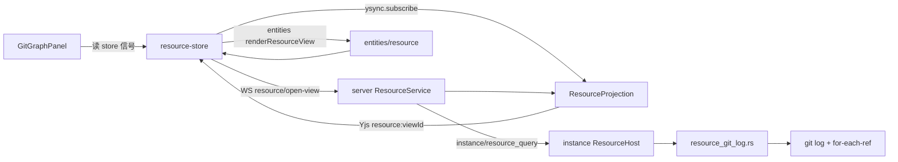

# Git Graph 数据传输方案

> 状态：**权威设计 v1.1**（2026-08-31，对抗审查修订）
>
> 范围：Web Resource Workbench 的 **Git Graph** 面板从 project 绑定 instance 上的 Git 仓库读取**有界提交历史**，经 server 投影到浏览器。本文是 Git Graph 数据面的唯一权威说明；总线与安全边界继承 [`remote-fs-git-protocol.md`](remote-fs-git-protocol.md)。
>
> **与父文档关系**：`remote-fs-git-protocol.md` 仍为 FS/Git 总线草案（v0.3）；**Git Graph 的 view kind、DTO、分页与安全条款以本文为准**。命名映射见 §4.0。
>
> 前置：Git Graph **可视化与布局引擎**已在 `web/widgets/resource/git/` 与 `ui-sandbox` 定稿；当前生产数据为 mock（`git-graph-mock.ts`）。本文定义 **machine → server → 前端** 的数据契约与落地顺序。

---

## 1. 决策摘要

1. **沿用 Resource 短租约 Yjs 投影**，与 Source Control（`git/repository`、`git/group-page`）同一管道；**不**走 `hub:registry` 长订阅，也**不**在浏览器执行 `git log`。
2. **新增视图种类 `git-log-page`**：按 `repoId` 分页返回提交 DAG 元数据（hash、parents、message、author、date、refs）；**布局与 SVG 路径只在客户端**由 `git-graph-engine.ts` 计算。
3. **instance 是唯一 Git 执行点**：固定 argv、`git` 子进程、有界 stdout 解析；raw stdout/stderr、绝对路径、任意 ref 字符串不得穿透到 Web。
4. **分页与 cursor** 对齐现有 `GitGroupPage`：`cursor = {repositoryGeneration}.{offset}`（见 `resource_common::parse_cursor`），**禁止**将客户端 token 当作 git object name；`offset` 映射为 `git log --skip=<offset>`。
5. **与 SCM 共享 `repoId`**，但 **log 页须额外携带 `expectedGeneration` + `headOid` 围栏**：`repository.generation` 来自 `hash_bytes(status)`（与 SCM 相同），**不足以单独证明 commit DAG 未变**；须以 `headOid` 变化触发 log 缓存失效。
6. **布局键统一为完整 `oid`**：`parents[]` 与 `layoutGitGraph` 的 `hash` 字段均使用 40 字符 oid；`shortOid` 仅用于表格「Commit」列展示。

---

## 2. 在整体架构中的位置



| 层 | 模块 | Git Graph 职责 |
| --- | --- | --- |
| **instance** | `ResourceHost` → `GitLog` query | 有界 `git log`、path-scoped（subtree 时）、解析为 `GitLogPage` DTO |
| **server** | `ResourceService` + `ResourceProjection` | 解析 `projectId` → workspace/instance/root；发布 `git_log_page` Y.Doc；租约/TTL/单写 |
| **proto** | `peri-studio-proto::resource` | `ResourceViewKind::GitLogPage`、`InstanceResourceQueryKind::GitLog`、DTO |
| **web** | `entities/resource` → `store`（`resource-state` / `resource-store`）→ `features/resource` → `widgets/resource/git` | 解析 Yjs、`reduceResourceView` 合并页、映射为 `GitGraphCommit`、驱动面板 |

**数据流（依赖方向）**：`Yjs Doc` → `entities`（只读解析）→ `store/reduceResourceView` → `features/map-git-log`（纯函数）→ `widgets/GitGraphPanel`。

**明确不采用的路径**

| 路径 | 原因 |
| --- | --- |
| `hub:registry` / Machine 拓扑 | 全局实例注册表，不含 per-repo 提交历史 |
| HTTP blob | 提交元数据体量小且需与 `generation`/`headOid` 同屏 |
| 浏览器直连 instance | 违反资源协议安全边界 |
| server 预计算 graph layout | 布局属视图模型；wire 只传 DAG 事实 |
| cursor 编码 `lastOid` | 与现有 `parse_cursor` 不一致，且构成 git object oracle 面 |

---

## 3. 现状与缺口

| 能力 | Source Control（已落地） | Git Graph（目标） |
| --- | --- | --- |
| instance 查询 | `GitSnapshot`、`GitChanges`、`GitDiff`、`GitMutate` | **`GitLog`**（待实现） |
| `ResourceViewKind` | `git_repository`、`git_group_page` | **`git_log_page`**（待实现） |
| server 投影 | `resource_projection.rs` 分支 | **`GitLogPage` 分支**（待实现） |
| web entity | `renderResourceView` 四种 view | **`git_log_page` + `VIEW_TYPES` 白名单**（待实现） |
| web store | `reduceResourceView` 级联 SCM | **独立 `git_log_page` 分支**（禁止落入 group fallthrough） |
| UI | `SourceControlPanel` 读 `resourceWorkspace()` | `GitGraphPanel` 仍用 **`MOCK_GIT_GRAPH_COMMITS`** |

---

## 4. 数据模型

### 4.0 命名映射（规范性）

| 层 | 格式 | Git Graph 值 |
| --- | --- | --- |
| WS `OpenResourceView.kind` | kebab-case | `git-log-page` |
| Yjs `meta.view_type` | snake_case | `git_log_page` |
| Instance query serde tag | snake_case | `git_log` |
| `remote-fs-git-protocol.md` §4.3 文档 kind | slash（设计叙述） | `git/log-page`（**实现以 kebab/snake 为准**） |

### 4.1 Wire DTO（proto，camelCase JSON）

```ts
type GitLogPage = {
  repoId: string;
  /** 与 git/repository.generation 相同（status hash）；分页 cursor 前缀 */
  sourceGeneration: string;
  commits: GitLogCommit[];
  nextCursor?: string;          // "{sourceGeneration}.{offset}"，instance 生成
  /** 查询完成时的 HEAD；用于 isHead 与跨页 fence */
  headOid: string;
  /** 是否在 subtree 只读 scope 下查询（未来 proto 字段；G1 可先省略） */
  scope?: 'full' | 'workspace-subtree-readonly';
};

type GitLogCommit = {
  commitId: string;             // MUST 等于 oid（Y.Map 键与 merge 键）
  oid: string;                  // 完整 40 字符；布局与 parents 的唯一键
  shortOid: string;             // 展示用（建议 8 字符）；不得用于 parents 或 layout
  message: string;              // subject only
  messageTruncated?: boolean;
  authorName: string;
  authorDate: string;           // ISO-8601
  parents: string[];            // 完整 oid；顺序与 git 一致
  parentsComplete: boolean;     // false = 父提交数超过上限，DAG 在该节点不完整
  refs: GitRefLabel[];
  refsComplete: boolean;
};

type GitRefLabel = {
  name: string;                 // 展示名：main、origin/main、v1.0.0
  kind: 'branch' | 'remote' | 'tag';
};
```

**`GitLogQuery`（instance 输入）必须包含：**

```rust
pub struct GitLogQuery {
    pub repo_id: String,
    pub expected_generation: String,  // 绑定 git/repository.generation
    pub cursor: Option<String>,
    pub limit: u32,
}
```

**Generation 与 HEAD 围栏（规范性）**

- `repository.generation` = `hash_bytes(git status porcelain)`（与 SCM 相同，见 `instance/src/resource_git.rs`）。
- **不能**假设「generation 不变 ⇒ commit DAG 不变」（例如仅 remote ref 移动）。
- 每页响应 **MUST** 携带 `headOid`；web store 在同一 logical log session 内若 `headOid` 与首屏不一致，**MUST** 丢弃已合并分页并以 `STALE_CURSOR` 或全量重开处理。
- mutation 后 `refreshGitRepository` **MUST** 清空 `RepositoryState.log` 并释放 log view 租约（见 §9.3）。

### 4.2 Yjs 投影视图（`resource:{viewId}`）

与现有 `resource_projection.rs` 一致，root `meta` 使用：

| 键 | 含义 |
| --- | --- |
| `view_type` | `"git_log_page"` |
| `repo_id` | opaque repoId |
| `project_id` | 浏览器 project |
| `source_generation` | repository generation |
| `next_cursor` | 分页游标 |
| `status` | 当前实现为 `"ready"`（发布时写入） |
| `generated_at` | RFC3339 |
| `head_oid` | HEAD oid |

**加载 / 离线 / 错误** 由 **store** 的 `loading[]`、`error` 与全局连接状态表达（与 SCM 相同），**不在** Yjs `meta` 发明 `availability` 枚举（除非后续统一升级所有 resource view）。

`entry_order`：`Y.Array<commitId>`；`entries`：`Y.Map<commitId, fields>`。

#### 4.2.1 Yjs entry 字段（与 `git_group_page` 同级扁平字段）

| 键 | 类型 | 说明 |
| --- | --- | --- |
| `oid` | string | 完整 hash |
| `short_oid` | string | 展示 |
| `message` | string | subject |
| `message_truncated` | bool | 可选 |
| `author_name` | string | |
| `author_date` | string | ISO |
| `parents` | string（JSON 数组）或 `Y.Array` | **实现二选一并写入 projection 测试**；推荐 JSON 字符串 以减少 Yjs 嵌套差异 |
| `parents_complete` | bool | |
| `refs` | string（JSON 数组） | `[{name, kind}]` |
| `refs_complete` | bool | |

**禁止**在 Doc 内存放：SVG path、layout 坐标、diff、绝对路径。

### 4.3 前端视图模型（widget）

`GitGraphPanel` 消费 `GitGraphCommit`（`web/widgets/resource/git/types.ts`）。映射在 **`features/resource/map-git-log.ts`**（纯函数 + 单测）：

| Wire | Widget | 规则 |
| --- | --- | --- |
| `oid` | `id` | |
| `oid` | `hash` | **布局键**；与 `parents[]` 一致 |
| `shortOid` | （仅 Commit 列） | 表格列可单独传 `shortOid`，但 `hash` 必须为完整 oid |
| `message` | `message` | |
| `authorName` | `author` | |
| `authorDate` | `date` | ISO 字符串 |
| `authorDate` | `time` | **mapper 派生**相对时间（如 `2m`） |
| `parents` | `parents` | 完整 oid |
| `refs[].name` | `refs[].label` | |
| `refs[].kind` | `refs[].tone` | `branch`/`remote`/`tag`；**无 `head` kind**——HEAD 用 `isHead` 圆点 |
| `oid === headOid` | `isHead` | `headOid` 来自 `GitLogPage` 或 `RepositoryState.headOid` |

`layoutGitGraph(commits, headHash, …)` 的 `headHash` **MUST** 为完整 oid（与 `commit.hash` 相同命名空间）。

**分页与布局**：单页底部提交之 parent 可能位于下一页，`layoutGitGraph` 会将缺失 parent 暂挂 `nullVertex`；加载更多并 **全量重算 layout** 后连线收敛。UI 须在未加载完历史时接受底部「悬空边」，不得假装 DAG 已完整。

---

## 5. 端到端时序

### 5.1 打开 Graph（首屏）

1. 用户切换到 Graph rail → `activateResourceProject(projectId)`（与 explorer/scm 相同）。
2. 等待 `workspace/repositories-page` → `git/repository` 级联完成。
3. `openGitLog(repoId, { expectedGeneration, cursor: null })`。
4. server → instance `GitLog`；投影 `git_log_page`；store `reduceResourceView` 写入 `RepositoryState.log`。
5. `mapGitLogToGraphCommits` → `GitGraphPanel`。

### 5.2 加载更多（分页）

- 用户点击「Load more」→ `openGitLog(repoId, { expectedGeneration, cursor: nextCursor })`。
- **每页独立 `viewId`/Doc**；store 在 `sourceGeneration` 与 `headOid` 均匹配时 **按 `entry_order` 追加** commits（与 `git-group-page` 相同代次合并规则）。
- 合并完成后 **MUST** `ysync.unsubscribe` + `resource/release-view` 释放**上一页** Doc，避免 `max_views_per_principal`（32）耗尽。
- `next_cursor` **仅**为 `{sourceGeneration}.{offset}`；浏览器不得解析。

### 5.3 刷新与失效

| 触发 | 行为 |
| --- | --- |
| `git/commit` 等 mutation `committed` | `refreshGitRepository` 清空 `groups` **与 `log`**，释放 `log:${repoId}:*` 租约，重开 `git/repository` |
| `repository.head_oid` 变化（即使 generation 未变） | 清空 `log` 缓存，从 `cursor=null` 重拉 |
| 用户点击 Refresh | 同上 |
| `STALE_CURSOR` | 清空 log 缓存，从首屏重查；**禁止** merge 旧页 |
| instance 离线 | store 级错误；保留最后有界页供展示（与 SCM 一致） |

Graph **不**订阅 instance 原始 invalidation 事件；以 **store 代次 + headOid** 收敛。

---

## 6. Proto 扩展（相对 v4）

```rust
// ResourceViewKind — wire: "git-log-page"
GitLogPage,

// InstanceResourceQueryKind — wire tag: "git_log"
GitLog(GitLogQuery),

// InstanceResourcePayload
GitLogPage(GitLogPage),
```

`OpenResourceView` **已含** `repo_id`、`cursor`、`limit`；仅新增 kind 与 instance payload/query 类型。

**能力协商**：可复用 `maxDirectoryPageSize` / `DEFAULT_DIRECTORY_PAGE_SIZE`，或新增 `maxGitLogPageSize`（须写入 hello caps 与契约测试）。**默认 `limit` 建议 50–100**（见 §10.3 体积预算）；上限 500。

---

## 7. instance 实现要点

**新模块**（建议）：`instance/src/resource_git_log.rs`，由 `resource.rs` 分发；**复用** `resource_common::{cursor_for, parse_cursor}` 与 `resource_git::git()` 子进程封装。

### 7.1 查询语义

1. `resolve_repo(repo_id)`（与 SCM 相同）。
2. 重算 `generation = hash_bytes(status)`；若 `expected_generation != generation` → **`STALE_CURSOR`**。
3. `offset = parse_cursor(cursor, &generation)?`。
4. 执行有界 `git log --skip=<offset> --max-count=<limit>`（固定 `--pretty=format:`，字段顺序封闭）。
5. 解析 oid 须匹配 `/^[0-9a-f]{40}$/`（或仓库 hash 长度）；否则整页 **`UNAVAILABLE`**。
6. refs：对页内 oid 使用有界 `git for-each-ref --points-at=<oid>`；**禁止**无界全仓库扫描（见 §10.4）。

**Workspace subtree（与 remote-fs-git §7.1 对齐）**

- 当 workspace 为更大仓库的子目录时，**MUST** 使用 path 限定 log（例如 `git log -- <validated-relative-path>`），**禁止**返回 workspace 外提交历史。
- 若 instance 尚无法可靠实现 subtree 有界 log，**MUST** 返回 `REPO_SCOPE_READ_ONLY` 或 `UNSUPPORTED_CAPABILITY`，**禁止** fail-open 为全仓库 log。
- 注：当前 wire **尚无** `RepoScope` 字段；G1 验收以 fixture 行为为准，proto 字段在后续迭代补充。

### 7.2 CLI 约束

- 固定 argv 数组；**禁止** shell；**禁止**将 cursor、message、ref 名拼入 argv。
- 继承：`GIT_TERMINAL_PROMPT=0`、`GIT_OPTIONAL_LOCKS=0`、stderr 丢弃、timeout、`MAX_GIT_OUTPUT_BYTES`（8 MiB）。
- 解析失败返回 `GIT_NOT_AVAILABLE` / `UNAVAILABLE` / `VIEW_TOO_LARGE`；不泄漏 stderr。

### 7.3 与 `git/refs` 的关系

| 阶段 | 行为 |
| --- | --- |
| **G1** | refs 随 `git-log-page` 每页附带 |
| **G2** | 独立 `git/refs` 分页视图（remote-fs-git §7.2 已规划但未实现） |

---

## 8. server 实现要点

1. `OpenResourceView { kind: GitLogPage, repoId, cursor, limit }` + 从当前 `git/repository` 投影读取 `expected_generation` 填入 `GitLogQuery`。
2. `ResourceProjection::publish`：`view_type = git_log_page`；entries 按 §4.2.1 写入；`head_oid` 写入 meta。
3. **授权**：principal + project；`repoId` 必须属于该 workspace 的 discover 结果。
4. **租约**：短 TTL；分页合并后客户端应 `release-view` 旧页。
5. **不写 SQLite**。

---

## 9. Web 实现要点

### 9.1 分层

| 层 | 职责 |
| --- | --- |
| `entities/resource/resource-view.ts` | `VIEW_TYPES` 增加 `git_log_page`；解析 §4.2.1 字段 |
| `features/resource/map-git-log.ts` | Wire → `GitGraphCommit`；oid 布局键；相对时间 |
| `features/resource/resource-state.ts` | `RepositoryState.log?: { commits, nextCursor, sourceGeneration, headOid }`；**独立 `if (view.viewType === 'git_log_page')` 分支** |
| `features/resource/resource-store.ts` | `openGitLog` / `openMoreGitLog`；`requested` 键 `log:${repoId}:${cursor??'start'}` |
| `widgets/resource/git/GitGraphPanel.tsx` | 读 store；Refresh 调用 `refreshGitLog(repoId)` |
| `widgets/resource/ResourceWorkbench.tsx` | `view === 'graph'` 时 `activateResourceProject` |

### 9.2 多仓库选择（规范性）

当前 SCM **无**「选中仓库」状态。Graph **MUST** 使用确定性规则：

1. `repositories.length === 0` → 空态；
2. `repositories.length === 1` → 该 repo；
3. `repositories.length > 1` → **默认第一个** `repositories[0]`，并在 Graph 顶栏提供 **repo 切换器**（G3 验收项）。

### 9.3 Store 变更清单（实现门禁）

- `reduceResourceView`：**禁止**落入 `git_group_page` fallthrough（当前 `groupId!` 分支会把未知 view 写入 `groups[undefined]`）。
- `RepositoryState` 增加 `headOid`（自 `git/repository` 的 `meta.head_oid`）。
- `refreshGitRepository`：`prefixes` 增加 ``log:${repoId}:``；清空 `log` 对象。
- `openMoreGitLog` 合并后 `releaseResourceView` 上一页。
- **`maxAccumulatedCommitsPerRepo`**（建议 4000）：达到上限停止 Load more。

### 9.4 空态与错误

| 状态 | UI |
| --- | --- |
| 无 repo | `EmptyState` |
| `GIT_NOT_AVAILABLE` / `REPO_SCOPE_READ_ONLY` | 内联错误 + Retry |
| `STALE_CURSOR` | 静默重拉首屏或 Toast「History changed」 |
| `VIEW_TOO_LARGE` | 提示缩小范围或降低 limit |
| 有 `nextCursor` | 「Load more commits」 |

---

## 10. 限额、安全与 fail-closed

继承 [`remote-fs-git-protocol.md`](remote-fs-git-protocol.md) §8–§9，并追加：

### 10.1 体积与截断（规范性）

| 项 | 值 | 说明 |
| --- | --- | --- |
| 默认 `limit` | **50**（可调至 100） | 须证明单页 JSON/Yjs ≤ 256 KiB |
| 最大 `limit` | 500 | 与目录页上限一致 |
| 单页编码快照 | ≤ **256 KiB** | 超出 **MUST** `VIEW_TOO_LARGE` + `suggestedLimit`；**禁止**截断后标 `complete` |
| 每 commit `parents` | ≤ 8 | 超出设 `parentsComplete: false` 或整页 `VIEW_TOO_LARGE` |
| 每 commit `refs` | ≤ 16 | 超出设 `refsComplete: false` |
| `message` | ≤ 4 KiB subject | 超出 `messageTruncated: true` |
| `GitRefLabel.name` | ≤ 256 字节 | 拒绝 `\0`、`..`、绝对路径；违规 ref 丢弃 |
| 并发 `GitLog` | ≤ 4 / instance | 与 git query 池共享 |
| 累计 commits / repo（浏览器） | ≤ **4000** | 达上限禁止继续 Load more |

**禁止静默截断 parents/refs 后仍绘制「完整」merge 图**（对齐 remote-fs-git §9.6）。

### 10.2 Cursor 与代次

- **MUST** `{repositoryGeneration}.{offset}`；**MUST NOT** `{lastOid, skip}` 或任意 oid 入参。
- `expected_generation` 不匹配 → **`STALE_CURSOR`**（非 `VERSION_CONFLICT`；后者仅用于 mutation CAS）。

### 10.3 日志与审计

info 级日志 **MUST NOT** 记录 commit message、完整 cursor、或超过 3 个 oid。允许：`operation=git_log`、`projectId`、`repoId`、`limit`、`offset`、`errorCode`、`durationMs`。

### 10.4 Graph mutation（`resource/git-action`）

Git Graph 写操作复用 SCM 同一 `resource/git-action` 通道，**CAS 绑定 `repository.generation`（status 哈希）**，成功后 web **MUST** `refreshGitRepository`（清空 `log` 并重开）。

| `action` | 必填字段 | git 命令（instance 固定 argv） |
| --- | --- | --- |
| `checkout` | `refName` **或** `targetOid`（互斥） | `checkout -- <ref>` / `checkout --detach <oid>` |
| `create-branch` | `refName` + `targetOid` | `branch <name> <oid>` |
| `rename-branch` | `refName` + `newRefName` | `branch -m <old> <new>` |
| `reset` | `targetOid`；`resetMode` 可选（默认 `mixed`） | `reset --soft\|--mixed\|--hard <oid>` |
| `revert` | `targetOid` | `revert --no-edit <oid>` |

`refName` / oid **MUST** 经 server + instance 双侧校验；**禁止**浏览器提交路径或任意 argv。


## 11. 落地阶段

| 阶段 | 交付 | 验收 |
| --- | --- | --- |
| **G1** | proto + instance `GitLog` + 契约测试 | `parse_cursor`、subtree path 限定、merge commit、`parentsComplete`/`refsComplete`、oid 校验 |
| **G2** | server 投影 + E2E | Yjs 字段 round-trip；越权拒绝；256 KiB 预算 |
| **G3** | web store + entity + Graph | 去掉 mock；`reduceResourceView` 独立分支；release 旧页租约；repo 切换器（N>1） |
| **G4** | 大面板 + Graph mutation UI | 桌面 Graph 占满 conversation pane；右键 checkout / branch / reset / revert |
| **G5**（可选） | sandbox 说明 | Layers 标注 live 数据依赖 instance |

**PR 顺序**：`proto` → `instance` → `server` → `web`；**G1 合并前本文 v1.1 条款为验收门禁**。

---

## 12. 测试策略

| 层级 | 内容 |
| --- | --- |
| instance | linear / merge / tag / detached HEAD；subtree 不泄漏外部 commit；`STALE_CURSOR`；stdout 超限 |
| server | projection 嵌套 `parents`/`refs` JSON；principal 隔离 |
| web | `map-git-log` oid 键；`reduceResourceView` 不污染 `groups`；分页 merge + headOid fence |
| browser | `scenario=git-graph`（可选） |

---

## 13. 明确拒绝

- 在 Yjs/WS 传输 **SVG / layout path / lane index**。
- 无分页全量 `git log --all`。
- **Machine 注册表** 或 **chat doc** 承载 commit DAG。
- 浏览器 **WebWorker git**。
- cursor 中编码 **commit oid** 并传入 git。
- **静默截断** parents/refs 后仍展示完整 merge 拓扑。
- 将 commit 历史与 **ACP chat message** 混为同一投影。

---

## 14. 相关文档

| 文档 | 关系 |
| --- | --- |
| [`remote-fs-git-protocol.md`](remote-fs-git-protocol.md) | FS/Git 总线、租约、blob、SCM DTO |
| [`frontend-architecture.md`](frontend-architecture.md) | Web 分层 |
| [`ui-implementation-plan.md`](ui-implementation-plan.md) | Graph **视觉**已落地 |
| [`architecture.md`](../architecture.md) §10 | Resource workbench |

**变更记录**

| 版本 | 日期 | 说明 |
| --- | --- | --- |
| v1.0 | 2026-08-31 | 首版：resource 短租约投影 + `git-log-page` |
| v1.1 | 2026-08-31 | 对抗审查修订：oid 布局键、`parse_cursor` 分页、headOid 围栏、Yjs meta 对齐实现、subtree log、租约释放、安全 fail-closed |
| v1.2 | 2026-08-31 | Graph mutation：`checkout` / `create-branch` / `rename-branch` / `reset` / `revert`；大面板 UI |
