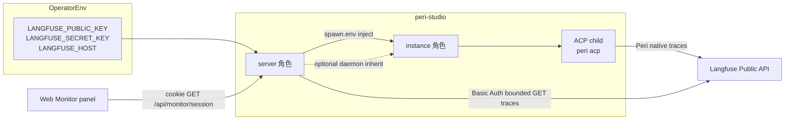

# Langfuse Monitor

> 状态：v1 设计稿（未实现）  
> 日期：2026-09-13  
> 关联：[`docs/terminology.md`](../terminology.md)（四层身份）、[`docs/architecture.md`](../architecture.md) §3.2 / health、[`docs/design/realtime-voice.md`](realtime-voice.md)（可选集成 + health 布尔模式）

## 1. 目标与非目标

### 1.1 目标

在 peri-studio 打通「**当前打开的 ACP session → Langfuse 中该 session 的观测摘要**」。

- Peri agent 已能按环境变量向 Langfuse 上报 trace，但 **ACP `session_id` 尚未作为 Langfuse `sessionId`**。本体系约定二者相等；peri-studio **只按当前 ACP id 查询**，不发明第三套观测 id。
- Web Monitor 面板在 Workbench rail 中展示当前 project session 的 trace 列表与汇总指标；数据经 server 同源 HTTP 拉取，不写入 Yjs。
- `/api/health` 暴露 credential-free 布尔 `langfuse`，供 UI 决定是否显示 Monitor 入口（模式同 `realtimeVoice`）。

### 1.2 非目标（V1）

| 不做 | 原因 |
|------|------|
| 浏览器直连 Langfuse | key / host 不得进入前端、health、日志或 Yjs |
| 通用 Langfuse 反代 | 只实现有界 `GET traces?sessionId=`，禁止任意路径代理 |
| prompt / trace 全文回放 | Chat Doc 已有对话；V1 DTO 不含 trace `input` / `output` |
| Langfuse 事实写入 Yjs | 外部系统，HTTP 拉取，不是 server 投影 |
| 修改 Peri 仓库代码 | 映射为跨仓库契约；本仓库只文档 + 查询 |
| peri-studio 在 `session/new` / `session/load` 的 `_meta` 里传观测 id | 你已选「本仓库只查询」；映射由 Peri 在 ACP 侧完成 |
| Langfuse v1 `/sessions/{id}` 双栈 | v4 将 404；V1 只用 traces 列表；v2 observations 为后续迁移点 |
| 按 principal 隔离 Monitor 目录 | M1 单操作员 loopback；目录为 server 全局 catalog（见 §4.2） |

## 2. 身份契约

### 2.1 选定键（唯一查询键）

```
ACP durable session_id  ===  Web selectedSessionId()  ===  Langfuse sessionId
```

| 层 | 标识 | 说明 |
|----|------|------|
| ACP | `session_id` | `session/new` 返回或 `session/load` 使用的 durable thread id |
| Web store | `selectedSessionId()` | 即 `ProjectSessionInfo.id`；Registry 投影 `acp_session_id` 同值 |
| Langfuse Public API | `sessionId` query 参数 | Peri 上报时必须写入该字符串 |
| Langfuse `trace.id` | 单次观测记录 | 仅作列表展示，**不是** session 键 |

**禁止**用 `chat_id`（runtime 容器，server 重启即换）或 `project_id` 作为 Langfuse session。

### 2.2 与四层身份的关系

沿用 [`terminology.md`](../terminology.md) 四层边界：

- `project_id`：Web 分组；与 Monitor 查询无关。
- **ACP `session_id` / wire `sessionId`**：Monitor 的**唯一** Langfuse 查询键；即 project session 目录项 id。
- runtime `chat_id`：打开 project session 时绑定，重启不复活；**不得**用于 Langfuse。
- Langfuse `trace.id`：单次观测记录；仅作列表展示，不是 session 键。

### 2.3 Peri 侧义务（跨仓库，本 PR 不改代码）

Peri 必须在以下时机把 **ACP `session_id` 字符串**（完整、不截断）写入 Langfuse `sessionId`：

1. `session/new` 得到新 ACP id 之后、首个 turn 产生 trace 之前；
2. `session/load` 使用已有 ACP id 时，后续 trace 的 `sessionId` 必须与该 id 一致。

**截断策略（硬性）**：Peri **不得**截断 ACP id 作为 Langfuse `sessionId`。若 ACP id 超过 Langfuse 200 字符 US-ASCII 上限，Peri 须在 trace 创建前 fail-fast 并记录错误（不静默截断）。peri-studio 查询始终使用完整 ACP id；双方以同一字符串为契约。

实现参考（Peri 仓库，非本仓库）：`LangfuseSession::from_env` 及 trace 创建路径。peri-studio **不**通过 ACP `_meta` 下发或校验该映射。

### 2.4 空态语义（必须可区分）

| 条件 | UI 态 | API |
|------|-------|-----|
| 未配置 `LANGFUSE_*` | Monitor rail 按钮隐藏；若直接请求 API | `503` `langfuse_not_configured` |
| 已配置但无打开 session | 面板内空态 | 不发起查询或 `400` `session_required` |
| 已配置、有 session、Langfuse 无匹配 trace | 「No traces yet」 | `200`，`found: false`，`traces: []` |
| session id 不在 server 目录 | — | `403` `session_not_accessible` |
| 上游超时 / 5xx | 错误 + Retry | 稳定 `error` 码，不回传上游原文 |

## 3. 进程与环境

### 3.1 拓扑



- **配置真源**：`LANGFUSE_*` 以 **server 角色**进程环境为唯一运维入口（与 Monitor 读 API 同源）。
- **写路径**（trace 上报）：Hub 在 spawn ACP child 时从 server 进程读取已配置的 `LANGFUSE_*`，经 `instance/spawn { env }` **注入** ACP 子进程（模式同 [`spawn_env.rs`](../../server/src/channel/spawn_env.rs) 的 `PERI_MCP_APPS`）；ACP child 经 `env_clear()` 后仅保留 allowlist 基集 + spawn.env 键值 → Peri 写 trace。
- **读路径**（Monitor 查询）：Web → server `GET /api/monitor/session` → Langfuse Public API；server 读**自身**进程环境，不经 instance 转发。

**远程拓扑（V1 接受）**：`LANGFUSE_*` 密钥随 `instance/spawn.env` 经 instance 协议送达远端 `connect`，再进入 ACP child。这是远程 Peri 能 trace 的唯一可靠路径；**不得**把「运维在远端 connect 进程单独导出 `LANGFUSE_*`」作为主契约。密钥仍**不得**进入 health、日志、Yjs 或浏览器；**不得**记录 spawn.env 键值。

| 角色 | 变量位置 | 用途 |
|------|----------|------|
| server（`serve` / `local` 的 server 进程） | operator 配置的唯一真源 | Monitor 读 API；Hub spawn 时注入 ACP |
| instance（`connect`） | 不经由 operator 单独配置为主路径 | 透传 spawn.env 至 ACP child |
| ACP child | spawn.env + allowlist 基集 | Peri 写 trace |

**优先级（冲突时）**：Hub 经 spawn.env 注入的值 **优先于** instance daemon 经 allowlist inherit 的同名键（inherit 仅作 spawn.env 未携带该键时的兜底）。

### 3.2 环境变量

与 Peri `LangfuseSession::from_env` 对齐；**不**另发明 `PERI_STUDIO_LANGFUSE_*` 前缀。

| 变量 | 必填 | 含义 |
|------|------|------|
| `LANGFUSE_PUBLIC_KEY` | 是（与 secret 成对） | Public API Basic Auth 用户名 |
| `LANGFUSE_SECRET_KEY` | 是 | Public API Basic Auth 密码 |
| `LANGFUSE_HOST` 或 `LANGFUSE_BASE_URL` | 否 | API / UI 根；默认 `https://cloud.langfuse.com` |

**优先级**（server 与 Peri 必须一致）：`LANGFUSE_BASE_URL` > `LANGFUSE_HOST` > 默认 `https://cloud.langfuse.com`。

**已配置判定**：`public_key` 与 `secret_key` 均非空 trim 后即为 `langfuse: true`；host 缺失时用默认 cloud。

配置源（实现时对齐 realtime voice 的「server 进程 env + health 布尔」模式，但写路径经 spawn 注入而非 instance 自读）：

- **server 进程环境变量**为唯一运维配置面（读路径与 spawn 注入同源）；
- Hub 在 ACP spawn 时将 server 侧非空 `LANGFUSE_*` 写入 `instance/spawn.env`；
- 不在 V1 增加 `config.toml` 字段（避免双源；若后续需要再 ADR）。

**上游 URL 校验（SSRF 防护）**：解析 host 时要求 `https`；仅 loopback 开发场景允许 `http`（与全局 `connect` / `wss` 策略一致）。拒绝 userinfo、fragment 与非 API 路径；出站请求路径固定为 `/api/public/traces`。

### 3.3 ACP 子进程环境与 spawn 注入

今日 [`ENV_BASE_ALLOWLIST`](../../instance/src/child.rs) 与 server [`ENV_ALLOWLIST_BASE`](../../server/src/config/mod.rs) 在 `env_clear()` 后仅保留 `PATH` / `HOME` / `LANG` / `SHELL` / `PERI_MCP_APPS`；Studio 拉起的 `peri acp` **看不到** Langfuse 变量，除非 Hub 经 spawn.env 注入。

**实现要求**（双端 allowlist **必须一致**，architecture §9.6；spawn.env 键未 allowlist 会被拒绝）：

| 列表 | 变更 |
|------|------|
| server `ENV_ALLOWLIST_BASE` | **新增** `LANGFUSE_PUBLIC_KEY`、`LANGFUSE_SECRET_KEY`、`LANGFUSE_HOST`、`LANGFUSE_BASE_URL` |
| instance `ENV_BASE_ALLOWLIST` | **同上四键**（spawn.env 透传 + 可选 daemon inherit 兜底） |
| Hub [`spawn_env.rs`](../../server/src/channel/spawn_env.rs) | 扩展 `default_acp_spawn_env()`（或等价路径）：从 **server 进程 env** 读取非空 `LANGFUSE_*` 并入 spawn map（模式同 `PERI_MCP_APPS`） |

`PERI_MCP_APPS` 与 `LANGFUSE_*` 均属 Hub **主动注入** spawn.env 的键；二者均须出现在 server / instance 双端基集 allowlist。

**合并语义**（instance `child.rs` spawn 顺序）：`env_clear()` → allowlist 基集（daemon 环境）→ spawn.env 键值。**spawn.env 覆盖**同名 allowlist inherit 值。

契约测试须断言：

- 四键出现在 server `ENV_ALLOWLIST_BASE` 与 instance `ENV_BASE_ALLOWLIST`；
- server 已配置 `LANGFUSE_*` 时，Hub spawn 携带对应 spawn.env 条目；
- spawn.env 值**不出现在**日志、health、Yjs 或测试断言明文。

注意：`LANG`（locale）与 `LANGFUSE_*` 名称相近但语义无关，文档与运维清单中须分开列出。

## 4. Server API

### 4.1 风格

手写 HTTP（无 axum），路由注册于 [`server/src/web/http.rs`](../../server/src/web/http.rs)，模式仿 [`/api/resource-blobs`](../../server/src/web/http.rs) 的 loopback + cookie 认证，并**额外要求同源 Origin**（比 resource-blobs 更严，对齐 auth 端点 CSRF 防护）。

### 4.2 `GET /api/monitor/session`

**Query**

| 参数 | 必填 | 说明 |
|------|------|------|
| `sessionId` | 是 | ACP durable `session_id` |

**Query 校验**（上游调用前）

- 非空；≤ 200 字符；US-ASCII 可打印字符；
- 拒绝 `&`、`#`、控制字符等会破坏 query 的字符；
- 失败返回 `400` `{ "error": "invalid_session_id" }`（区别于 `session_not_accessible`）。

**认证与授权**

- Cookie `peri_studio_session`；`TokenRole::Full`。
- Peer 须 loopback；`Host` 通过 loopback 校验；`Origin` 同源。
- `sessionId` 必须存在于 **server 全局 session 目录**（`projects.catalog()` / Registry `project_sessions`）。M1 不按 `principalId` 过滤；任意 Full token 可查询目录内任意 session（与 architecture §9 单操作员假设一致）。

**响应**

- 未配置 Langfuse：`503`，`{ "error": "langfuse_not_configured" }`
- 未登录：`401`，`{ "error": "unauthorized" }`
- session 不在目录：`403`，`{ "error": "session_not_accessible" }`
- 缺少或非法 `sessionId`：`400`，`{ "error": "session_required" }` 或 `invalid_session_id`

**上游调用（有界）**

```
GET {host}/api/public/traces?sessionId={percent_encoded_id}&limit=50
Authorization: Basic base64(public_key:secret_key)
```

- 总超时 30s（单次请求预算，含 DNS、TCP、TLS、读写）；TCP 阶段 15s；响应体大小上限（如 512 KiB）；超限 → `upstream_payload_too_large`。
- 出站为直连 TCP+TLS 至 `LANGFUSE_BASE_URL` / `LANGFUSE_HOST`；DNS 解析优先 IPv4；V1 **不**支持 HTTP(S) 转发代理。
- 失败映射为稳定 `error` 码（如 `langfuse_upstream_timeout`、`langfuse_upstream_error`），**不回传** Langfuse 响应原文。
- **禁止**通用路径代理或其它 Langfuse 端点（scores、datasets、prompts 等）。

### 4.3 V1 视图 DTO（camelCase JSON）

不含 trace `input` / `output` 全文。

```json
{
  "sessionId": "acp-…",
  "configured": true,
  "found": true,
  "summary": {
    "traceCount": 12,
    "totalTokens": 48200,
    "totalCostUsd": 0.042,
    "lastTimestamp": "2026-09-13T08:00:00.000Z"
  },
  "traces": [
    {
      "id": "trace-uuid",
      "name": "turn",
      "timestamp": "2026-09-13T08:00:00.000Z",
      "latencyMs": 1200,
      "tokens": 4100,
      "costUsd": 0.003,
      "level": "DEFAULT"
    }
  ]
}
```

| 字段 | 说明 |
|------|------|
| `configured` | 恒为 `true`（仅已配置时可达此 handler）；供前端统一解析 |
| `found` | 是否存在 ≥1 条 trace |
| `summary` | 由 traces 列表聚合；`totalCostUsd` 可选（上游缺失时省略） |
| `traces[].name` | 有界展示；Peri 应使用通用名（如 `turn`），避免路径/工具名泄漏；server 侧 max length 截断 |
| `traces[].level` | `DEFAULT` \| `ERROR`（映射 Langfuse level） |

Langfuse v1 `GET /api/public/sessions/{id}` 在 v4 将移除；V1 **不**调用。V1 drill-in 使用 `GET /api/public/traces/{traceId}`（见 §4.4）。

### 4.4 `GET /api/monitor/trace`

**Query**

| 参数 | 必填 | 说明 |
|------|------|------|
| `sessionId` | 是 | ACP durable `session_id` |
| `traceId` | 是 | Langfuse `trace.id` |

**认证与授权**：同 §4.2（cookie + Full + loopback + Origin + catalog sessionId）。

**上游调用（有界）**

```
GET {host}/api/public/traces/{percent_encoded_trace_id}
Authorization: Basic base64(public_key:secret_key)
```

- 总超时 / 响应体上限同 §4.2。
- 上游返回后 **必须**校验 `trace.sessionId === query.sessionId`；不匹配视为 `404 trace_not_found`（防跨 session 探测）。
- DTO **不得**含 observation / trace 的 `input` / `output`；generation 可保留 `model`、`tokens` 等元数据。

**响应 DTO（camelCase JSON）**

```json
{
  "sessionId": "acp-…",
  "traceId": "trace-uuid",
  "name": "turn",
  "observations": [
    {
      "id": "obs-root",
      "name": "agent",
      "kind": "SPAN",
      "latencyMs": 900,
      "level": "DEFAULT",
      "children": [
        {
          "id": "obs-child",
          "name": "llm",
          "kind": "GENERATION",
          "latencyMs": 700,
          "level": "DEFAULT",
          "model": "gpt-4",
          "tokens": 1200,
          "children": []
        }
      ]
    }
  ]
}
```

| 字段 | 说明 |
|------|------|
| `observations[]` | 由 `parentObservationId` 映射为嵌套 `children[]`；上限 200 节点 |
| `observations[].kind` | `SPAN` \| `GENERATION` \| `EVENT` |
| `observations[].level` | `DEFAULT` \| `ERROR` \| `WARNING` \| `DEBUG` |

**错误码（增量）**

| `error` | HTTP | 含义 |
|---------|------|------|
| `trace_required` | 400 | 缺少 `traceId` |
| `invalid_trace_id` | 400 | `traceId` 格式非法 |
| `trace_not_found` | 404 | 上游 404 或 sessionId 不匹配 |

### 4.5 Health

`GET /api/health` 增加布尔字段 `langfuse`（camelCase），不含 host / key / project id。判定同 §3.2「已配置」。

## 5. Monitor Workbench UI

### 5.1 壳层归属

「弹窗」= 现有 **Workbench rail + `ResourceFloatingPanel`**（与 Terminal、Explorer 同族），**不是** Settings `Dialog`（Settings 走侧栏齿轮 → `AppSettingsPanel`）。

| 场景 | 行为 |
|------|------|
| 桌面 | 右侧 `ResourceFloatingPanel` |
| 移动 compact | 已有 `resource-compact` `Dialog` 自动包裹整个 Workbench |

参考：[`ResourceWorkbench.tsx`](../../web/src/widgets/resource/ResourceWorkbench.tsx)、[`ResourceFloatingPanel.tsx`](../../web/src/widgets/resource/ResourceFloatingPanel.tsx)。

### 5.2 类型与模块落点

| 层级 | 路径 | 职责 |
|------|------|------|
| T3 | `packages/ui/src/components/monitor/` | 无 store 壳：`MonitorPanelShell`（trace 列表）、`MonitorTraceTurnTreeShell` + `IoTabsShell` / `IoViewer`（trace drill-in）；**body-only** |

> **Legacy 移除（2026-09-14）**：旧 `MonitorObservationTree` / `MonitorTraceDetailShell` / `MonitorObservationDetailShell` 已由 `MonitorTraceTurnTree` + `IoViewer` 替代；web / ui-sandbox 零引用后自 `@peri/ui` 删除。
| T4 | `web/src/widgets/resource/MonitorPanel.tsx` | store 接线、`selectedSessionId()`、列表/drill-in 状态、Refresh、轮询生命周期 |
| Feature | `web/src/features/monitor/` | `fetchMonitorCapability`、`fetchSessionTraces`、`fetchTraceDetail`、DTO 解析、`flattenMonitorObservations` 适配器；`useMonitorCapability()` hook |
| Workbench | `ResourceWorkbench.tsx` | `WorkbenchView` 增 `'monitor'`；rail 按钮；`panelTitle` / `panelWidthProfile` |

**依赖方向**：`features/monitor` 不 import `store`；widget 注入 `sessionId`、fetcher 与 `turnActive()`。

**T3 props 契约（草案）**

```ts
type MonitorPanelShellProps = {
  embedded?: boolean;
  summary?: MonitorSummaryView | null;
  traces: MonitorTraceRowView[];
  state: 'loading' | 'empty-session' | 'empty-traces' | 'error' | 'ready';
  errorMessage?: string;
  onRetry?: () => void;
  onTraceSelect?: (trace: MonitorTraceRowView) => void;
};
```

`embedded` 时由外层 `WorkbenchPanelChrome` 提供标题与 Refresh/Close（同 `GitGraphView` + `nested` 模式）；T3 不渲染第二套 header。

**CSS 策略**：采用 Git Graph 模式——`monitor-panel-layout.ts` + Tailwind token utility；`css-contracts` 断言组件 import 路径，**不**在 `extra.css` 新增 `ui-monitor-*`（除非后续出现 Tailwind 无法表达的子选择器）。

### 5.3 Rail 与可见性

- Rail 按钮文案 **Monitor**；图标待定（如 `Activity`）。
- 顺序：**Terminal 之后、`SessionRailActions` 之前**（观测工具邻接运行时工具，与会话生命周期动作分离）。
- **仅当** `langfuse === true` 时渲染按钮。
- Capability 探测：`features/monitor/useMonitorCapability()`（或等效 hook），`onMount` 调 `fetchMonitorCapability`（仿 [`fetchVoiceCapability`](../../web/src/features/voice/capability.ts)）：`cache: 'no-store'`、`credentials: 'same-origin'`、失败 → 隐藏 rail。**不**写入 `store/index.ts`。
- `toggle('monitor')` 与 Explorer / Terminal 相同互斥逻辑。

### 5.4 Workbench 集成要点

Monitor 挂载于现有 `PanelBody` / `WorkbenchPanelChrome` 内：

```tsx
<Show when={view() === 'monitor'}>
  <MonitorPanel embedded />
</Show>
```

**不**走 `TerminalDockShell` 路径。

| 行为 | Monitor |
|------|---------|
| `activateResourceProject` | **不触发**（非 FS/Git 资源面） |
| Explorer/SCM Refresh header | **不显示** |
| 数据键 | 仅 `selectedSessionId()` |

### 5.5 布局与宽度

- `widthProfile`：新增 **`monitor`** profile，默认 **520px**，可拖拽 **360–720**，独立 storage key `peri:workbench-panel-width-monitor`（避免与 Terminal 共用 `peri:workbench-panel-width-terminal`）。
- 面板标题：**Monitor**；header 含 Refresh + Close（由 `WorkbenchPanelChrome` 提供）。

### 5.6 数据流与轮询

1. 打开 panel → 读 `selectedSessionId()` → `GET /api/monitor/session?sessionId=…`。
2. 点击 trace 行 → `GET /api/monitor/trace?sessionId=…&traceId=…` → 同 panel 内 drill-in observation 树。
3. Back → 回到 trace 列表（不关闭 workbench panel）。
4. 用户切换 project session → 取消 in-flight、清 drill-in、重拉列表。
3. Refresh 按钮 → 显式重拉。
4. turn 活跃时（V1 可选）：widget 读 `turnActive()` from `@/store`（同 `SessionRailActions` 门控）；仅当 `view === 'monitor' && panel visible && turnActive()` 时低频轮询（如 15s）；离开 panel 或 turn 结束则 `clearInterval`。

### 5.7 Sandbox 先行

1. `#/components-monitor`：`MonitorTraceTurnTreeLayout`、`MonitorIoDetailLayout` 等 mock 组合。
2. 在 `ui-sandbox/src/catalog/page-sections.ts` 登记 `#/components-monitor` 章节（trace 列表面板仍由生产 `MonitorPanelShell` 承载，不在 Shell catalog 重复 demo）。
3. `packages/ui` T3 组件 + `bun run test`。
4. `cd ui-sandbox && bun run typecheck` → 镜像 `web/src/widgets/resource/MonitorPanel.tsx`。

### 5.8 测试落点

| 类型 | 位置 |
|------|------|
| Feature 单测 | `web/src/features/monitor/*.test.ts`（DTO、错误码映射） |
| Widget 测 | `web/src/widgets/resource/MonitorPanel.test.tsx` |
| Server 契约 | `server/src/web/http_test.rs` 或 `monitor` 模块内联测 |
| CSS 契约 | `packages/ui/tests/css-contracts.test.mjs` 登记 monitor 组件 import |
| Spawn env 注入 | `server` / `instance` 契约测：Hub 从 server env 注入 allowlisted `LANGFUSE_*`；双端 allowlist 一致 |

## 6. 安全

| 原则 | 要求 |
|------|------|
| 配置真源 | operator 只配置 **server** 进程 `LANGFUSE_*`；读 API 与 spawn 注入同源 |
| 密钥驻留 | server 进程（读）与 ACP child（写，经 spawn.env）；不进浏览器、health、Yjs、日志、issue |
| spawn 传输 | 远程拓扑下密钥仅经 `instance/spawn.env` 送达 ACP child；V1 **接受**跨 instance 协议传输；**不得**记录 spawn.env 值 |
| allowlist 双端 | 四键须同时在 server `ENV_ALLOWLIST_BASE` 与 instance `ENV_BASE_ALLOWLIST` |
| 优先级 | Hub spawn 注入 **优于** daemon inherit 同名键 |
| 认证 | Monitor API：cookie + Full role + loopback + Origin |
| 目录门控 | `sessionId` 须存在于 server session catalog（M1 非 per-principal） |
| 有界上游 | 固定 traces 端点、`limit=50`、超时、响应体上限、HTTPS（非 loopback 禁 http） |
| 日志 | 只记 `sessionId` **长度**、稳定 `error` 码、上游 HTTP status、`upstream_host`；不记 key、trace IO、Authorization、**完整 query string** |
| 元数据 | `traces[].name` 有界；Peri 用通用 trace 名 |
| 网络 | 遵循现有 loopback HTTP 约束；非回环部署须 TLS |
| 混淆防范 | `LANG` ≠ `LANGFUSE_*` |

## 7. Peri 跨仓库契约（摘要）

供 Peri 仓库实现与验收；**本仓库 V1 只文档，不改 Peri 代码**。

1. **sessionId 映射**：Langfuse trace 的 `sessionId` 字段必须等于 ACP JSON-RPC 返回的 `sessionId`（`session/new` / `session/load` 目标 id），**完整字符串、不截断**。
2. **环境**：使用 `LANGFUSE_PUBLIC_KEY`、`LANGFUSE_SECRET_KEY`、`LANGFUSE_HOST`（或 `LANGFUSE_BASE_URL`）；优先级与 §3.2 一致；peri-studio Hub 从 server env 经 spawn.env 注入 ACP child（allowlist 双端对齐）。
3. **字符集**：ACP id 须 ≤ 200 US-ASCII；超限 Peri fail-fast，不静默截断。
4. **trace 命名**：使用有界通用名（如 `turn`），避免文件路径或敏感工具名进入 `traces[].name`。
5. **验收**：在 **server** 配置 Langfuse → 新建 project session → prompt → Langfuse UI 按 ACP `sessionId` 过滤可见 trace → peri-studio Monitor 显示同 session 摘要；远程拓扑下**仅 server** 配置 env 即可（Hub 经 spawn.env 注入远端 ACP）。

## 8. UI 微文案（英文）

产品 UI 使用英文；下表为 V1 权威文案。

| 键 / 场景 | 文案 |
|-----------|------|
| Rail button | Monitor |
| Panel title | Monitor |
| Refresh | Refresh |
| Close | Close resource panel（沿用 workbench） |
| Loading | Loading traces… |
| No session selected | Select a project session to view traces. |
| Not configured | （无按钮；不展示文案） |
| No traces yet | No traces yet for this session. |
| Peri not mapped hint | Traces appear after the agent reports to Langfuse with this session id. |
| Error generic | Couldn't load traces. |
| Trace detail loading | Loading trace… |
| Trace detail error | Couldn't load trace. |
| Back to traces | Back to traces |
| Untitled trace | Untitled trace |
| No observations | No observations for this trace. |
| Retry | Retry |
| Summary: traces | {n} traces |
| Summary: tokens | {n} tokens |
| Summary: cost | ${amount} |
| Summary: last activity | Last activity {relative time} |
| Trace level error | Error |

## 9. 将同步的文档索引

| 文档 | 变更 |
|------|------|
| [`docs/architecture.md`](../architecture.md) | v2.20：`/api/health` 增 `langfuse` 布尔；配置表增 Langfuse 行；指向本文 |
| [`docs/terminology.md`](../terminology.md) | Monitor 表面；Langfuse `sessionId` = ACP `session_id` |
| [`docs/design/realtime-voice.md`](realtime-voice.md) | 可选集成对照指针 |
| [`docs/design/frontend-architecture.md`](frontend-architecture.md) | `features/monitor`、`widgets/resource/MonitorPanel` 落点（实现时） |
| [`docs/design/t3-blocks-in-ui-package.md`](t3-blocks-in-ui-package.md) | `MonitorPanelShell` T3 登记（实现时） |
| Peri 仓库 | `LangfuseSession` 必须用完整 ACP `session_id`（Issue / ADR，非本 PR） |

---

## 附录 A：与 realtime voice 对照

| 维度 | Realtime Voice | Langfuse Monitor |
|------|----------------|------------------|
| 可选集成 | `realtimeVoice` health 布尔 | `langfuse` health 布尔 |
| 密钥 | server only | server（读 + spawn 注入）→ ACP child（写） |
| 传输 | WebSocket `/voice` | HTTP `GET /api/monitor/session` |
| 浏览器 | 采麦 + 预览 | 只读列表 + drill-in observation 树 |
| Yjs | 不写 | 不写 |
| 配置 env | `PERI_REALTIME_VOICE_*` | `LANGFUSE_*`（与 Peri 共用） |

## 附录 B：错误码稳定表

| `error` | HTTP | 含义 |
|---------|------|------|
| `langfuse_not_configured` | 503 | 未配置密钥 |
| `unauthorized` | 401 | 无 cookie / 无效会话 |
| `session_required` | 400 | 缺少 `sessionId` |
| `invalid_session_id` | 400 | `sessionId` 格式非法 |
| `session_not_accessible` | 403 | id 不在 server 目录 |
| `langfuse_upstream_timeout` | 504 | 上游超时 |
| `langfuse_upstream_error` | 502 | 上游非 2xx |
| `upstream_payload_too_large` | 502 | 响应体超限 |
| `trace_required` | 400 | 缺少 `traceId` |
| `invalid_trace_id` | 400 | `traceId` 格式非法 |
| `trace_not_found` | 404 | trace 不存在或不属于该 session |
