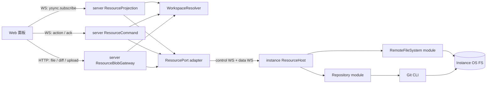

# Peri Studio 远程 FS / Git 通信协议设计

> 状态：设计草案 v0.3
>
> 日期：2026-08-23
>
> 范围：Web 面板经 server 访问 project 所绑定 instance 上的文件系统与 Git 仓库。本文不改变 ACP wire，也不把 workspace 等同于 Git 仓库。

## 1. 决策摘要

1. **借鉴 VS Code 的 provider 语义，不复制其内部 wire。** VS Code 的 Code-OSS 仓库公开了远程文件系统 client/server、IPC channel 与内置 Git 扩展源码，但这些接口是内部实现，不是承诺兼容的独立协议。官方 VS Code Server 也明确不面向其他客户端单独使用。
2. **资源操作沿用 `Web 面板 → server → instance` 拓扑。** server 负责认证、workspace 归属和路由；真正的 FS/Git 操作只能在 workspace 所绑定的 instance 上执行。
3. **FS 与 Git 是两个深模块。** 它们共享资源传输 adapter，但不共享一个万能 `exec(method,args)` interface。浏览器永远不能传 shell、任意 Git argv 或绝对路径。
4. **浏览器侧采用“Yjs 投影 + WS 命令 + HTTP blob”。** 文件树与 Git 状态以 server 单写、浏览器只读的有界 Y.Doc 投影；mutation 继续走现有 WebSocket action/ack；文件正文、diff、patch、归档和 upload 走 HTTP。server↔instance 仍使用独立的 control/data transport，因为 instance 主动回连且浏览器不能直连 instance。
5. **Yjs 承载 UI 投影，不成为 FS/Git 权威事实。** 文件系统和 Git 是 instance OS 上的外部权威事实。resource Doc 只保存惰性加载、可分页、可回收、可从 instance 重建的当前视图，并明确标注 source generation 与 stale/offline 状态。
6. **所有路径在线上都表示为 `(workspace_id, relative_path)`。** `canonical_path` 只存在于 server/instance 可信侧，浏览器不得提交或覆盖它。
7. **Git 使用目标 instance 上的 Git CLI。** 返回值是稳定 DTO，Git stdout/stderr 和命令行细节不穿透到 Web 面板。

## 2. 可复用的 VS Code 与开源项目

### 2.1 VS Code 中真正可借鉴的部分

- [`RemoteFileSystemProviderClient`](https://github.com/microsoft/vscode/blob/main/src/vs/workbench/services/remote/common/remoteFileSystemProviderClient.ts) 把 `vscode-remote` scheme 注册为远程 provider，并通过名为 `remoteFilesystem` 的 channel 调用远端。
- [`DiskFileSystemProviderClient`](https://github.com/microsoft/vscode/blob/main/src/vs/platform/files/common/diskFileSystemProviderClient.ts) 暴露 `stat`、`realpath`、`readdir`、`readFile`/stream、`writeFile`、`open/read/write/close`、`mkdir`、`delete`、`rename`、`copy`、`watch/unwatch`。
- [`AbstractDiskFileSystemProviderChannel`](https://github.com/microsoft/vscode/blob/main/src/vs/platform/files/node/diskFileSystemProviderServer.ts) 是对应的 server adapter；每个连接 session 聚合 watcher，并用 request id 管理取消。
- [`IChannel`](https://github.com/microsoft/vscode/blob/main/src/vs/base/parts/ipc/common/ipc.ts) 的抽象只有 `call` 与 `listen`，底层支持 promise、取消、事件订阅和二进制 buffer 序列化。这套“少量通道原语 + 深 provider”值得借鉴。
- 内置 [Git 扩展](https://github.com/microsoft/vscode/tree/main/extensions/git) 运行 Git CLI，而不是通过 Git wire protocol 实现工作区 Source Control；其 [`Repository` interface](https://github.com/microsoft/vscode/blob/main/extensions/git/src/api/git.d.ts) 把 status、diff、stage、commit、branch、remote、worktree 等建模为结构化操作。

限制同样明确：VS Code 官方 FAQ 说明 [Remote SSH、WSL、Dev Containers 及相关组件不是开源项目](https://code.visualstudio.com/docs/remote/faq#_why-arent-the-remote-development-extensions-or-their-components-open-source)，并说明 [VS Code Server 由 VS Code 客户端管理，不供其他客户端独立安装或使用](https://code.visualstudio.com/docs/remote/faq#_can-vs-code-server-be-installed-or-used-on-its-own)。所以不能把官方 Remote SSH/Server 当作可嵌入的独立开源协议产品。

### 2.2 候选开源项目

| 项目 | 最适合借鉴什么 | 不应期待什么 |
| --- | --- | --- |
| [OpenVSCode Server](https://github.com/gitpod-io/openvscode-server) | 最接近“可独立运行的浏览器版 Code-OSS”；适合验证完整 remote extension host、FS、terminal、SCM 的组合方式 | 没有承诺稳定、可单独复用的 FS/Git wire spec |
| [code-server](https://github.com/coder/code-server) | 成熟的 Code-OSS 浏览器部署、认证、代理、升级和运维经验 | 重点是托管完整 VS Code，不是为第三方 UI 提供小型资源协议 |
| [Eclipse Theia](https://github.com/eclipse-theia/theia) | 前后端可替换模块、typed RPC、filesystem/SCM/plugin 模块 seam；适合参考模块拆分 | 不是 VS Code Remote 协议兼容实现；当前 wire 也不是公开 JSON-RPC endpoint |
| [microsoft/vscode](https://github.com/microsoft/vscode) | 最权威的 provider、IPC、SCM/Git 行为参考 | 内部 wire 不是公开标准，版本兼容成本高 |

结论：如果目标是直接得到完整远程 IDE，优先评估 OpenVSCode Server；如果目标是给 Peri Studio 增加自己的文件树和 Source Control UI，应实现本文协议，并只把 VS Code 源码作为行为参考。

## 当前落地状态（2026-08-23）

本轮已经交付可运行的第一条纵向切片，协议版本为 `2`，资源投影 schema 版本为 `1`：

- 浏览器只提交 `projectId` 与相对路径；server 从 SQLite 项目元数据解析可信 instance 与 workspace root，并在每次 view、mutation、Y.Doc subscribe 和 HTTP blob 请求上重新授权。
- instance 已实现有界目录分页、精确文件读取、workspace containment、symlink 逃逸拒绝、仓库发现、Git snapshot/changes，以及带 generation CAS 的 Stage/Unstage。
- server 是资源 Y.Doc 的唯一 writer；目录、仓库、SCM group 都是按需、短租约、显式排序的独立只读投影，文件字节不进入 Yjs。
- 浏览器通过 opaque、principal-bound、60 秒 ticket 的同源 `GET/HEAD /api/resource-blobs/{blobId}` 下载文件；响应保留精确字节、MIME、ETag，并要求当前 HttpOnly session cookie。
- Web 已提供 VS Code 风格 Activity Bar、可折叠 Explorer、懒加载文件树、Source Control 仓库/分组/状态装饰、ahead/behind、逐文件 Stage/Unstage、刷新与 SCM badge。

当前实现是该设计的 R1/R2/R5 与 R6 的可用子集，不把尚未完成的接口伪装成已支持：浏览器 bulk bytes 已走 HTTP，但 instance→server 的文件读取暂时仍以 64 MiB 硬上限的 base64 control result 传输；Range、下游取消传播、独立 authenticated data WebSocket、diff/编辑/upload、文件 mutation，以及 commit/branch/remote 等 Git 操作仍按后续阶段实现。这个兼容 seam 被限制在可信 server↔instance 链路，不会暴露给浏览器，也不会写入 Yjs。

### 2.3 Theia 与 OpenVSCode Server 的设计校准

进一步沿源码调用链检查后，两者对本文设计的价值并不相同：

| 观察 | 接受进本文 | 不原样采用 |
| --- | --- | --- |
| Theia 用 path-addressed logical channel 把前后端 service 复用在一条 Socket.IO 连接上 | 保留“传输多路复用 → RPC → FS/SCM 深模块”的三层结构 | 不把控制消息和大文件流塞进同一条无界连接 |
| Theia `RpcProxyFactory` / message-RPC 支持 request、reply、notification、cancel，默认以 MessagePack 编码二进制消息 | 领域 interface 保持 typed request/event/cancel，wire codec 可替换 | 不采用依赖 method-name 前缀推断 notification 的隐式规则；协议消息类型必须封闭、显式 |
| Theia 主连接恢复后重新打开 logical channel，`RemoteFileSystemProvider` 会重建 watcher | 重连后按当前 fenced generation 重建订阅 | 不假设重建后事件连续；仍使用 `epoch + seq + reset_required` |
| Theia FS 同时暴露整文件 API、fd API 和流回调 | server↔instance 保留整文件 query/mutation 与独立 stream seam；浏览器以 HTTP 消费 blob | M1 不开放远程 fd；不把文件字节放入 Yjs 或 JSON WS |
| Theia SCM bridge 用排序后的 resource splice 同步 provider/group/resource | 大仓库第二阶段可做带版本的 resource delta | 不发送无 baseline 的 splice；必须带 `baseGeneration/newGeneration`，失配即全量重查 |
| OpenVSCode Server 的目标是以最小改动把 Code-OSS 作为浏览器服务运行 | 用它做 FS、Git、extension host 组合行为和升级回归的端到端基准 | 不依赖其内部 channel，不 fork 整棵 Code-OSS 来给 Peri 增加两个面板 |
| OpenVSCode 的 Git 仍由远端 extension host 中的内置 Git 扩展运行，并向 workbench 投影 SCM 模型 | Git CLI/仓库状态机位于 instance；Web 只消费结构化 SCM DTO | 不设计“Git stdout over RPC”或逐个 Git 子命令的通用远程执行协议 |

Theia 当前实现的相关固定源码入口包括 [`RpcProxyFactory`](https://github.com/eclipse-theia/theia/blob/c66a38110467826d2eb718fccd88eb2692d28969/packages/core/src/common/messaging/proxy-factory.ts)、[`RPCProtocolImpl`](https://github.com/eclipse-theia/theia/blob/c66a38110467826d2eb718fccd88eb2692d28969/packages/core/src/common/message-rpc/rpc-protocol.ts)、[`RemoteFileSystemProvider`](https://github.com/eclipse-theia/theia/blob/c66a38110467826d2eb718fccd88eb2692d28969/packages/filesystem/src/common/remote-file-system-provider.ts) 和 [SCM plugin bridge](https://github.com/eclipse-theia/theia/blob/c66a38110467826d2eb718fccd88eb2692d28969/packages/plugin-ext/src/plugin/scm.ts)。OpenVSCode Server 自己的 [README](https://github.com/gitpod-io/openvscode-server/blob/2bfb814c5215c51a10e80c2cb1b58ed91068ad8b/README.md) 明确强调 minimal changes 与跟随 VS Code 的升级路径；其远程 FS、Remote Agent 与内置 Git 主体仍来自同一棵 Code-OSS 源码树。因此它是完整产品基线，不是一个有独立兼容承诺的协议包。

## 3. 系统位置与 seam



| Module | Interface | Implementation 隐藏的复杂度 |
| --- | --- | --- |
| `ResourceProjection` | `openView`、`refresh`、`release` | Y.Doc schema、惰性查询、分页、租约、watch debounce、generation fencing、Yjs transaction batching、TTL/LRU 回收 |
| `ResourceCommand` | `execute(ResourceMutation)` | Web principal 授权、command outbox、workspace 路由、并发版本、投递不确定性、审计与错误脱敏 |
| `ResourceBlobGateway` | `openRead`、`openUpload` | opaque ticket、HTTP Range/ETag、逐请求授权、流取消、大小上限、checksum、临时 upload 生命周期 |
| `WorkspaceResolver` | `resolve(workspace_id)` | SQLite 权威读取、归档判断、instance 在线状态、locator 漂移复验 |
| `RemoteFileSystem` | `query(FsQuery)`、`mutate(FsMutation)`、`watch(FsWatch)` | anchored path 解析、symlink、原子写、版本冲突、分页、watch overflow |
| `Repository` | `snapshot`、`query`、`mutate` | repo discovery、Git CLI argv、porcelain 解析、per-repo 串行化、凭据与 hook 风险 |
| `ResourcePort` | `query`、`mutate`、`watch`、`openStream` | server↔instance control/data 双连接关联、流多路复用、取消、credit/backpressure、断线清理、checksum |

`RemoteFileSystem` 与 `Repository` 是 remote-but-owned 依赖：server 侧 `ResourcePort` 的生产 adapter 使用 instance WebSocket，测试使用 in-memory adapter。调用方与契约测试只穿过上表 interface，不测试 transport、Y.Doc 内部布局或 Git argv 的偶然形状。

`ResourceProjection` 是最重要的深模块。删除它会使授权、惰性加载、watch 刷新、分页、generation、Yjs 写入和资源回收重新散落到各个 handler；因此这些行为都应隐藏在其小型 interface 后，而不是让 Web 层直接操作 `Y.Doc`。

现有 “instance 是 ACP dumb pipe” 约束继续成立于 ACP 通道。`ResourceHost` 是并列、封闭的新模块；它不得解析 ACP，也不得允许 ACP forward 进入资源操作。

## 4. 投影与线协议分层

### 4.1 能力协商

`instance/hello.caps` 从不透明值收窄出可选资源能力：

```jsonc
{
  "resources": {
    "version": 1,
    "fs": ["stat", "readDir", "read", "write", "move", "delete", "watch"],
    "fileReadModes": ["whole", "range", "stream"],
    "git": ["snapshot", "diff", "stage", "unstage", "discard", "commit"],
    "binaryStreams": true,
    "maxChunkBytes": 262144,
    "pathCaseSensitive": true
  }
}
```

- `resources` 缺失表示 instance 不支持资源协议，Web 面板显示明确不可用状态。
- 资源子协议独立使用 `version`；新增可选 operation 只扩 capabilities，破坏性变化才升级版本。
- 因 `Frame` 是封闭 serde enum，第一次落地仍需升级 Peri Studio 全局线协议版本；之后的资源能力不应继续绑死全局版本。

### 4.2 浏览器侧三条数据路径

1. **Yjs resource Doc**：文件树和 Git 当前状态的只读 UI 投影，复用现有 `ysync.subscribe/unsubscribe/update` 与 broadcaster 背压机制。
2. **WebSocket query/action**：query 只负责申请/释放视图和 blob ticket；mutation 继续使用现有 `commandId`、`accepted → committed/error` 与 `DELIVERY_UNKNOWN`。
3. **HTTP blob**：文件正文、diff、patch、归档和 upload；不得进入 Yjs、action ack 或 JSON WebSocket frame。

打开一个目录视图：

```jsonc
{
  "t": "resource_query",
  "requestId": "uuid",
  "workspaceId": "workspace-uuid",
  "type": "resource/open-view",
  "payload": {
    "kind": "fs/directory-page",
    "path": "src",
    "cursor": null,
    "limit": 200
  }
}
```

```jsonc
{
  "t": "resource_result",
  "requestId": "uuid",
  "type": "resource/open-view",
  "result": {
    "docId": "resource:opaque-view-id",
    "leaseExpiresAt": 1787414400000
  }
}
```

server 必须在返回成功前创建 view lease 并完成首个有界快照；浏览器随后用现有 `ysync.subscribe` 订阅 `docId`。折叠目录、切换 workspace 或关闭页面时先 `ysync.unsubscribe`，再释放本地 `Y.Doc`。server 在最后一个订阅者离开后按短 TTL 回收 view、watch 和 mirror Doc。

Web 面板 mutation 继续走现有 action：

```jsonc
{
  "t": "action",
  "commandId": "uuid",
  "type": "fs/write-file",
  "payload": {
    "workspaceId": "workspace-uuid",
    "path": "src/main.rs",
    "uploadId": "single-use-upload",
    "ifMatch": "opaque-file-revision"
  }
}
```

server 与 instance 之间使用对应的封闭帧 `instance/resource_query`、`instance/resource_result`、`instance/resource_action`、`instance/resource_ack`、`instance/resource_event` 和 stream control。不得复用 chat-scoped `instance/forward`。

Web-facing contract 与 instance-facing contract 是两套独立类型：可以复用 `FsStat`、`RepoSnapshot` 等领域 DTO，但 `canonicalPath`、`instanceId`、`connectionGeneration`、授权 grant 等可信路由字段只存在于后者。server 必须构造新的 instance request，不能把浏览器 payload 原样转发或反序列化进可信类型。

resource mutation 的 terminal `action_ack` 增加小型、封闭的可选 `resourceResult` union，例如写文件后的 `FsStat` 或 Git mutation 后的 `repoGeneration`。command outbox 必须连同该结果一起缓存并在 duplicate 时重放。文件内容、diff 等大结果绝不能进入 ack。mutation 完成后由 `ResourceProjection` 刷新受影响 view；ack 不携带一份容易和 Yjs 分叉的 UI 状态副本。

### 4.3 有界 resource Doc

不创建“整个 workspace 的递归文件树 Doc”。第一阶段只有以下动态、按需创建的 view：

| View kind | 内容 | 分区方式 |
| --- | --- | --- |
| `workspace/summary` | workspace 可用性、根摘要、repo count | 每 workspace 一个小型租赁 Doc |
| `workspace/repositories-page` | workspace 内的一页 repo 摘要 | 每页一个 Doc，默认最多 50 项 |
| `fs/directory-page` | 某目录的一页直接子项 | 每目录每页一个 Doc，默认最多 200 项 |
| `git/repository` | HEAD、upstream、operation、各 group count/revision | 每 repo 一个小型租赁 Doc |
| `git/group-page` | 某 SCM group 的一页 `GitChange` | 每 group 每页一个 Doc，默认最多 200 项 |

`resource:{viewId}` 使用 server 生成的 opaque id；浏览器不能从 path/repoId 自行构造合法 Doc。每次 subscribe 都重新校验 principal 对该 view 所绑定 workspace 的权限，知道 view id 不等于有权限。

每个 resource Doc 的 root 至少包含：

```ts
type ResourceViewMeta = {
  schemaVersion: number;       // Y.Doc layout 兼容版本
  kind: 'workspace/summary' | 'workspace/repositories-page' | 'fs/directory-page' | 'git/repository' | 'git/group-page';
  sourceGeneration?: string;   // instance/目录/repo 的不透明事实代次；首次离线时可缺失
  availability: 'loading' | 'ready' | 'refreshing' | 'offline' | 'error';
  observedAt: number;
  complete: boolean;
  nextCursor?: string;
  errorCode?: string;
};
```

条目使用 `Y.Map<opaqueId, DTO>` 保存 identity，单独的 `Y.Array<opaqueId>` 保存展示顺序。一次 refresh 必须在单个 Yjs transaction 中完成；客户端只在 transaction 后渲染。resource Doc 是当前状态，不是事件历史，也不落盘；server 重启后从 instance 重新查询构建。

有界性来自分区与限额，而不是来自 Yjs 本身：

- 每 Doc 限制条目数、编码后快照字节数和单次 update 字节数。
- 每 principal 限制活动 view 数；每 workspace/repo 限制全局 view 数。
- 最后一个订阅者离开后进入 TTL，随后销毁 mirror Doc、watch 和 cursor。
- 多客户端可以复用相同 logical view，但租约与权限按连接独立记录；不同 cursor 不混为同一 Doc。
- 超限返回 `VIEW_TOO_LARGE` 或更小的 `nextCursor`，不得发送巨型快照后依赖 broadcaster 兜底。
- server 是唯一 writer；浏览器上行 `ysync.update` 继续按现有规则拒绝。

### 4.4 取消、租约与时限

- query 取消：`resource_cancel { requestId }`，幂等。
- view 生命周期：`ysync.unsubscribe` 释放连接订阅；`resource/release-view { viewId }` 可提前释放 lease，重复释放幂等。
- HTTP 请求取消或连接关闭必须向 instance 传播 `resource_stream_cancel` 并释放句柄。
- 每个 query/action/HTTP upstream stream 在 server 与 instance 都有独立 deadline；浏览器给出的 timeout 只能请求更短，不能扩大服务端上限。
- WebSocket 断开必须释放该 principal 的所有 view lease 与未提交 upload；HTTP 请求也不能在 principal/session 撤销后继续读取。

## 5. 路径与文件模型

### 5.1 资源身份

```text
浏览器可见：workspace://{workspace_id}/{relative_path}
可信路由：  workspace_id → (instance_id, canonical_path)
instance：   anchored_root + validated_relative_path → OS handle
```

server 在建立资源路由时，先通过认证后的 instance control 连接发送 `instance/workspace_grant { workspaceId, canonicalPath, locatorGeneration }`。instance 复验路径后，仅在当前 fenced connection generation 内保存 `workspaceId → anchored_root`；后续资源帧只携带 `workspaceId`。重连后 grant 失效并由 server 重建，路径漂移则拒绝 grant。这样绝对路径只穿过受信的 server→instance 控制边，不会进入 Web 协议或每个资源操作。

- `relative_path` 使用 `/` 分段；空串表示 workspace 根。
- 拒绝绝对路径、NUL、`.`/`..` segment、反斜杠歧义、超长 segment、Unicode 非法序列。
- 协议保留原始文件名字节不可行时，instance 必须返回 `UNREPRESENTABLE_NAME`，不得有损替换后继续 mutation。
- Web 面板永远不能提交 `canonical_path`、`instance_id`、`file://` URI 或任意 scheme。

路径校验不能只做字符串前缀或一次 `canonicalize`。instance 应以 workspace 根句柄为锚点逐段解析；Linux 优先使用 `openat2(RESOLVE_BENEATH | RESOLVE_NO_MAGICLINKS)` 等能力。不能可靠保证 containment 的平台，对跨根 symlink mutation 必须 fail closed。

### 5.2 `FsStat`

```ts
type FsStat = {
  path: string;
  kind: 'file' | 'directory' | 'symlink' | 'other';
  size: number;
  mtimeNs: string;
  permissions: 'read-only' | 'read-write';
  revision: string; // opaque optimistic-concurrency token
};
```

`revision` 是 instance 生成的不透明 token；浏览器不得解析。写、删、移、覆盖必须携带 `ifMatch`，新建必须携带 `ifNoneMatch: "*"`。外部进程修改后 token 变化，mutation 返回 `VERSION_CONFLICT`。

### 5.3 第一阶段 FS interface

server→instance 投影/metadata query：

- `fs/stat { path }`
- `fs/read-dir { path, cursor?, limit }`
- `fs/open-read { path, ifMatch?, offset?, length? }` → stream metadata

浏览器可见 interface：

- WS `resource/open-view { kind: "fs/directory-page", path, cursor?, limit? }` → `docId`
- WS `resource/open-blob { kind: "fs/file", path, ifMatch? }` → 短期 `blobId + httpUrl`
- HTTP `GET/HEAD /api/resource-blobs/{blobId}` → 文件正文

mutation：

- `fs/write-file { path, uploadId, ifMatch? | ifNoneMatch, mode }`
- `fs/create-dir { path, ifNoneMatch: "*" }`
- `fs/move { source, target, sourceIfMatch, targetIfMatch? | targetIfNoneMatch }`
- `fs/delete { path, ifMatch, recursive, useTrash }`

instance watcher：

- `fs/watch { path, recursive, excludes[] }`
- `fs/unwatch { subscriptionId }`

watcher 只存在于 `ResourceProjection`→instance 的内部 seam，浏览器不直接订阅原始文件事件。第一阶段不暴露远程 fd 的 `open/read/write/close`。浏览器编辑器需要的是 HTTP Range read 与 atomic whole-file write；远程 fd 会引入连接重建、泄漏和跨请求锁语义，却没有足够 leverage。未来出现超大文件随机写的真实需求后再增加。

### 5.4 目录与 watch 一致性

- directory page 绑定 `directoryRevision`；目录变化后旧 cursor 失效，`ResourceProjection` 从第一页重建受影响 view，并以新 `sourceGeneration` 原子替换 Doc 内容。
- watcher 事件是**server 的失效提示**，不是浏览器事实日志。事件只包含 `created|changed|deleted`；不能可靠证明 rename 时发送 delete + create。
- instance watcher 使用 `{ subscriptionId, connectionGeneration, epoch, seq, resumePolicy: "resubscribe-and-reset" }`。seq gap、overflow、instance 重启或旧 generation callback 都触发 server 全量刷新；浏览器只观察 resource Doc 的 `refreshing → ready/error`。
- 事件批处理建议 50–150 ms；同一目录 refresh single-flight。Git 刷新应再 debounce，不能对每个文件事件执行一次 `git status`。
- instance 离线时保留最后一份有界视图供展示，但必须原子写入 `availability: "offline"`；恢复后先标记 `refreshing`，重查完成才回到 `ready`。

## 6. HTTP blob 与 instance 数据平面

当前 WebSocket 协议是 JSON 文本帧且单帧上限 1 MiB，Yjs update 还会 base64 膨胀。因此浏览器与 server 之间的所有 bulk bytes 改走同源 HTTP；Yjs/WS 只传 metadata、view id、blob ticket 与命令。

### 6.1 浏览器→server HTTP

读取流程：

1. 浏览器通过 WS `resource/open-blob` 请求 `fs/file`、`git/diff`、`git/show` 或 archive。
2. server 重新授权 workspace/repo/path，创建与 principal、workspace、revision、operation 和短 TTL 绑定的 opaque `blobId`。
3. 浏览器用现有 HttpOnly session cookie 请求 `GET/HEAD /api/resource-blobs/{blobId}`；URL 不携带 token、绝对路径或 relative path。
4. server 再次检查 session 与 ticket binding，随后从 instance 拉流并以 HTTP response streaming 转发。

HTTP reader 支持 `Range`、`ETag`、`If-None-Match`、`Content-Length`（已知时）、`Content-Disposition`（显式下载时）与客户端取消。ETag 对应 `FsStat.revision` 或 Git blob/diff generation；Range 超出与 revision 漂移返回标准 HTTP 状态并附稳定、脱敏的资源错误码。

upload 流程：

1. WS `resource/open-upload { workspaceId, expectedBytes?, sha256? }` 创建单次 `uploadId`。
2. 浏览器 `PUT /api/resource-uploads/{uploadId}` 流式上传；server 设置 body、并发、速率、TTL 和 checksum 上限。
3. `fs/write-file` action 以 `uploadId + ifMatch/ifNoneMatch` 消费 upload，在目标目录临时文件写入、flush 后 atomic rename。
4. 成功、失败、session 撤销或 TTL 到期都销毁 upload。

HTTP ticket 只是一次传输能力，不等于 workspace 授权；每个 HTTP 请求仍必须校验当前 principal，且 ticket 不能跨 principal/workspace/operation 使用。普通编辑器打开、diff 预览和“下载文件”共用这一 blob seam，而不是为下载按钮另造一套路径。

### 6.2 server→instance 有界数据流

浏览器使用 HTTP 不会消除 server→instance 的数据通道：instance 主动连接 server，通常不能被浏览器或 server 直接以 HTTP 回连。第一阶段保留独立 authenticated data WebSocket，按 instance control `connectionGeneration` 绑定并 fencing；多个 stream 在同一 data connection 上复用。

stream 不跨 data connection 重连恢复；断线即取消，HTTP 调用方按 revision 重新申请 blob，upload 则重新创建。data frame 形态：

```text
0..3   magic = "PERI"
4      resource stream version = 1
5      kind = DATA
6..7   flags
8..23  stream_id (128 bit)
24..27 seq (u32, big endian)
28..31 payload_length (u32, big endian)
32..   payload
```

控制帧：

- `resource_stream_open { streamId, connectionGeneration, direction, byteLength?, sha256?, chunkBytes }`
- `resource_stream_credit { streamId, grantBytes }`
- `resource_stream_end { streamId, byteLength, sha256 }`
- `resource_stream_error/cancel { streamId, code }`

默认建议：chunk 256 KiB、初始 credit 2 MiB、每 principal 同时 4 条 HTTP blob、普通文件读取 64 MiB、diff 8 MiB、upload ticket TTL 60 秒。所有值由服务端配置收紧，不能由浏览器扩大。

credit 与 HTTP downstream drain 关联：server 只有在 HTTP response 消费并释放 buffer 后才向 instance 补 credit。server relay 每条 stream 最多缓存 1–2 个 chunk，绝不以 unbounded queue 桥接 instance data WS 与 HTTP response。

upload/write 不是跨文件事务。多文件保存、Git apply 或 rewind 若需要整体原子性，必须另立显式 batch/rollback 设计，不能复用多个 `fs/write-file` 假装原子。

## 7. Git 模型

### 7.1 Git 不是 FS 的子命令

Git 使用同一 workspace 路由，但有独立 `repoId`：

```ts
type RepoSnapshot = {
  repoId: string;
  scope: 'full' | 'workspace-subtree-readonly';
  root: string;                 // workspace-relative；上级仓库不泄漏绝对路径
  generation: string;           // opaque
  head: { oid: string; name?: string; detached: boolean } | null;
  upstream?: { name: string; ahead: number; behind: number };
  operation?: 'merge' | 'rebase' | 'cherry-pick' | 'revert' | null;
  groups: Array<{
    id: 'conflicts' | 'index' | 'workingTree' | 'untracked';
    label: string;
    count: number;
    revision: string;
  }>;
};

type GitChange = {
  changeId: string;             // 绑定 repo generation 的 opaque id
  path: string;
  originalPath?: string;        // rename/copy
  status: string;               // 封闭 enum，不能直接暴露 porcelain 字符
  additions?: number;
  deletions?: number;
};
```

- `repoId` 由 instance 生成并绑定 workspace 与仓库 identity；浏览器不得提交 repo path。
- workspace 本身不要求是 Git 仓库，`git/discover` 返回 0..N 个 repo。
- repo root 在 workspace 内时为 `full`。workspace 是更大仓库子目录时，第一阶段只提供 subtree 范围的只读 status/diff；禁止 commit、checkout、reset 等可能影响 workspace 外部文件的 mutation。
- 不在 project/session 持久身份中记录 branch、commit 或 repoId；这些都是可重建运行事实。

这对应 VS Code 的公共 SCM 模型：`SourceControl → ResourceGroup → ResourceState`，而不是把 Git 命令输出直接交给 UI。其官方 [SCM provider 指南](https://code.visualstudio.com/api/extension-guides/scm-provider) 和 [extension host SCM 实现](https://github.com/microsoft/vscode/blob/main/src/vs/workbench/api/common/extHostSCM.ts) 可作为字段与交互参考。

### 7.2 第一阶段 Git interface

server→instance projection query：

- `git/discover { mode: "workspace" }`
- `git/snapshot { repoId }`
- `git/changes { repoId, groupId, groupRevision, cursor?, limit }`
- `git/open-diff { repoId, changeId, context? }` → stream metadata
- `git/open-show { repoId, source: "head" | "index", path }` → stream metadata
- `git/refs { repoId, cursor?, limit }`

浏览器可见 interface：

- WS `resource/open-view { kind: "workspace/summary", workspaceId }` → workspace 摘要 Doc
- WS `resource/open-view { kind: "workspace/repositories-page", workspaceId, cursor? }` → repo 列表 Doc
- WS `resource/open-view { kind: "git/repository", repoId }` → repository Doc
- WS `resource/open-view { kind: "git/group-page", repoId, groupId, cursor? }` → changes Doc
- WS `resource/open-blob { kind: "git/diff" | "git/show", repoId, changeId/source }` → `blobId + httpUrl`
- HTTP `GET/HEAD /api/resource-blobs/{blobId}` → diff/blob bytes

mutation：

- `git/stage { repoId, changeIds[], expectedGeneration }`
- `git/unstage { repoId, changeIds[], expectedGeneration }`
- `git/discard { repoId, changeIds[], expectedGeneration, confirmationToken }`
- `git/commit { repoId, message, expectedGeneration }`
- `git/checkout { repoId, refId, expectedGeneration }`

fetch/pull/push、rebase、merge、stash、worktree 放到第二阶段。它们涉及远端凭据、任意 hooks、长任务和更强的投递不确定性，不应和本地 status/stage 一次上线。

### 7.3 Git CLI adapter

- instance 直接 spawn `git` argv，绝不执行 shell 字符串。
- status 优先解析稳定的 machine format（例如 porcelain v2 + NUL 分隔）；解析后的 DTO 才能离开 instance。
- 所有 path argv 前使用 `--`，并有数量、总字节和 workspace containment 上限。
- 每个 repo mutation 串行执行；执行前重新计算 `generation`，不匹配返回 `VERSION_CONFLICT`。
- query 可并发但有总量限制；mutation 完成后发 `git/invalidated` 给 server 的 `ResourceProjection`，由它刷新相关 repo/group Doc，浏览器不直接消费 raw invalidation。
- 第一阶段 instance 只提供 invalidation + 有版本分页快照，server 将结果以单个 Yjs transaction 投影。第二阶段如需降低大型仓库刷新成本，可在 instance seam 增加 `git/resource-splice { repoId, groupId, baseGeneration, newGeneration, splices[] }`；base 不匹配或增量过大就由 server 全量重查，绝不能把无基线 splice 直接套进 Y.Doc。
- 普通响应不包含绝对路径、完整命令、环境、remote credential、raw stdout/stderr。诊断日志也只记录 operation、repoId、退出码和稳定错误码。
- commit hook 会执行仓库代码，必须在 UI 明示；未来可提供受控 `noVerify`，但不能由浏览器注入任意环境。

### 7.4 Git 副作用与投递不确定性

`stage` 等操作近似可安全重算，但 `commit`、未来的 `push` 不是 exactly-once。统一规则：

- action 使用现有 `commandId` 与 no-redelivery barrier；instance 写入/启动 Git 后断线不能自动重放。
- 每次 mutation 先回 `accepted`，进程退出并重新读取 repo snapshot 后才回 `committed`。
- 无法确定 Git 是否执行时回 `DELIVERY_UNKNOWN`。Web 面板先重查 `HEAD`/snapshot，再允许用户裁决；不得换新 commandId 自动重试。
- `expectedGeneration` 解决并发陈旧，不解决 exactly-once；两者不能混称。

## 8. 稳定错误码

| 域 | 错误码 |
| --- | --- |
| 通用 | `UNAUTHENTICATED`、`FORBIDDEN`、`RATE_LIMITED`、`UNAVAILABLE`、`CANCELLED`、`UNSUPPORTED_CAPABILITY` |
| view/blob | `VIEW_NOT_FOUND`、`VIEW_EXPIRED`、`VIEW_TOO_LARGE`、`BLOB_EXPIRED`、`RANGE_NOT_SATISFIABLE` |
| workspace/path | `WORKSPACE_NOT_FOUND`、`WORKSPACE_UNAVAILABLE`、`WORKSPACE_PATH_DRIFTED`、`INVALID_PATH`、`OUTSIDE_WORKSPACE`、`UNREPRESENTABLE_NAME` |
| FS | `NOT_FOUND`、`NOT_DIRECTORY`、`IS_DIRECTORY`、`ALREADY_EXISTS`、`PERMISSION_DENIED`、`VERSION_CONFLICT`、`STALE_CURSOR`、`TOO_LARGE`、`WATCH_OVERFLOW` |
| Git | `REPO_NOT_FOUND`、`REPO_SCOPE_READ_ONLY`、`GIT_NOT_AVAILABLE`、`GIT_LOCKED`、`DIRTY_WORKTREE`、`CONFLICTS_PRESENT`、`AUTH_REQUIRED`、`REF_NOT_FOUND` |
| 副作用 | `DELIVERY_UNKNOWN`、`UPLOAD_EXPIRED`、`CHECKSUM_MISMATCH` |

`message` 必须脱敏且只用于展示；Web 面板的行为只能依赖 `code`、`retryable`、`retryAfterMs` 与显式版本字段。

## 9. 安全与资源限制

1. 每个 query/action、resource Doc subscribe 和 HTTP blob 请求都在 server 重新解析 principal → project/workspace 归属；知道 workspace UUID、viewId 或 blobId 都不等于有权限。
2. control/data transport ticket 只证明连接关联，HTTP blob/upload ticket 只证明一次传输申请；它们都不等于 workspace capability，每次 operation 仍独立授权。
3. resource Doc id 必须是 server 生成的 opaque id；Doc 内不得包含 canonical path、instance secret、credential 或 raw Git command。
4. instance 只接受 server 已解析出的 workspace identity，并以自己保存/复验的 locator 执行；不能信任 server 转发的任意绝对路径。
5. FS mutation、Git discard/checkout/commit 分别进入独立审计类别；审计不记录文件内容、diff、commit message、绝对路径或凭据。
6. view 数、Yjs snapshot/update bytes、目录条目、diff 行数、path 数量、HTTP body、stream bytes、并发 Git process 全部设硬上限；达到上限返回显式错误、分页或 reset，不静默截断成“完整结果”。
7. Git remote 凭据只由 instance 本机的 credential helper/askpass broker 获取；不得把密码、token、SSH key 经 WebSocket、Yjs 或 HTTP ticket 发送给 server 或浏览器。
8. 删除默认走 trash；永久/递归删除必须独立确认。确认 token 绑定 principal、workspace、path revision、operation 和短 TTL。

## 10. 落地顺序

| 阶段 | 纵向切片 | 验收重点 |
| --- | --- | --- |
| R1 | dynamic `resource:{viewId}` + `ResourceProjection` lease | 新 DocId 白名单、逐订阅授权、server 单写、快照/update/view 数硬限额、TTL 回收 |
| R2 | instance 目录验证 + `fs/read-dir` → directory-page Y.Doc | workspace 路由、路径 containment、分页、transaction 原子投影、loading/offline/error 状态 |
| R3 | HTTP blob ticket + `fs/open-read` + instance data stream | cookie/authz、opaque URL、Range/ETag、credit、取消、checksum、断线释放 |
| R4 | HTTP upload + atomic `fs/write-file` | `ifMatch` 冲突、单次 ticket、临时文件清理、symlink/TOCTOU |
| R5 | `fs/watch` → server refresh → Yjs update | epoch/seq、overflow 全量刷新、debounce/single-flight、旧 generation fencing |
| R6 | `git/discover/snapshot/changes` → repo/group Y.Doc + HTTP diff | repo scope、porcelain 解析、有界分页、Git 缺失/锁/冲突状态 |
| R7 | `stage/unstage/discard/commit` | per-repo 串行、expectedGeneration、投影刷新、确认 token、delivery unknown |
| R8 | fetch/pull/push 等远端操作 | credential broker、长任务进度、取消与对账 |

每阶段至少包含：proto round-trip/shape/whitelist 测试、`ResourceProjection` interface 测试、server in-memory `ResourcePort` adapter 契约测试、instance 临时目录真实 FS/Git 测试、resource Doc/HTTP 越权与 symlink 对抗测试、断线/背压/取消/TTL 测试，以及 Web 加载/空/offline/error/重试状态测试。投影测试只断言 interface 可观察结果，不依赖 Y.Doc 内部 item/tombstone 布局。

## 11. 明确拒绝

- 不复刻或声称兼容 VS Code Remote 内部 wire。
- 不把 Git smart protocol v2 当作 Source Control UI 协议；它解决 Git 对象传输，不解决 status/stage/diff/commit UI。
- 不让 Web 面板调用任意 shell、Git argv、绝对路径或 `file://` URI。
- 不把 Yjs 当作 FS/Git 权威事实、持久数据库或 watcher event log。
- 不把整个 workspace 递归文件树、完整 Git history/refs、文件正文、diff、patch 或 upload 放进 Yjs；Yjs 只承载有界、分页、可回收的 metadata 投影。
- 不允许浏览器上行 Yjs update；资源投影与 chat 一样保持 server 单写、Web 只读。
- 不靠 watcher 事件维护“绝不丢失”的目录/Git 状态。
- 不在第一阶段支持 workspace 外的上级仓库 mutation、自动 worktree 或多文件伪事务。
- 不把大文件或 diff base64 编码进 JSON 控制帧，也不为浏览器再建立一条 resource data WebSocket；浏览器 bulk bytes 统一走 HTTP。
