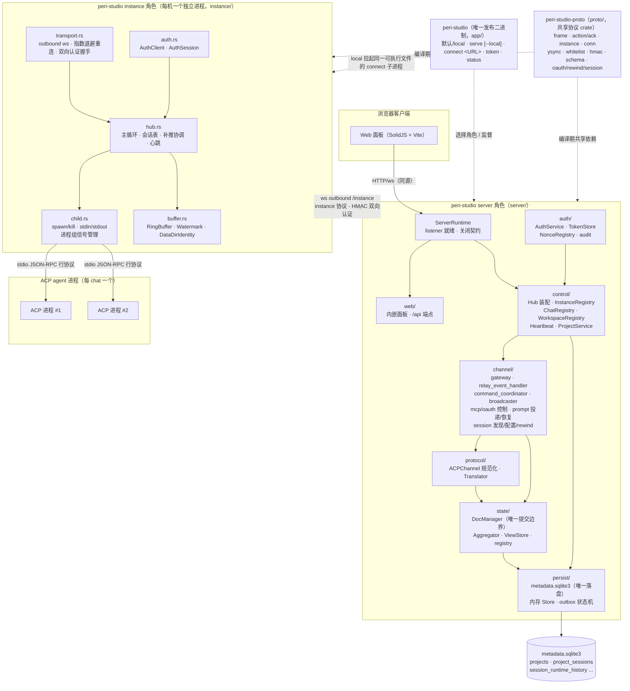
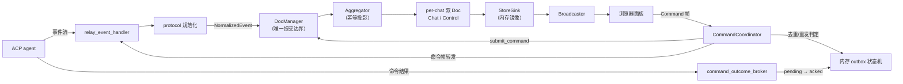
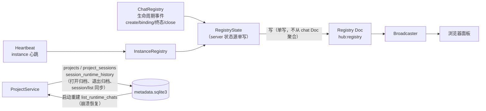
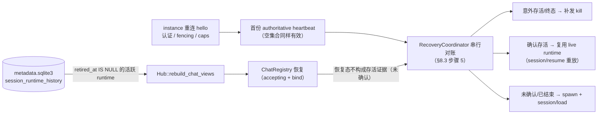
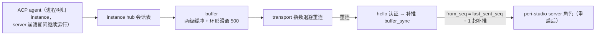
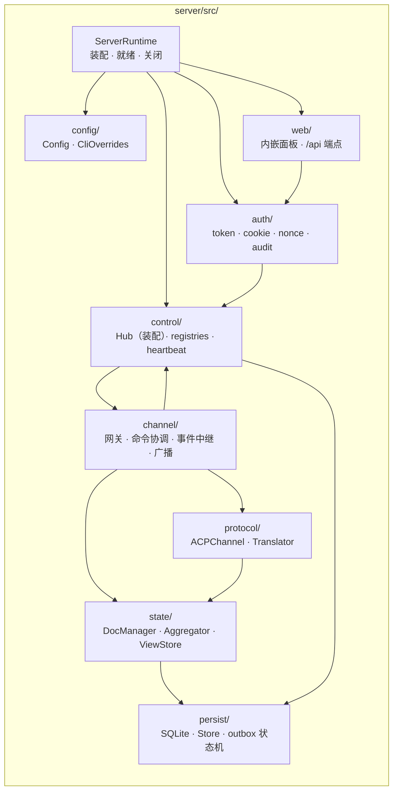
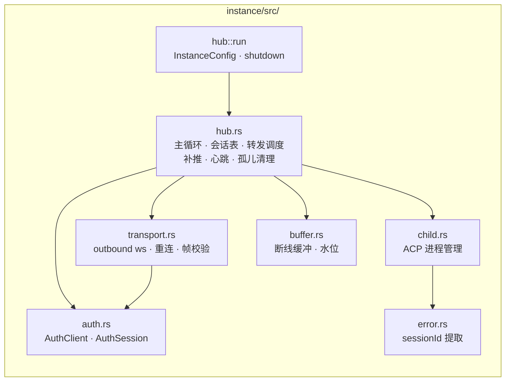
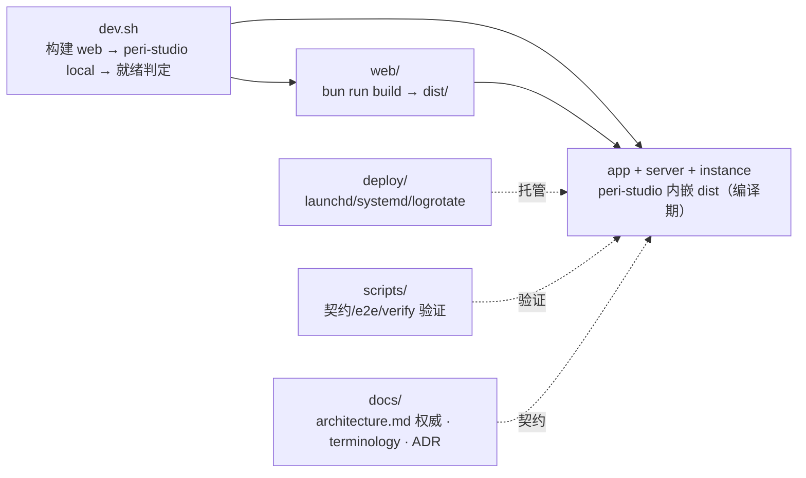

# Peri Studio 顶层模块拓扑

> 状态：现行（2026-08-21，单二进制发布后）
> 事实来源：仓库代码（`app/`、`proto/`、`server/`、`instance/`、`web/`）、`Cargo.toml`、`dev.sh`、`README.md`
> 与 `docs/architecture.md` 的关系：本文只描述**模块间拓扑与依赖方向**，是 §3.1 旧 ASCII 拓扑图的现行版；协议细节、安全模型、状态机等权威契约仍以 `docs/architecture.md` 为准。

## 1. 一图总览（单二进制 / 双进程角色）

要点：

- **连接方向**：instance **主动 outbound** 连接 server（`ws://127.0.0.1:8456/instance`，NAT 友好、server 零入站依赖）；浏览器经同源 HTTP/ws 连接 server（静态面板 + `/api` 端点）。
- **发布物 ≠ 故障域**：发布包仅有 `peri-studio`，但 local 的 server 与 instance 是两个 OS 进程。server crash 不得级联终止 instance/ACP。
- **本地与远程同路**：默认/`local` 和 `serve --local` 拉起同一二进制的 `connect` 子进程；不设进程内快速路径，同样经过 `/instance` ws、版本校验、HMAC、重连与补推。
- **SSH 挂载（可开工，实现未开始）**：远端 instance 仍 outbound 连 `/instance`；`app/` 经 OpenSSH 反向隧道把远端 `127.0.0.1` 转到 server listener。SSH 不是第二套 instance 传输。全局 Restarting 只等 local。见 `docs/design/ssh-machine-mount.md` 与 ADR-0002。
- **单 ws 多路复用**：server ↔ instance、server ↔ 浏览器均为单连接按 `Frame` 枚举区分控制帧（Action/Ack）与状态帧（y-sync），见 `architecture.md §4`。
- **instance 是 dumb pipe**：不解析事件语义、不聚合、不落盘业务状态，只做 sessionId 提取、按 chat 分桶 + seq、进程管理与断线缓冲（`architecture.md §3.3`）。
- **规范化只在 server 侧**：`protocol::ACPChannel` 把 ACP 原始事件流规范化为 `NormalizedEvent`，经 `state` 层投影到 Y.Doc 视图。
- **编译期共享**：`proto/` 是唯一共享 crate，server 与 instance 均只依赖它，互不依赖。

## 2. 顶层模块清单

| 目录 | 角色 | 形态 | 关键职责 | 对外接口 |
| --- | --- | --- | --- | --- |
| `app/` | `peri-studio` | **唯一发布二进制** | CLI 角色选择、信号/就绪契约、local 子进程监督、【v2.16】SshBackend | `local`、`serve [--local]`、`connect <URL>`、`token`、`status` |
| `proto/` | `peri-studio-proto` | 纯协议 crate（无异步依赖） | 帧模型、Action/Ack 信封、instance 协议 9 帧、连接生命周期、y-sync envelope、M1 帧集白名单、HMAC 双向认证原语、Y.Doc schema 类型镜像 | server / instance 编译期共享 |
| `server/` | server 角色库 | 运行时模块 | 认证/授权、控制面（Hub）、ACPChannel 规范化、Y.Doc 聚合投影、命令协调（mcp/oauth/prompt/rewind）、唯一业务权威 `metadata.sqlite3`、内嵌 Web 面板、【v2.16】MachineService | ws `/`（浏览器）、ws `/instance`（instance）、HTTP `/api/health`、`/api/auth/session` |
| `instance/` | instance 角色库 | 运行时模块 | outbound 连 server、收 spawn/kill 指令、管理 ACP 进程树（进程组信号）、透明转发 + 断线缓冲 + 补推、心跳 | ws outbound `/instance`；stdio 对接 ACP 进程 |
| `web/` | Web 面板 | 前端源码（Vite + SolidJS + TS，Bun 构建） | 面板 UI；构建产物 `dist/` 内嵌进 `peri-studio`，只消费 server 事实 | 仅经 server 角色暴露 |
| `deploy/` | 部署模板 | systemd unit / launchd plist / logrotate 配置 | 同一可执行文件以两个 service 分别托管 `serve` 与 `connect`，保持故障隔离 | 面向运维，不内嵌 token |
| `scripts/` | 验证脚本 | shell + .mjs（bun） | 契约测试、e2e 流、release 验证、ws 验证客户端 | 开发期使用，无运行时依赖 |
| `docs/` | 文档 | `architecture.md`（权威）、`terminology.md`、`topology.md`、`adr/`、`design/` | 架构契约、术语、决策与设计记录 | 面向人 |
| 根文件 | 装配与门禁 | `dev.sh`、`Cargo.toml`（workspace）、`README.md`、`SECURITY.md`、`deny.toml`、`ui.md`（历史基线） | 开发启动编排、依赖门禁、安全边界声明 | 面向人/CI |

## 3. 通信拓扑（连接方向与协议）

| 连接 | 方向 | 协议/帧 | 认证 | 说明 |
| --- | --- | --- | --- | --- |
| 浏览器 ↔ server | 浏览器主动 | HTTP/ws，Action/Ack + y-sync | token 换 HttpOnly cookie 会话 | 同源 loopback 明文 HTTP（当前部署边界，`README.md`） |
| server ↔ instance | **instance 主动 outbound** | instance 协议 9 帧（hello/event/spawn/kill/process_exit/heartbeat/buffer_sync…） | instance token + HMAC-SHA256 双向认证（§9.2，HKDF 派生） | 单连接多路复用；断线指数退避重连 |
| instance ↔ ACP 进程 | instance 拉起 | stdio JSON-RPC 行协议 | 无（本地进程树） | 每 chat 一个进程，进程组 `kill(-pgid)`；stdout 逐行 → sessionId 提取 → 分桶 |

## 4. chat 管理的数据流（生命周期）

chat 的打开、运行、关闭与崩溃恢复横跨 server 的 `channel/`（命令与事件入口）、
`state/`（投影与提交边界）、`control/`（状态机与注册表）、`persist/`（唯一落盘），
以及 instance 侧的会话表与子进程管理。以下三张图分别描述控制流、数据流与
注册表/持久化关系。

### 4.1 控制流：chat 打开 / 关闭（spawn / kill 路径）

```mermaid
flowchart LR
    UI["浏览器面板"]
    GW["gateway（ws 分派）"]
    COORD["CommandCoordinator（命令路由）"]
    REG["ChatRegistry<br/>ChatEntry · ChatState 状态机"]
    RELAY["relay_event_handler<br/>（instance 入站/出站）"]
    HUB2["instance hub 会话表"]
    CHILD["child 进程管理"]
    ACP["ACP agent 进程"]

    UI -->|"CreateChat / Close 帧"| GW --> COORD
    COORD -->|"登记 + 状态迁移<br/>accepting → … → 终态"| REG
    REG -->|"InstanceSpawn / InstanceKill 帧"| RELAY --> HUB2
    HUB2 -->|"spawn / kill（进程组信号）"| CHILD --> ACP
    ACP -->|"process_exit 上报"| HUB2
```

### 4.2 数据流：运行中事件投影与命令提交

### 4.3 注册表与持久化：Registry Doc、SQLite 映射

### 4.4 数据实体与存放位置

| 实体 | 存放位置 | 写入/更新者 | 生命周期与说明 |
| --- | --- | --- | --- |
| `ChatEntry` + `ChatState` | `ChatRegistry`（内存） | `runtime_creation` / `runtime_closure` / `relay_event_handler` | 单 chat 运行时状态机：accepting → gap / ended / closed / crashed / pending_close；终态后不再接受新事件 |
| Chat / Control 双 Doc | `DocManager`（yrs 内存） | `Aggregator`（事件投影）、`CommandCoordinator`（命令提交） | per-chat 事实源；视图跨重启不落盘，由重放恢复 |
| Registry Doc | `DocManager`（yrs 内存） | `RegistryState` 单写 | 会话列表/机器列表唯一权威；聚合器不直写（gap 走上报路径） |
| 内存镜像（快照+增量） | `StoreSink` | `DocManager` 提交流 | 同源同 clientID，客户端应用无 CRDT 分叉 |
| outbox 记录 | `Store`（内存） | `CommandCoordinator` / `command_outcome_broker` | 命令去重与重发判定（§4.4） |
| `projects` / `project_sessions` | `metadata.sqlite3` | `ProjectService` | 逻辑会话所有权（navigation catalog） |
| `session_runtime_history` | `metadata.sqlite3` | `ProjectService`（激活/退役归档） | 崩溃恢复重建 runtime 的唯一来源（`Hub::rebuild_chat_views`） |
| `metadata_commands` / `oauth_commands` | `metadata.sqlite3` | `metadata_command_processor` / `oauth_control` | 命令审计 |

### 4.5 崩溃恢复：server 重启后的视图重建

server 崩溃时 **ACP 进程不受影响，继续运行**（进程树归 instance 管，§8.3 不变）。
server 重启后：

- **视图重建**（`Hub::rebuild_chat_views`，control/hub.rs）：从 `session_runtime_history`
  （`retired_at` 为空）全量恢复非终态 chat——`ChatRegistry::register` +
  `bind(acp_session_id, confirmed = false)`；Registry Doc `chats` 段同步恢复。
- **未确认语义**：重建不构成进程存活证据。恢复的 chat 先按未确认处理；
  hello 不携带 `alive_sessions`，必须等首份 heartbeat 对账裁决（§8.3 步骤 5）：
  - 确认存活 → 复用为 live runtime（`session/resume` 重放）；
  - 意外存活 / 需终止 → server 补发 kill；
  - 未确认 → 用户显式打开时 spawn + `session/load`。
- **终态 chat 不重建**（不在 runtime 历史中），显式打开由 spawn + `session/load`
  兜底；活跃 runtime 重建不完整会 fail-fast，不能以部分 Registry 进入 Healthy。
- **Registry Doc 全量重建**：由 `metadata.sqlite3` 经 `ProjectService::reproject`；
  server 侧 `StoreSink` 内存镜像启动即空（零落盘，不参与恢复）。
- **后台维护**：单一 tick 合并 instance 离线 sweep + nonce sweep；周期
  `session/list` poller 持续对齐精确 durable identity。

### 4.6 韧性：server 挂掉期间与重连后的 instance 侧

- **断线缓冲**（instance/src/buffer.rs）：per-session 内存 + 磁盘两级（预算
  10MB/万条），环形滑窗常驻最后 500 条；**未确认不移出**——`drain_batch`
  （peek）→ 发送成功 `commit`，发送中断 `rollback`（帧回置队首，from_seq
  不变）；超预算时事件类优先丢弃、控制类最后丢弃（信封结构性分类）。
- **重连与补推**（instance/src/transport.rs）：指数退避
  `reconnect_base → reconnect_max`；认证通过后启动补推任务，逐条推进
  from_seq；发送队列满即关闭连接走重连补推（不缓存 in-flight）。
- **缓冲不跨重启保留**：磁盘缓冲是崩溃即弃的临时溢出文件（无 CRC）；兜底是
  滑窗 `ring_snapshot`——覆盖 server 崩溃前已收未落盘段。
- **水位与启动清理**（`watermark.json`）：epoch 跨重启单调（seq 判定正确性
  前提）、pgid + leader 指纹 + data-dir 身份供可证明所有权的孤儿清理。
- **close 遇 offline**：`ChatState::PendingClose` 状态持有，instance 重连后
  补发 kill（§7.6）。

### 4.7 恢复边界（不夸大的部分）

- server 侧 outbox 为**内存状态机**，崩溃即失：命令去重/重发防护仅在进程
  存活期内有效（重发穿透防护 §4.4 在线期语义）。
- 离线期间 server → instance 的指令**不排队**（唯一例外：close 的
  `PendingClose` 状态持有 + 重连补发）。
- 缓冲溢出被丢弃的事件类帧、终态 chat 的未归档视图不恢复（归档发生在
  process_exit 上报路径，依赖在线）。

## 5. server 内部模块拓扑

模块职责与依赖方向：

| 模块 | 职责 | 关键类型 | 依赖 |
| --- | --- | --- | --- |
| server 运行时接口 | 装配 Hub，回报 listener 就绪，接受调用方 shutdown | `ServerRuntime` | `app/` 持有 CLI 与信号管理 |
| `config/` | 配置加载（CLI > env > 默认），`Config::load` | `Config`、`CliOverrides` | 无 |
| `auth/` | 客户端 token 与浏览器会话（HttpOnly cookie）、nonce 防重放、审计 | `AuthService`、`TokenStore`、`NonceRegistry` | `config/` |
| `web/` | 内嵌 Vite 面板与 `/api` 端点（health/auth/session）、ws 升级识别 | `HealthSnapshot`、`BrowserAuthSetup` | `auth/`、`config/` |
| `control/` | **装配核心 `Hub`**：instance/chat/workspace 注册表、心跳、project 服务、StoreSink | `Hub`、`InstanceRegistry`、`ChatRegistry`、`WorkspaceRegistry`、`Heartbeat`、`ProjectService` | `channel/`、`state/`、`persist/` |
| `channel/` | ws 网关（`gateway`）、ACP 事件中继（`relay_event_handler`）、命令协调（`command_coordinator` + `runtime_command_ledger`/`oauth_command_ledger`/`command_outcome_broker`）、MCP/OAuth 控制、prompt 投递/恢复、session 发现/配置/rewind、turn 取消、广播器 | `Gateway`、`CommandCoordinator`、`Broadcaster`、`PromptRecovery`、`SessionRewind` | `protocol/`、`state/` |
| `protocol/` | ACP 事件规范化（双格式 sessionId 提取、幂等聚合输入）、peri 扩展翻译（oauth/rewind/skill_names…） | `AcpChannel`、`Translator`、`NormalizeOutcome` | `state/`（产出 `NormalizedEvent`） |
| `state/` | Y.Doc 聚合面：`DocManager` 唯一提交边界、`Aggregator` 幂等投影、per-chat 双 Doc（Chat/Control）+ Registry Doc、会话历史列表投影、权限 CAS、Degraded 判定 | `DocManager`、`Aggregator`、`ViewStore`、`Factory`、`RegistryState` | `persist/`（`UpdateSink`） |
| `persist/` | **唯一落盘** `metadata.sqlite3`（projects/project_sessions/session_runtime_history…）；内存 `Store`（chat 索引 + outbox 状态机，零落盘） | `Store`、`OutboxStore`、`MetadataStore`（sqlx pool） | 无（最底层） |

依赖方向（单向为主）：`config/auth/web → control(Hub) → channel → protocol → state → persist`；`channel ↔ control` 双向协作（命令提交与结果回收）。

## 6. instance 内部模块拓扑

| 模块 | 职责 | 关键类型 | 依赖 |
| --- | --- | --- | --- |
| instance 运行时接口 | 接受 `InstanceConfig` 与调用方 shutdown；不自行抢占全局 `Ctrl+C` | `hub::run` | `app/` 持有 CLI 与信号管理 |
| `hub.rs` | daemon 主循环：会话表、seq/epoch 分配、转发调度（在线直送 / 断线入缓冲）、补推协调、心跳、孤儿清理三层 | `InstanceConfig`、`Sessions` | `transport/`、`auth/`、`child/`、`buffer/` |
| `hub/control.rs` | managed-local owner 的 HMAC 身份绑定关闭通道；由 instance 自行收尾，supervisor 不向 adopted PID 发信号 | `OwnerControl`、`request_owner_shutdown` | 0600 Unix socket、owner lock、instance token |
| `transport.rs` | outbound ws、指数退避重连、双向认证握手编排、每帧 `Frame::parse` + M1 白名单校验、`send_acked` 发送确认 | `TransportConfig`、`TransportEvent`、`TransportHandle` | `auth/` |
| `auth.rs` | token 认证客户端与握手状态 | `AuthClient`、`AuthSession`、`HelloCtx` | 无 |
| `child.rs` | ACP 进程 spawn（进程组）/kill（组级 SIGTERM→SIGKILL）/stdin 写/stdout 读/wait 监控 | `AcpProcess`、`ChildOutput` | `error/`、`buffer/`（`ProcessFingerprint`） |
| `buffer.rs` | 断线环形缓冲、磁盘溢出缓冲、水位与 data-dir 所有权（启动时孤儿 SIGKILL 判定） | `Buffer`、`RingBuffer`、`Watermark`、`DataDirIdentity` | 无 |
| `error.rs` | 双格式 sessionId 提取 | `extract_session_id` | 无 |
| `router.rs` / `global.rs` | **废弃空壳**（F6 后旧单机 stdio 桥接职责已由 hub 吸收；`lib.rs` 声明保留） | — | — |

## 7. 共享契约：peri-studio-proto 子模块

| 子模块 | 内容 |
| --- | --- |
| `frame.rs` | `Frame` 枚举（serde tag `"t"`）+ `Frame::parse`，未知 tag 与反序列化失败可区分 |
| `action.rs` / `ack.rs` | Action 信封（8 种方法面）、两阶段 Ack（accepted/committed/duplicate）与稳定错误码 |
| `instance.rs` | server ↔ instance 协议 9 帧（hello/spawn/kill/event/process_exit/heartbeat/buffer_sync/…） |
| `conn.rs` | 连接生命周期：auth/auth_response/ready/keep_alive/pong、`DocId`、关闭码常量 |
| `ysync.rs` | y-sync envelope（subscribe/unsubscribe/update/sync/awareness），update 为 S→C 单向 |
| `whitelist.rs` | M1 帧集收窄 + 方向约束（全量 tag 注册表） |
| `hmac.rs` | HMAC-SHA256 双向认证原语（HKDF 派生、MAC 输入规范化、常量时间校验），纯函数无 I/O |
| `schema.rs` | Chat/Control/Registry 三 Doc 的 Rust 类型镜像（不持有 yrs 句柄） |
| `oauth.rs` / `rewind.rs` / `session.rs` | 扩展帧：MCP OAuth 授权、rewind 候选/预览、session 列表与 prompt 投递状态 |
| `version.rs` / `protocol.rs` | 协议版本与参数常量 |

`proto/` 无任何 tokio 依赖，是 server 与 instance 唯一的共享编译单元；两端均只依赖它，不互相依赖。

## 8. 持久化边界（无状态投影重构后）

- **唯一落盘**：`<data_dir>/metadata.sqlite3`（sqlx + SQLite，schema v6）：`projects`、`project_sessions`（含 `acp_session_id`、lifecycle）、`session_runtime_history` 等导航元数据；`Hub::rebuild_chat_views` 据此跨重启恢复 chat 视图。
- **零落盘**（重构后删除）：Yjs updates.log、outbox.log、watermark、closed_at、归档文件。
- **内存态**：`persist::Store`（chat 索引 + outbox 状态机）、`state::ViewStore`（Y.Doc 投影）、Registry Doc map 为可重建投影（由 `ProjectService` 持有）。
- **崩溃恢复**：instance 缓冲不跨重启保留（`hello` 上报 `buffer_lost`）；server 重启不伪装恢复旧进程，打开持久会话时以精确 ACP session id 建新 runtime 并经 `session/load` 恢复上下文（`README.md` 产品模型）。

## 9. 支撑目录关系

- `dev.sh`：构建 Web 产物 → `cargo run -p peri-studio` 启动 local 模式 → 等 listener 与本地 instance 认证完成 → 前台滚动日志。
- `deploy/`：systemd / launchd 各以两个 service 执行同一 `peri-studio` 的 `serve` 与 `connect`，保留失败隔离；默认 loopback 边界、不内嵌 token（`deploy/README.md`）。
- `scripts/`：`dev-contract-test.sh`（协议契约测试）、`e2e-flow.mjs`、`verify-create-chain.sh`、`verify-load.mjs`、`verify-release.sh`、`ws-verify*.mjs`（ws 闭环验证）。
- `docs/`：`architecture.md` 为权威架构契约；`terminology.md` 为唯一权威术语表；`adr/` 保留难以逆转的架构裁决；`design/` 保留专项设计记录。
- `ui.md` 是重构前历史基线，非当前实现说明（`README.md` 明确声明）。

## 10. 变更维护约定

- 本文件是**拓扑速览**，协议/安全/状态机细节一律以 `docs/architecture.md` 为准；两者冲突时以架构文档为权威（与 `README.md` 产品模型同源）。
- 新增/删除顶层模块或改变连接方向、持久化边界时，同步更新本文件第 1、3、8 节；
  崩溃恢复语义（§4.5–4.7）随 hello/心跳/缓冲协议变更同步维护。
